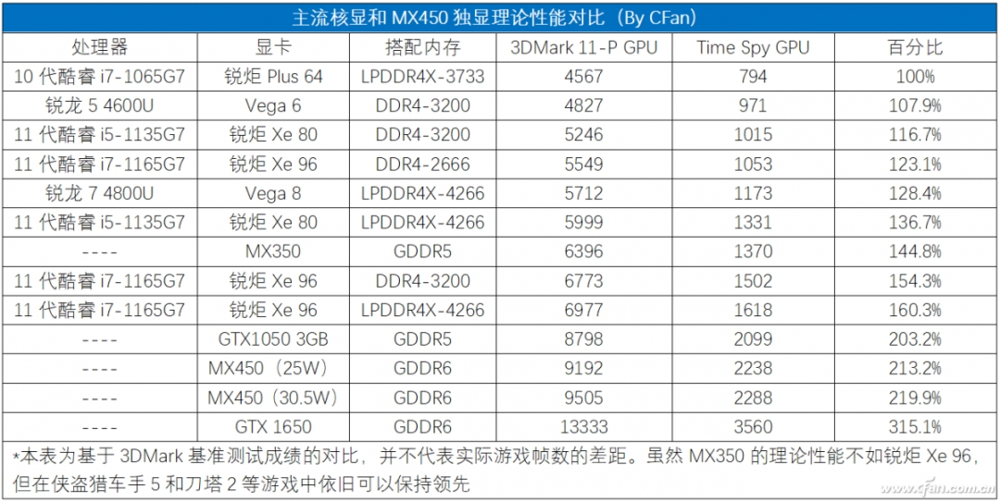
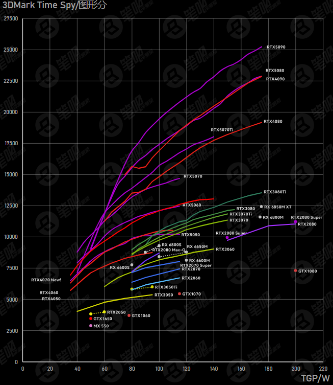
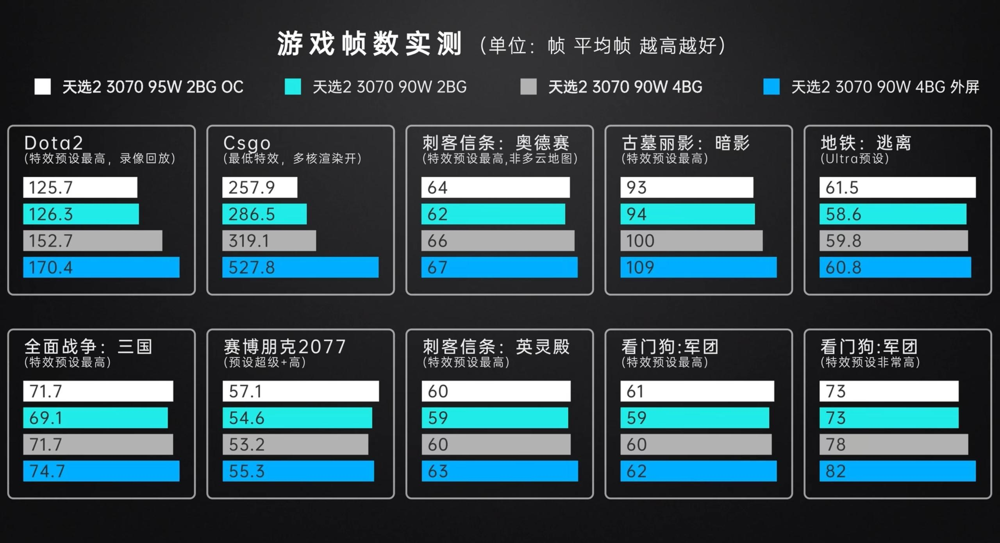

# 显卡

## 核芯显卡

前年市场上，R7-6800U 处理器上搭载的 Radeon 680M 核芯显卡已在多数项目中战胜了同期投产的 MX550 显卡，一战封神；今年，产品代号为 Strix Halo 的锐龙 AI Max+ 392 处理器搭载了基于 RDNA3.5 新架构的核芯显卡，其 Radeon 8060S 的图形性能基本与 3 年前发布的 RTX4060 比肩——核芯显卡性能的飞速发展直接宣告了 MX 系列独立显卡的死刑，这类独立显卡终将进入历史的垃圾桶中。

### 核芯显卡内存频率敏感性

核芯显卡的性能发挥极度依赖内存带宽，因此，同学你在购买仅搭载核芯显卡的轻薄本时，需要额外留意一下其搭载内存的运行频率。比如在 2021 年的市场上，主流的笔记本电脑往往会搭载 LPDDR4x-4266MT/s 或者 DDR4-3200MT/s 的内存。在其他条件相同的基础上，前者的图形性能比后者要强 4% 到 17%；同样，去年市场上也出现了搭载 LPDDR5-6400MT/s 甚至 LPDDR5-7200MT/s 内存的产品，相较于那些搭载 DDR5-4800MT/s 的产品，其图形性能比后者要强 10% 到 20%。

内存频率对核芯显卡性能的影响，以 2020 至 2021 移动端处理器为例

## 独立显卡

如今市场上 NVIDIA 依然在独立显卡领域一家独大。但可惜且可恶的是，NVIDIA 的 RTX50 系列显卡除 RTX5080 和 RTX5070Ti 在性能上有巨大提升，RTX5060、RTX5070 只能说是完成了对于原先 RTX40 系列对应级别显卡的迭代，RTX5060 在核心规格上大约只有 8%的提升，而 RTX5070 除了将显存更换为了带宽更大的 GDDR7 显存，在显存位宽、大小，核心规模上没有任何改进。只能说 NVIDIA 宣传的所谓技术民主化，本质是技术的资本专制化，个人用户他们大抵是瞧不起的。

RTX50 及 RTX40 系列独立显卡具体规格介绍

RTX50 及 RTX40 系列主流独立显卡性能对比，以 Time Spy 为例

综上，我们一般建议同学你选购搭载 RTX5070Ti 及以下显卡配置的产品，当然，如果同学你履丝曳缟，选择搭载 RTX5080 甚至 RTX5090 的笔记本产品也并非不可。只是，在这种预算条件下，组装一台搭载 RTX5070Ti、RX9070(XT) 或更高显卡配置的台式电脑会明显更为合适。

### 独立显卡散热设计功耗

唐代文学家韩愈曾经在人才问题上发出过这样的议论：

> 是马也，虽有千里之能，食不饱，力不足，才美不外见，且欲与常马等不可得，安求其能千里也？

要发挥设备的千里之能，一个必要条件就是让它们食饱力足，满足这些元器件的功耗需求。同样，电脑生产厂商们也为他们产品中搭载的独立显卡标定了一个散热设计功耗。在 30 系时代，性能释放强大的 RTX3060 机型相比于性能释放平庸的同类机型，在图形性能会强约 16%，而这一差距几乎相当于将 RTX3060 升级至 RTX3070。

不过，基于集成电路特性，芯片功耗的增加对于性能的提高存在边际效应。在 RTX30 系列独立显卡的市场寿命周期中，各大厂商在固定显卡基础功耗的情况下，将其动态增强功耗由 15W 上调至 25W，并宣称这是满血方案。可是这样的设计在实际测试中却只能够带来约 1%的性能提升，甚至在误差范围内，不过是厂商的营销话术罢了。所以，为了更好地呈现功耗对于显卡性能的影响，我们引用了由极客湾测试的笔记本显卡能耗曲线图：

常见笔记本显卡的能耗曲线，以 3DMark 为例

观察图中 RTX50 系列独立显卡的能耗曲线，不难看出：边际效应在 RTX50 系列独立显卡上较 RTX40 系列更为明显，RTX5050 和 RTX5060 的性能在 100W 之后已几乎不再增长。但对此，我们的观点保持不变：良好散热设计带来的不仅仅是性能的提高，更是用户日常体验的升级和产品寿命的延长，边际效应的存在，不是厂商对散热设计摆烂的借口，正如弱小和无知从不是生存的障碍，傲慢才是。

从而另一角度来看，RTX50 系列最大的亮点恐怕是其基于 TSMC 5nm 工艺带来的惊人能效比：RTX5070 仅需要不到 100W 的功耗就能超越 RTX3080 在 180W 时的性能，堪称外星科技！毫无疑问，极高的能效比对于那些关注机身三围的性能本用户是一个巨大利好，因为这使得这些用户仍可以在充电设备功率受限的情况下拥有相当的图形性能。所以同学你完全可以期待市场上那些具有轻薄设计的性能本的表现，比如天选的 Air 系列。

### 独显直连模式与 MUX switch

独显直连，指的是笔记本电脑直接屏蔽其搭载的集成显卡，由高性能的独立显卡直接输出信号流的工作模式。与厂商的宣传文案相反，独显直连并非什么新奇的工作模式：那些由独立显卡输出视频信号的台式电脑采用的都是独显直连。事实上，在笔记本电脑发展的早期，采用独显直连模式不仅不会大幅提高电脑的性能，反而会极大地降低笔记本的续航时间。所以在先前，独显直连模式仅为少数高性能笔记本支持，是一个聊胜于无的卖点。

但是伴随着集成电路制造工艺的突飞猛进，以往由集成显卡为显示器输出信号流的方案已经不能为广大笔记本使用者所接受，所以独显直连技术又重新登上了笔记本市场的主舞台。为更好地展示出独显直连模式对于电脑性能的提升，我们以天选 2 为例：当天选 2 使用自带的屏幕时，其工作模式为独显计算，集显输出的混合模式；当天选 2 外接屏幕时，其独立显卡得以直接为显示设备输出信号流，等效于开启了独显直连。表明，天选 2 在独显直连模式下的游戏帧率都有不同程度上的提升，而对于一些对处理器性能有一定要求的游戏，这样的提升甚至几乎是翻倍的。

独显直连模式对笔记本电脑游戏性能的影响

不过需要说明的是，开启独显直连虽然能够带来一定的性能提升，但也会使得笔记本电脑的续航时长大幅下降。所以在近几年的市场上，厂商又开始宣传他们的 MUX switch 技术，这项技术允许电脑在核显模式、独显模式以及混合模式下切换。MUX switch 技术允许用户在根据自己的实际使用环境做出不同的切换在续航和性能之间做出灵活的取舍，甚至有部分产品还支持这三种模式的热切换，让用户无需重新启动电脑就可以自由完成模式切换，非常方便。
