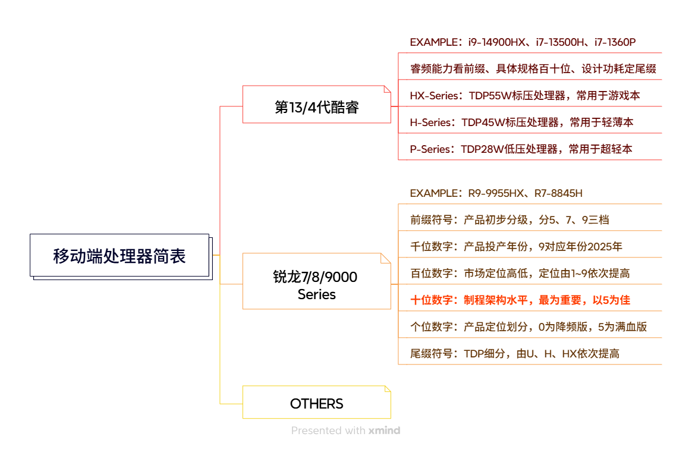
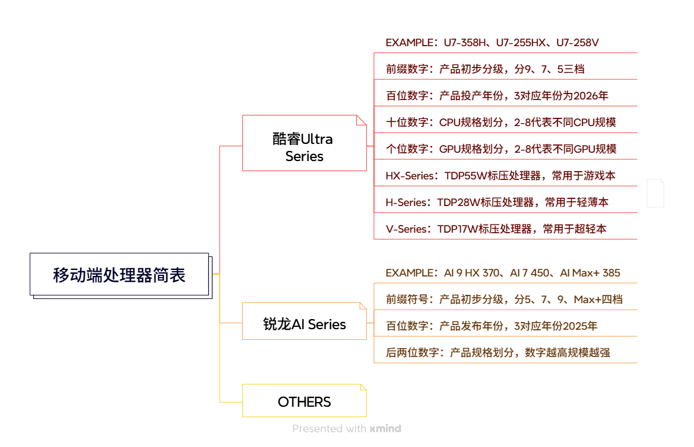
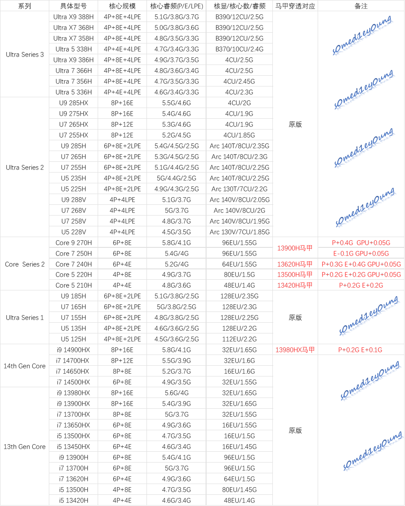
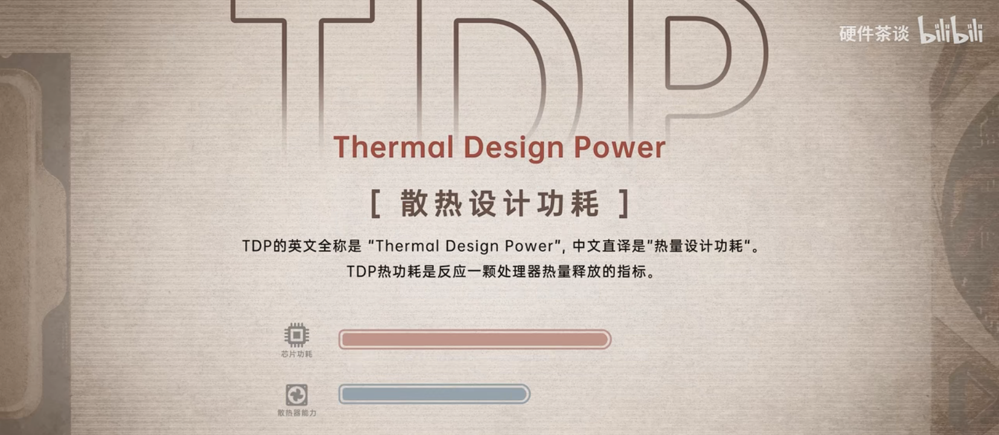
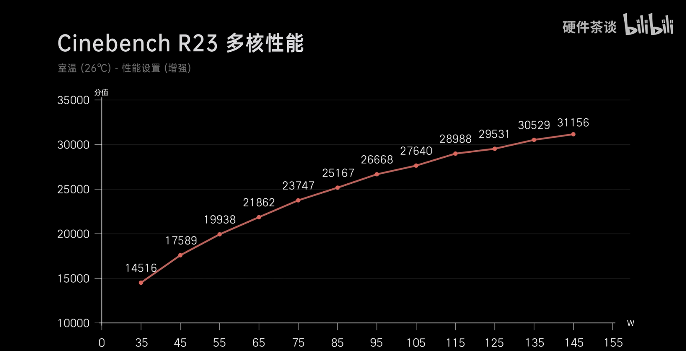

---
head:
  - - meta
    - name: keywords
      content: CPU,处理器,性能,AMD,Intel,锐龙,酷睿,Ultra,移动端,马甲,TDP
---

# 处理器

## 处理器型号

处理器的型号对应着该处理器的代数、核心数以及散热设计功耗等诸多重要信息，是同学你在选择电脑时参考的一项重要参数。虽然当今的移动端处理器已经可以轻松满足绝大多数用户的需要，但是其中也不乏一些暗坑，容易使同学多出一笔不必要的开支。我们注意到，去年市场上主要流行的移动端处理器为 Intel 酷睿 Ultra2 代处理器、第 14 代酷睿处理器和 AMD Ryzen AI 处理器、锐龙 9000（7000）系列处理器，其简要信息可参考下图：

2025 年移动端处理器命名规则参考（请点击放大查看）

同时，我们预估今年市场上主要流行的移动端处理器为 Intel 第 3 代酷睿 Ultra 处理器、和 AMD 锐龙 AI 系列处理器，其简要信息可参考下图：

2026 年移动端处理器命名规则参考（请点击放大查看）

若你需要了解更详细的关于今年移动端处理器的命名参考，请参考位于本段末尾的视频。

在今年的移动端处理器中，我们较为推荐的型号如下：

> **Ultra X7 358H、Ultra 5 358H、Ultra 7 255HX、Ultra 5 225H、Ryzen 9955HX、Ryzen AI Max+ 392、Ryzen AI 7 450**。

如果你的预算相对不高，以下的旧款处理器也能满足你的需求：**i7-14650HX、Ryzen 9 (7/8)94(5/0)HX、Ryzen 7 8(8/7)45H/HS、Ryzen 7 H250/255**等。

:::tip 注：
上文括号中用`/`分隔的数字代表可替换，例如：`Ryzen 9 (7/8)94(5/0)HX`代表了四款 CPU。
:::

@[Bilibili](BV1DrN7eiENp)

同时在这两年的市场上，AMD 与 Intel 推出了一大批换皮马甲 U，这是厂商为了迷惑消费者而使用的小伎俩。例如 Ryzen 7 H250 本质是 7840H(S)的换皮 U，对于没有认真做过功课的消费者来说，容易误以为将它当做新品，进而有可能购买到性价比偏低的产品。

为了应对这种情况，帮助消费者辩明每一款处理器的“真面目”，我们精心制作了目前市面上 AMD 与 Intel 常见处理器的详细规格表，同时将马甲 U 也进行了详细列举与对比，方便读者进行查阅。

AMD 移动端处理器详细规格参考

---

Intel 移动端处理器详细规格参考

## 处理器散热设计功耗

受厂商营销话术及产品实际体验的影响，不少用户对于处理器的选择存在刻板印象，常常会有认准搭载某一厂商、某一产品线处理器的机型进行购买的现象。这样的认识固然有其产生的原因和实践的验证，但也终究会随着时代的变化而失准，有时反而会干扰消费者做出合适的选择。

需要明确的是，任一厂商下属的任意产品线所生产的任一处理器，其最终的性能发挥取决于其在具体机型上的性能释放。颠覆许多人认识的是，抛开处理器外围设计不谈，其实低压处理器的体质会略好于比标压处理器，这使得低压处理器能够以更低的功耗达成更高的性能。而实际上，在近几年的处理器产品当中，仅有酷睿系列处理器对于低压处理器和标压处理器的核心数量及缓存大小做出了明确的划分。既然如此，为什么厂商还要宣传标压处理器性能强于低压处理器呢？

这时我们就要引入散热设计功耗这一概念了。

散热设计功耗

所谓散热设计功耗，即 TDP，指的是为使电子设备在正常工作时保持适当的温度而所需的散热能力，是电子设备设计中重要的一部分；而在实际的电子设备生产过程中，该值可被设备生产商根据模具的实际散热能力进行调整，是衡量处理器性能强弱的重要指标。在此，我们利用搭载了 i9-13980HX 处理器的枪神 7 Plus 超竞版的在 Cinebench R23 中的成绩作为参考来说明：

i9-13980HX 处理器的能耗曲线，以 Cinebench R23 为例

利用回归方程分析上图可知：在 35W 至 55W 的区间内，每提高 10W 性能释放，i9-13980HX 的成绩都会大幅提高约 2700 分；而在 55W 至 75W 的区间内，每提高 10W 的性能释放，i9-13980HX 的成绩可以提高约 1900 分；即便在 75W 至 115W 的区间内，每提高 10W 的性能释放，i9-13980HX 仍可以提高约 1300 分；可当 i9-13980HX 的功耗超过 115W 时，功耗的提高对其性能的提高贡献已极小。

诚然，电子设备的性能提升随功耗上涨是存在边际效应的，性能越高，能耗比也就越低。可对于绝大多数的用户而言：电费有价，时间无价。由合理散热设计带来的性能释放提升可以帮助用户以更高的速率处理任务，节省宝贵的时间；同时，从某种程度上看，拥有充分散热余量的模具也能在一定程度上提高设备的寿命和体验，简单来说就是用户可以拥有更为稳定且清净的使用过程，还可以间隔更长时间清理灰尘和更换导热硅脂。

所以，消费者在选择笔记本电脑产品时，**并不应当迷信于某一生产线**，而更应该考虑到自己的实际需要进行选择：自己是需要更高的续航还是更为出色的性能？为了追求这项指标，自己又愿意花费多少预算？相信你可以根据自己的情况得出相应结论。
