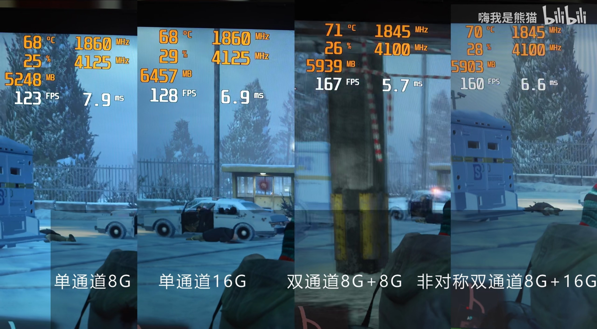
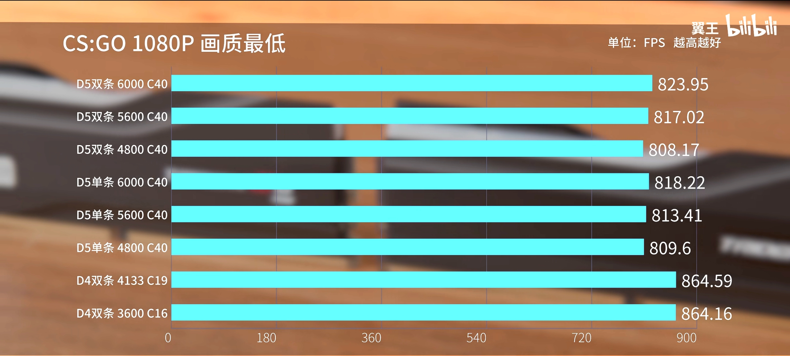

# 内存

## 如何分辨运存、内存、外存、硬盘、RAM 和闪存（Flash）?

我们平常使用的电子设备一般分为两种，一种是使用 Arm 架构处理器的智能手机，另一种则是使用 X64 架构处理器的电脑。因为**某些手机厂商的错误宣传**，许多消费者对于运存、内存、硬盘和闪存这几个概念有所混淆，因而闹出了许多笑话。

比如小明看到他人电脑内存为 32G，放声嘲笑说我手机的“内存”都有 256G，你的电脑也太垃圾了吧。事实上这是一种概念混淆导致的误解，我们首先来了解内存这个概念。

内存用于暂时存放 CPU 中的运算数据，以及与硬盘等外部存储器交换的数据，也就是说，我们平时是不能读取到内存中的文件的，并且内存具有易失性，断电之后内存中的数据就会消失。那手机上所说的“内存”到底是什么呢？

其实手机上所谓的“内存”，应该叫做外存，是用来存储我们平时经常使用的软件和文件的，它在断电之后不会丢失数据。那手机上有没有内存呢？当然是有的，我们一般把它称作运存，也就是运行内存。运存的本质就是内存，他们都属于 RAM。

而手机上的外存，一般采用的是闪存（Flash）颗粒，我们平时使用的电脑，则是靠硬盘来充当外存的。而硬盘的本质其实也就是闪存（Flash）颗粒组成的存储器。所以我们今后在购买手机和电脑时，如果要看手机的内存，实际上是应该看厂商标注的运存大小。而手机的存储空间大小则是厂商标注的所谓“内存”大小。

在购买笔记本时，我们不仅要看内存的大小，还得看硬盘的大小来进行选购。

## 内存容量

随着内存发展进入 DDR5 时代，16GB 大小的内存容量已成为所有主流价位新产品的基本盘。目前越来越多的学生，尤其是那些选择了建筑和数媒专业的学生，在他们的后续使用中甚至需要有 32GB 甚至是更大的内存空间。此时，笔记本电脑在内存方面的配置和拓展性就显得相当重要。对于内存的扩展性问题，我们将在下文中的有关部分进行详细介绍。

## 内存双通道

如果同学你曾经上过信息技术课程，那你可能会从老师那里听过内存双通道这个概念。由于对于内存工作原理的解析涉及一些晦涩的知识，在此我们可以做一个相对恰当的比喻：如果把内存和处理器比作两地，那么内存通道就相当于其中的公路，通行在公路上的车辆就是数据。而影响车辆通行效率的主要因素一是车辆的速率，二是公路的宽度以及数量，一般而言，公路的数量越多，两地之间的交互也就越便利。因此在其他参数相同的基础上，即便都是 16GB 大小的内存，单条 16GB 的内存的实际性能表现是不如两条 8GB 的内存的，而且这样的性能差距有时甚至如同更换了一张显卡[^10]。

不过，DDR5 内存由于自身的大带宽特性，即便只安装单根内存也能接近 DDR4 内存双通道的效果，所以也有厂商为他们搭载 DDR5 内存的产品选择的是 1\*16GB 而不是 2\*8GB 的配置，为用户留下了可在未来升级的宝贵空间。

内存单、双通道状态对游戏性能的影响，以GTA5为例

## 内存规格

前年，市场上的主流内存规格正在从 DDR4 向 DDR5 演进，许多产品都搭载了 DDR5 内存。至于 DDR5 内存的特性及其最终的性能表现，可类比具有高内存带宽和高内存延迟的 HEDT 平台，而事实结果也与该类比一致：初代 DDR5 内存除了在少部分的专业软件上胜出，在大多数的专业软件和几乎所有的游戏上都不如现今的 DDR4 内存[^11]。而在两年之后的今天，DDR5 内存的价格已大幅下降，市场上的笔记本基本上都搭载高频 DDR5 内存，DDR5 内存取代 DDR4 内存已只是时间问题。不过，目前市场上尚少有支持 SO-DIMM 插槽的高频 DDR5 内存，而支持内存超频的 HX55 系列处理器价格也相对较高，这说明广大性能本用户不得不为使用 DDR5 内存付出更多的后期升级成本。

内存规格对游戏性能的影响，以CSGO为例

[^10]: [【熊猫科普】双通道内存有啥用？16G 对比 8+8G 谁强谁弱?](https://www.bilibili.com/video/BV1s54y1i7UX/)
[^11]: [最新的 DDR5 内存比 DDR4 强多少？单条真的是双通道吗？【翼王】](https://www.bilibili.com/video/BV1TS4y1N7ee/)
