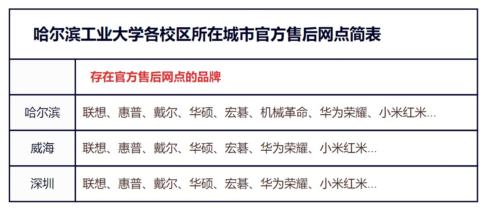

# 售后服务

在为广大同学推荐笔记本电脑的过程中，许多同学不仅关注产品的具体配置，还会关心产品的售后服务问题。售后服务不仅是消费者的一项重要权利，其水平高低更是区分一线厂商和二线厂商的一项重要标准。近年来，许多国内二线厂商，如机械革命和宏碁推出了一系列高性价比的惊艳产品，且其部分产品的做工品质也可以与一线厂商联想、惠普、戴尔相媲美，但是消费者在选购时仍然会迟疑，原因就在于其售后水平与一线厂商仍然存在差距。但是，这些差距的具体表现是什么呢？毕竟几乎所有的厂商都生成自己对所售产品提供两年时长的质保。对此，我们应秉持负责的态度，实事求是地进行考察。

## 如何计算售后服务时长

新兴厂商，如华为、荣耀、小米，会以产品激活日期为准生产电子保卡；而传统厂商，如联想、惠普、戴尔、华硕等，虽然官方宣传是从生产日期起开始计算，但倘若用户持有购买发票，则以发票开具日期为准，这也是为什么我们首推同学你从京东自营购买电子产品。而且， 都什么年代了，还在搞传统售后？传统厂商的高端产品线，如 ThinkPad、Legion、EliteBook、Alienware、ROG 也是以产品激活日期生成电子保卡的。

## 如何理解两年有限质保

自产品保修时长计算日起，对整机提供一年质保，重要零部件提供两年质保，一般不包含意外险。其中，重要零部件的描述就显得有些暧昧，一般来说仅包括主板、处理器、显卡、内存、硬盘、键盘、屏幕，但也有厂商将副板、无线网卡、触控板、电池、风扇等元件包含其中，甚至不同产品线的产品的售后内容都存在不同。另外，笔记本电脑的外壳一般不在有限保修范围内，若存在磨损或者变形基本只能自认倒霉。

## 如何解决电脑意外故障

意外故障分为人为和非人为两种情况，对于非人为产生的意外，可以正常进行售后；而人为产生的意外发生时，保修期自动终止，需进行付费维修，情况严重时厂商售后甚至不予维修。同时，需要注意的是，京东、天猫等平台上随机购买的延保和意外保服务的担保方都是第三方机构，且不对人为产生的意外提供服务，非常的坑。倘若同学你确实有购买意外保的需求，请在保修期内于官方售后网站或线下服务网点处购买。当然，在哈工大本部的学生在这种情况下可以通过加入[电脑互助群：304067847](https://qm.qq.com/q/HU05k45VmK)或是[QQ 频道：h777k26yg1](https://pd.qq.com/s/e100hstql) 的方式寻求帮助。

## 如何看待售后服务途径

中国大陆内的绝大多数厂商都支持个人送保，消费者可以直接前往官方售后网点进行售后，部分产品线甚至支持上门服务。但也有一部分产品，如 Intel 的 NUC 就仅支持经销商售后，即消费者仅能通过购买产品的店铺进行售后，不能说没有用，只能说确实没啥大用。而且不同厂商的个人送保服务水平亦有差距，对于机械革命等二线品牌，往往需要将故障产品送回工厂检测维修；而联想、戴尔等一线品牌通过申请备件的方式就明显更为快速。

当然，不管是何售后途径，各品牌售后都有一些不会明说的事。比如，其实售后为你更换的主板等部件一般不是全新的，而是先前返修主板经过厂商维修后的良品，不过对应补偿就是该更换部件的保修时长将会自更换日起重新计算，在一般情况下无需担心。

## 哈工大各校区所在城市官方售后网点简表

最后，为彰显我校一校三区的大格局，在此我们列出了各校区所在城市有官方售后网点的品牌，相关信息来自于各厂商官方网站。

哈工大各校区所在城市官方售后网点简表

