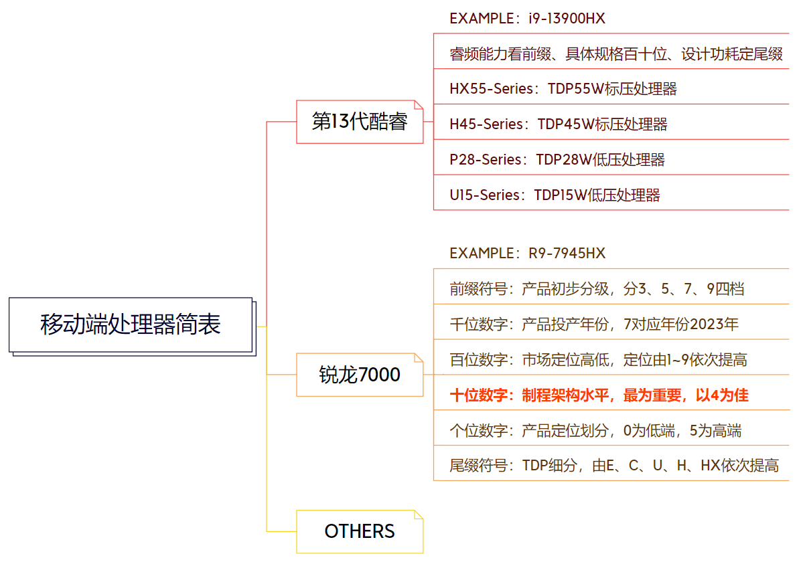
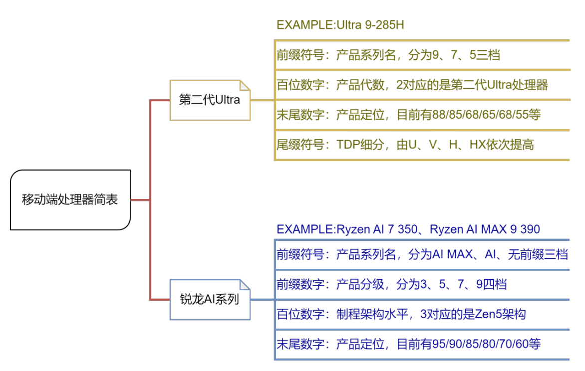
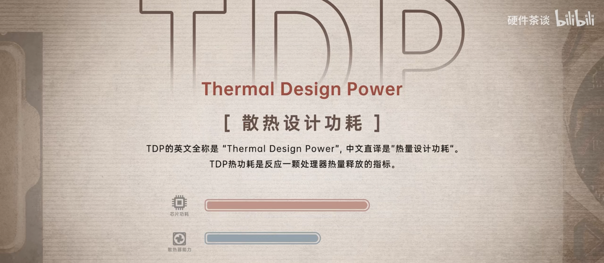
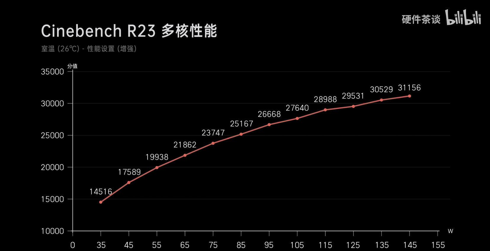

# 处理器

## 处理器型号

处理器的型号对应着该处理器的代数、核心数以及散热设计功耗等诸多重要信息，是同学你在选择电脑时参考的一项重要参数。虽然当今的移动端处理器已经可以轻松满足绝大多数用户的需要，但是其中也不乏一些暗坑，容易使同学你多出一笔不必要的开支。去年市场上主要流行的移动端处理器为Intel第14（13）代酷睿处理器、酷睿Ultra处理器和AMD锐龙8000（7000）系列处理器，其简要信息可参考下图：

2023年移动端处理器命名规则参考（请点击放大查看）

Intel 第 14（13） 代酷睿处理器在第 12 代酷睿处理器的基础上进一步深耕异构多核设计。其中，HX55 系列处理器，尤其是 i9-14900HX 在核心规模、睿频能力、内存支持、外围拓展等方面都有惊人表现，不过我们最推荐的是 i7-14650HX，这款处理器不仅有着完整的 HX55 特性，还拥有较高的性价比，在游戏性能上已趋于完美；同时因为Intel 爆出工艺门事件之后，其 13 代与 14 代的 H55 处理器稳定性存疑，因此我们并不推荐你购买核心规模更大的i9处理器。

而要评价 AMD 锐龙 8000 系列处理器，我们只需要看 7000 系锐龙即可。8000 系锐龙并没有推出 HX 处理器，而 8000 系中的 H 处理器，其实都是 7000 系的换皮 CPU。以 8845H 为例，其只不过是 7840H 增加一个 NPU 后的所谓“新”U，无论是基础频率还是全核睿频又或是核显频率都没有一丝变化。要观察锐龙 7000 处理器的型号，首要看其十位数字，这一位对应着该处理器的架构及制程，如所谓的 R7-7735H，实际上是基于 Zen3+ 架构、6nm 制程的 R7-6800H 的套皮，并不是真正的新款处理器。不过，我们建议预算相对余裕的用户考虑 7045 以及 7040 系列处理器，如 R9-7940HX 和 R7-8845H，前者具有高达 16 核 32 线程的恐怖核心规格，常为高端性能本所搭载；后者的核芯显卡性能强劲，预计在轻薄本上会有不俗表现[^5]。

我们预估今年市场上主要流行的移动端处理器为Intel第2代酷睿Ultra处理器、和AMD锐龙AI系列处理器以及AMD锐龙9000（7/8000）系列处理器，其简要信息可参考下图：

2024年移动端处理器命名规则参考（请点击放大查看）

若你需要了解更详细的关于今年移动端处理器的命名参考，请参考本段末尾的视频。在今年的移动端处理器中，我们较为推荐的型号如下：Ultra 7 258V、Ultra 5 225H、Ultra 7 255HX、Ryzen 9955HX、Ryzen AI Max 385、Ryzen AI 9 365。如果你的预算相对不高，以下的旧款处理器也能满足你的需求：i7-14650HX、Ultra 5 125H、Ryzen 9 （7/8）94(5/0)HX、Ryzen 7 7745HX、Ryzen 7 8(8/7)45H/HS等。

@[Bilibili](BV1DrN7eiENp)

[^3]: [酷睿 Ultra 全面评测：变化很大，但疗效如何？](https://www.bilibili.com/video/BV1PG411Y73S)
[^4]: [Brief: 13th Gen Intel® Core™ Mobile Processor](https://www.intel.cn/content/www/cn/zh/products/docs/processors/core/13th-gen-core-mobile-brief.html)
[^5]: [Brief: AMD Ryzen 7000 Series Processor](https://www.amd.com/zh-cn/products/processors/laptop/ryzen.html#%E8%A7%84%E6%A0%BC)
[^6]: [AMD Zen 5 深度评测：HX370 能效超强！但大小核靠谱吗？](https://www.bilibili.com/video/BV1ZE421w7eb)

## 处理器散热设计功耗

受厂商营销话术及产品实际体验的影响，不少用户对于处理器的选择存在刻板印象，常常会有认准搭载某一厂商、某一产品线处理器的机型进行购买的现象。这样的认识固然有其产生的原因和实践的验证，但也终究会随着时代的变化而失准，有时反而会干扰消费者做出合适的选择。

需要明确的是，任一厂商下属的任意产品线所生产的任一处理器，其最终的性能发挥取决于其在具体机型上的性能释放。颠覆许多人认识的是，抛开处理器外围设计不谈，其实低压处理器的体质会略好于比标压处理器，这使得低压处理器能够以更低的功耗达成更高的性能。而实际上，在近几年的处理器产品当中，仅有酷睿系列处理器对于低压处理器和标压处理器的核心数量及缓存大小做出了明确的划分。既然如此，为什么厂商还要宣传标压处理器性能强于低压处理器呢？

这时我们就要引入散热设计功耗[^7]这一概念了

散热设计功耗

[^7]: [【硬件科普】CPU 和显卡的 TDP 指的是什么？和功耗是什么关系？](https://www.bilibili.com/video/BV12L411976B/)

所谓散热设计功耗，即 TDP，指的是为使电子设备在正常工作时保持适当的温度而所需的散热能力，是电子设备设计中重要的一部分；而在实际的电子设备生产过程中，该值可被设备生产商根据模具的实际散热能力进行调整，是衡量处理器性能强弱的重要指标[^8]。在此， 我们利用搭载了 i9-13980HX 处理器的枪神 7 Plus 超竞版的在 Cinebench R23 中的成绩作为参考：

i9-13980HX 处理器的能耗曲线，以Cinebench R23 为例

利用回归方程分析上图可知：在 35W 至 55W 的区间内，每提高 10W 性能释放，i9-13980HX 的成绩都会大幅提高约 2700 分；而在 55W 至 75W 的区间内，每提高 10W 的性能释放，i9-13980HX 的成绩可以提高约 1900 分；即便在 75W 至 115W 的区间内，每提高 10W 的性能释放，i9-13980HX 仍可以提高约 1300 分；可当 i9-13980HX 的功耗超过 115W 时，功耗的提高对其性能的提高贡献已极小[^9]。

诚然，电子设备的性能提升随功耗上涨是存在边际效应的，性能越高，能耗比也就越低。可对于绝大多数的用户而言：电费有价，时间无价。由合理散热设计带来的性能释放提升可以帮助用户以更高的速率处理任务，节省宝贵的时间；同时，从某种程度上看，拥有充分散热余量的模具也能在一定程度上提高设备的寿命和体验，简单来说就是用户可以拥有更为稳定且清净的使用过程，还可以间隔更长时间清理灰尘和更换导热硅脂。

所以，消费者在选择笔记本电脑产品时，并不应当迷信于某一生产线，而更应该考虑到自己的实际需要进行选择：自己是需要更高的续航还是更为出色的性能？为了追求这项指标，自己又愿意花费多少预算？相信你可以得出相应结论。

[^8]: [Thermal Design Power](https://en.wikipedia.org/wiki/Thermal_design_power)
[^9]: [【产品评测】把 i9 和 4080 塞进笔记本里会有多强？ROG 枪神 7Plus 超竞版深度评测](https://www.bilibili.com/video/BV1W8411u7Hy/)
