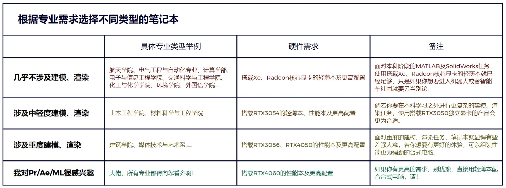
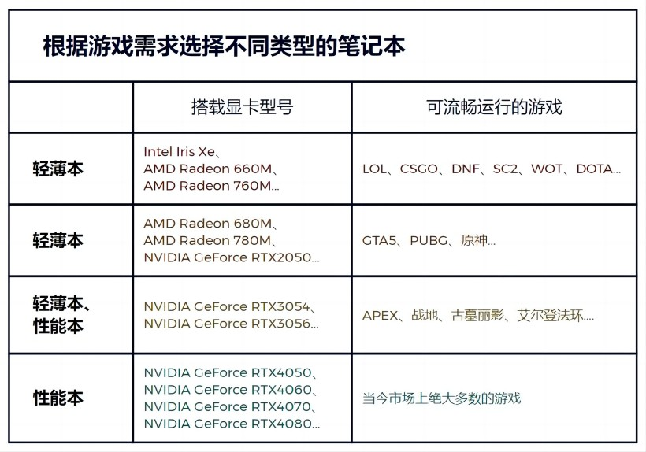

# 笔记本电脑的选择

> 鱼，我所欲也，熊掌亦我所欲也；二者不可得兼，舍鱼而取熊掌者也。

选购笔记本电脑时，即是在经费预算、性能释放、机身尺寸、颜值做工等多种因素之间做出合乎个人实际的取舍。回顾近三年来的笔记本电脑市场中那些红极一时的明星产品，它们无一不是在多因素的斡旋中做出了适度的妥协。下面我们将列举我们于《2023 年新生购机指南》中推荐的笔记本电脑产品，事实上，它们也是去年市场中的明星产品，以此说明背后的规律。

2023年笔记本电脑明星产品

在这十二款机型中，前六款属于轻薄本，而后六款属于性能本。根据购机推荐群的实践， 我们发现：大部分的新生在购买轻薄本时的预算在 5000 元左右，更加关注产品在屏幕素质、 拓展能力、续航时长等方面的综合实力，产品的性能释放已不再是他们最关心的点。不过在购买性能本时，同学们会更倾向于溢价少、售后良好的产品，且普遍会选择 RTX4060 显卡的配置。同时，联想拯救者系列产品虽然依然是性能本的标杆，但其较高的溢价也使得越来越多的同学选择购买机械革命、七彩虹等厂商的高性价比产品。虽然我们的统计结论并不能真正代表同学你最终的决策，但是看到这里，相信你已至少对笔记本电脑的选择过程有了一个初步的认识。

## 根据专业需求选购不同类型的笔记本电脑

在全日制本科学校中，不同的专业对笔记本电脑性能的要求是不一样的。对于处理器、显卡性能要求都低的专业自然就只需要用到轻薄本；对于处理器要求高，但却对显卡要求低的专业，比如土木工程学院，就可以直接选购处理器性能释放良好的轻薄本；而对于处理器、显卡性能要求都比较高的专业，比如建筑学院，有时即便是性能本的性能也无法满足他们的需 要，许多同学往往是先购买了轻薄本，后期再更换台式电脑。所以对于我们哈尔滨工业大学目前几乎所有的专业，同学们大致可以参考如下表格：

不同专业需求对应电脑性能水平（请点击放大查看）

## 根据游戏需求选购不同类型的笔记本电脑

游戏性能的高低是消费端电脑性能强弱的最直接体现，也是厂商营销宣传的重要卖点。虽然处理器和显卡的性能高低都会对电脑的游戏性能造成影响，但在当今的笔记本电脑市场环境中，升级电脑显卡配置带来的体验提升是最明显的。在此我们列出了今年新款笔记本电脑产品所能够搭载的主流显卡类型，各位同学可以根据你所想玩的游戏在此进行一定程度的参考：

不同游戏需求对应电脑性能水平

::: tip
此表中对于可流畅运行的定义为在 1920\*1080 分辨率、特效中的设置下，Benchmark
平均帧率可达到 60FPS。若对游戏的分辨率、特效、平均帧数、1%LOW 帧数有更高的要求，建议适度提高配置。
:::

