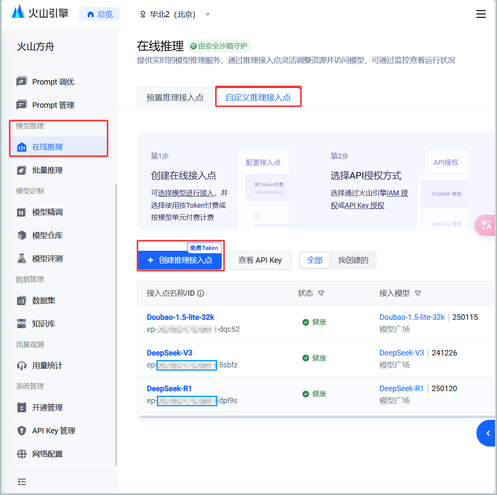

# **Dive Deeper, Seek Further** 一种高效、稳定的 DeepSeek 系列模型调度方案

**作者**：劳家康 & lkyu

**单位**：哈尔滨工业大学，仪器科学与工程学院 & 未来技术学院

**日期**：2025 年 2 月 25 日

## 一、背景介绍

自 2025 年 1 月 20 日 DeepSeek-R1 系列模型发布以来，其卓越的推理能力不仅震撼了业内研究人员，更在全球范围内掀起了前所未有的体验热潮。然而，面对空前高涨的用户访问量，DeepSeek 官方服务稳定性大幅下降，多次因流量过载而 "爆红" 宕机。与此同时，尽管众多第三方调度方案如雨后春笋般涌现，但市场却陷入了鱼龙混杂的局面：一些平台或机构滥用所所谓 "满血版" 的招牌招摇过市，实则**挂羊头卖狗肉**，所提供的模型性能参差不齐，**甚至暗藏安全隐患**[^1]，让用户苦不堪言。

[^1]: [公安机关提醒！仿冒 DeepSeek 的手机木马病毒被捕获 - 腾讯网-人民日报](https://news.qq.com/rain/a/20250301A02YWJ00)

为解决这一问题，本教程从广大用户的实际需求出发，提出了一种基于开源大模型调度客户端 Cherry Studio 和领先云计算服务平台火山引擎（VolcEngine）的**高效、稳定**的 DeepSeek 系列模型调度方案。本方案旨在为开发者、研究者以及广大学生提供切实可行的解决方案，助力用户轻松驾驭 DeepSeek 系列模型的强大能力。

## 二、基础设置

### Step 2.1：下载并安装 Cherry Studio 客户端

Cherry Studio 是一款功能强大的开源跨平台大模型调度客户端。该客户端不仅支持多样化的模型供应商，还预置了 300 多种智能助手模板，更集成了搜索增强生成和网页搜索功能，能够为用户提供更加便捷、智能的使用体验。

  <a href="https://cherry-ai.com"> Cherry Studio 官网页面链接：https://cherry-ai.com </a>

### Step 2.2：实名注册火山引擎平台 {#step2-2}

火山引擎是国内领先的云计算服务平台，提供计算、存储、数据库、大数据和人工智能等多样化云服务。该平台拥有丰富的计算资源，是国内调度 Doubao 以及 DeepSeek 系列模型的最佳选择，在响应延迟、输出速率、应用功能和使用成本等方面均表现卓越。

  <a href="https://www.volcengine.com/"> 火山引擎平台页面链接：https://www.volcengine.com/</a>

如果您对本教程感到满意，欢迎点击图中所示的 "参与活动" 按钮，并使用邀请码 **QVCCGDLJ** 完成注册。通过这一步骤，您不仅能获得官方赠送的 60 万 tokens 推理额度，还可额外领取 15 元大模型代金券。登录成功后，请点击页面右上角的用户头像，进入账号管理界面，完成实名认证，以解锁后续操作。

### Step 2.3：创建火山方舟平台 API Key 和模型推理点 {#step2-3}

<!-- 链接片段使用.会报错 -->

完成 [**Step 2.2**](#step2-2) 后，前往火山方舟一站式大模型服务平台的 "系统管理 > API Key 管理" 页面，点击 "创建 API Key"。请注意，API Key 是您请求火山方舟大模型服务的重要凭证，务必妥善保管，避免泄露给他人，以防造成不必要的损失。

  <a href="https://console.volcengine.com/ark/region:ark+cn-beijing/apiKey/"> 火山方舟平台 API Key 管理页面链接：https://console.volcengine.com/ark/region: ark+cn-beijing/apiKey </a>

接下来，前往 "模型推理 > 在线推理 > 自定义推理接入点" 页面，点击 "创建推理接入点"，在弹出页面中填写以下信息：

- **接入点名称**：建议直接使用模型名称，例如 `DeepSeek-R1`
- **接入点描述**：可选填写，建议留空
- **模型选择**：选择需要使用的模型，例如 `DeepSeek > DeepSeek-R1 > 260120`
- **开通模型**：首次创建模型推理接入点时，系统会提示 "该模型未开通，开通后可创建推理接入点"，点击 "立即开通" 即可

  <a href="https://console.volcengine.com/ark/region:ark+cn-beijing/endpoint/"> 火山方舟平台在线推理页面链接：https://console.volcengine.com/ark/region: ark+cn-beijing/endpoint/</a>

最后，点击 "确认接入" 完成推理接入点的创建，开启在线推理服务。

### Step 2.4: 配置 Cherry Studio 客户端

完成 [**Step 2.3**](#step2-3) 后，需要在 Cherry Studio 客户端中配置推理接入点信息。点击客户端左下角的齿轮图标进入设置，在 "模型服务" 页面中找到 "火山引擎" 选项，然后将右上角的按钮切换至开启状态，填写以下信息：

- **API Key**：填入 [**Step 2.3**](#step2-3) 中获得的 API Key

然后在 "添加模型" 页面填写以下信息：

- **模型 ID**：[**Step 2.3**](#step2-3) 中获得的推理接入点 ID，例如 `ep-xxxxxxxxxxxxxx-xxxxx`
- **模型名称**：建议与接入点名称保持一致，例如 `DeepSeek-R1`
- **分组名称**：建议与模型系列保持一致，例如 `DeepSeek`

点击 "添加模型" 完成配置。使用时，请留意对话页面上方的模型标识，在本教程中会显示为 `DeepSeek-R1 | 火山引擎`。

## 三、进阶设置：联网搜索功能

完成基础设置后，我们可以进一步创建具备联网搜索能力的模型。虽然 Cherry Studio 在 v1.0.0 版本后通过集成 tavily API 实现了联网搜索功能，但经过实测，效果有限。因此，我们可以借助火山引擎平台的服务组件实现模型的高质量联网搜索。具体步骤如下：

### Step 3.1: 开通火山方舟平台联网内容插件组件库 {#step3-1}

前往火山方舟一站式大模型服务平台的 "应用实验室 > 组件库" 页面，点击 "开通联网内容插件"。

  <a href="https://console.volcengine.com/ark/region:ark+cn-beijing/components/"> 火山方舟平台组件库页面链接：https://console.volcengine.com/ark/region: ark+cn-beijing/components/</a>

### Step 3.2: 创建大模型联网应用 {#step3-2}

完成 [**Step 3.1**](#step3-1) 后，前往 "应用实验室 > 我的应用" 页面，点击 "创建应用"。

  <a href="https://console.volcengine.com/ark/region:ark+cn-beijing/assistant/"> 火山方舟平台我的应用页面链接：https://console.volcengine.com/ark/region: ark+cn-beijing/assistant/</a>

在弹出的页面中，依次选择 "零代码" 和 "单聊"，然后在 "新建应用" 页面填写以下信息：

- **名称**：建议在原模型名称基础上添加额外标识，例如 `DeepSeek-R1-Pro`
- **推理接入点**：选择已创建的推理接入点，例如 `ep-xxxxxxxxxxxxxx-xxxxx`
- **开启联网内容插件**：勾选此选项以允许应用访问互联网内容（可根据需要完成高级配置）

最后，点击 "发布" 获取应用 ID。

### Step 3.3: 配置 Cherry Studio 客户端联网模型

完成 [**Step 3.2**](#step3-2) 后，在 Cherry Studio 客户端中配置联网模型。点击客户端左下角的齿轮图标进入设置，在 "模型服务" 页面中找到 "添加" 选项，填写以下信息完成自定义服务设置：

- **提供商名称**：可自定义填写
- **提供商类型**：选择 OpenAI

然后将右上角的按钮切换至开启状态，逐步填写：

- **API Key**：填入 [**Step 2.3**](#step2-3) 中获得的 API Key
- **API 地址**：设置为 **<https://ark.cn-beijing.volces.com/api/v3/bots/>**
- **模型 ID**：[**Step 3.2**](#step3-2) 中获得的应用 ID，例如 `bot-xxxxxxxxxxxxxx-xxxxx`
- **模型名称**：建议与应用名称保持一致，例如 `DeepSeek-R1-Pro`
- **分组名称**：建议与模型系列保持一致，例如 `DeepSeek`

点击 "添加模型" 完成联网模型的配置。

---

至此，您已成功完成 DeepSeek 系列模型的基础调度和联网搜索功能配置。通过这一高效稳定的方案，您可以充分发挥 DeepSeek 模型的强大能力，在此祝愿您的研究和工作更上一层楼。
