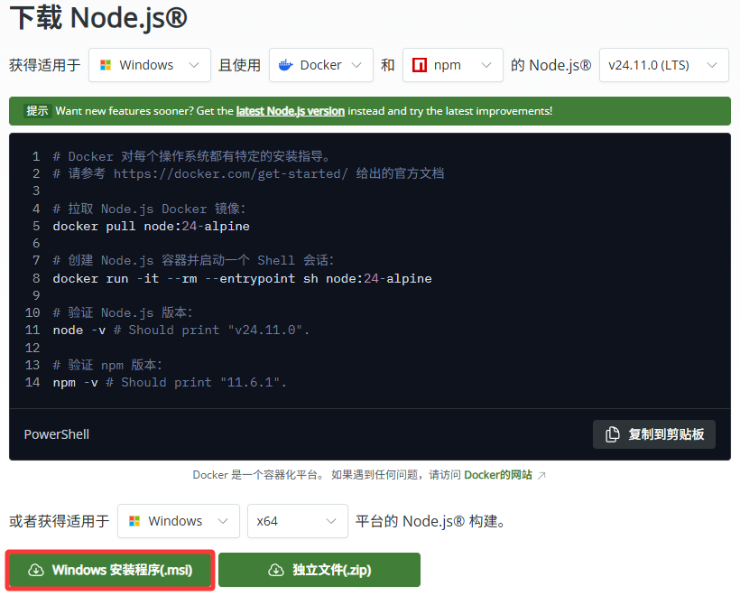
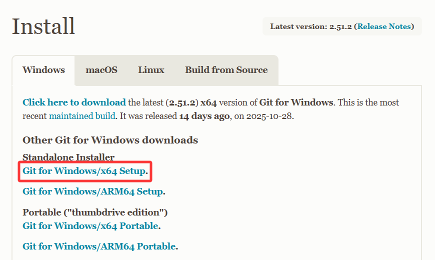
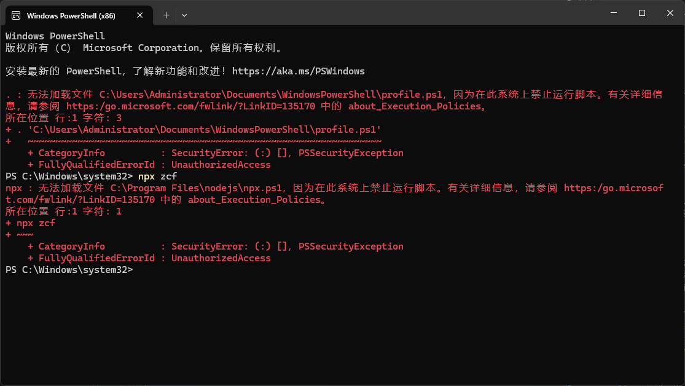
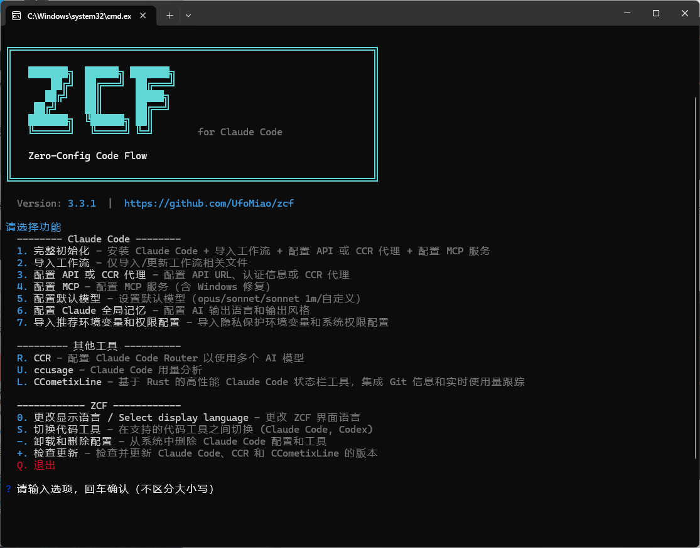
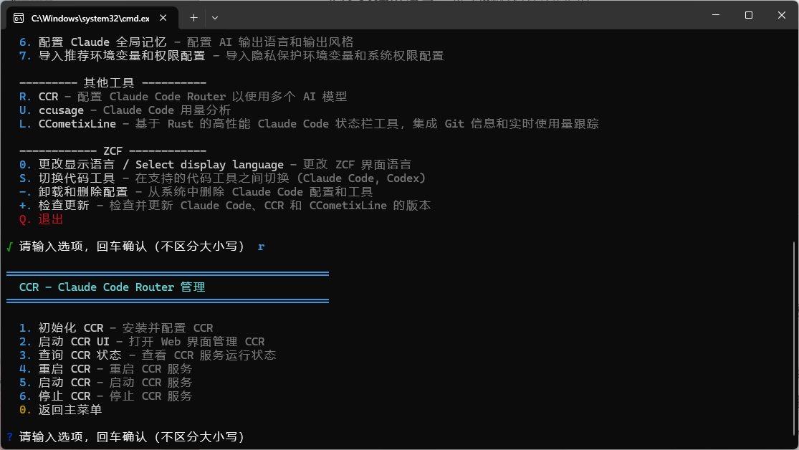
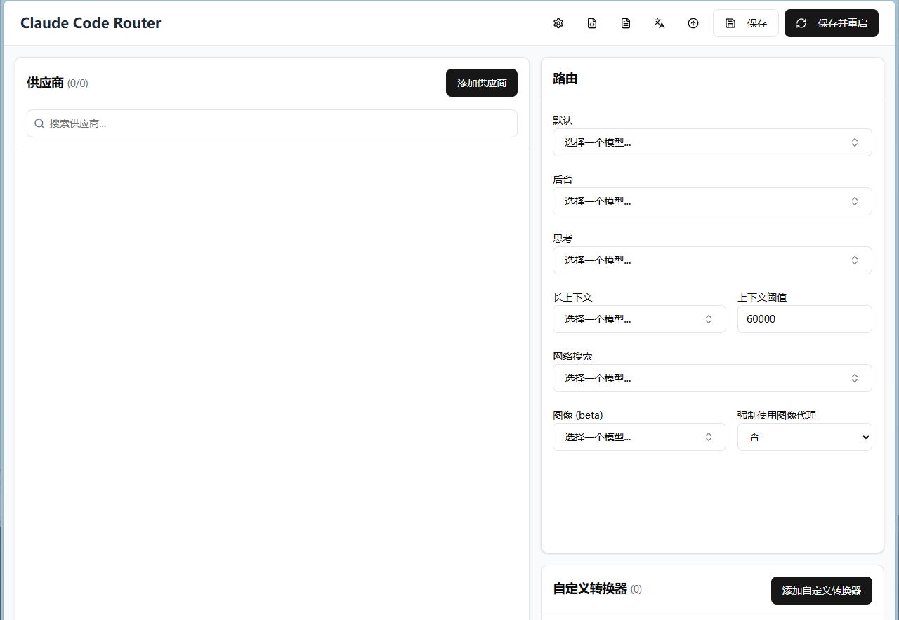
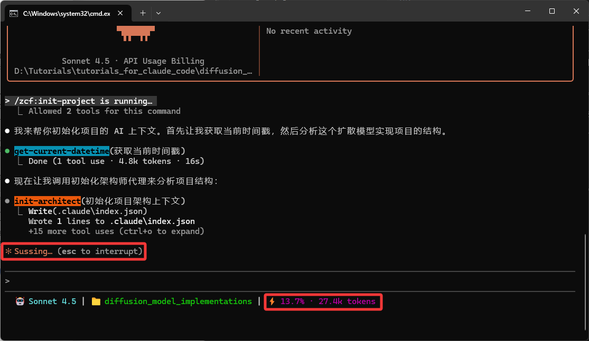

# 基于 Zero-Config Code Flow 的 Claude Code 配置教程

<br/>原文名为：《What could a soul like that be capable of? 基于 Zero-Config Code Flow 的 Claude Code 配置教程》
<br/>主要作者：劳家康，来自哈尔滨工业大学仪器科学与工程学院。排版：LKYU。
<br/>发布时间：2025 年 11 月 11 日

## 背景介绍

使用自然语言实现程序设计和开发，一直是无数“编程小白”的终极梦想，也是学术界和工业界长期努力的研究方向。近年来，大语言模型（Large Language Models，LLMs）的快速发展，推动了 AI 驱动的开发环境（AI-Driven Development Environments，AIDEs）的长足进步。以 [Cursor](https://cursor.com/cn) 和集成 [GitHub Copilot](https://github.com/features/copilot) 的 [Visual Studio Code](https://code.visualstudio.com) 为代表的 AIDEs，已经让这一梦想部分实现，通过智能代码补全和自动化辅助，提升了编程效率。

然而，当广大学生用户将这些工具应用于实际科研编程任务时，往往面临成本、时间和性能的限制。一方面以 Cursor 为例，其全代码库上下文感知能力和代码补全体验备受好评，但其频繁变更的付费策略对学生用户并不友好；另一方面以 GitHub Copilot 为例，其通过 [GitHub Education](https://education.github.com) 计划为学生用户提供免费使用资格，但其相对较弱的上下文感知能力和代码补全体验，在处理复杂项目需求时往往力不从心。除此之外，市场上的其他选项，例如以 [Trae](https://www.trae.cn)、[Qoder](https://qoder.com)、[CodeBuddy](https://copilot.tencent.com) 为代表的新兴 AIDEs，虽然性价比颇高，但在模型切换灵活性和代码补全体验上仍然存在短板；而以 [Continue](https://www.continue.dev)、[Roo Code](https://www.continue.dev) 为代表的开源插件，虽然提供高度定制性，但也因此提高了使用门槛，难以实现开箱即用的效果。

以上问题促使了 [Anthropic](https://www.anthropic.com) 的 [Claude Code](https://claude.com/product/claude-code) 和 [OpenAI](https://openai.com) 的 [Codex](https://openai.com/codex) 等基于命令行界面（Command Line Interface，CLI）的下一代编程智能体（Agents）的出现。这些智能体不仅通过插件框架、子代理协作、工具调用和沙盒执行等技术手段，显著提升了自主编程能力，甚至可以集成多种模型上下文协议（Model Context Protocols，MCPs），为用户提供更为先进的程序设计和开发体验。当然，使用这些先进的智能体对于中国地区的学生用户而言也并非易事。以 Claude Code 为例，由于 Anthropic 官方高昂的资费和不友好的地区政策，诸多用户必须寻求“曲线救国”的方案，一是需要通过配置开源项目 [Claude Code Router（CCR）](https://github.com/musistudio/claude-code-router) 实现对 Claude Code 模型的应用程序编程接口（Application Programming Interface，API）代理，二是需要集成其他 MCPs 以弥补代理模型相对于官方模型的性能差异。这对于本来就是“编程小白”的学生用户而言，无疑是一道难以逾越的门槛。

为彻底解决以上问题，本教程从广大学生用户的需求出发，在 Windows 操作系统下基于开源项目 [Zero-Config Code Flow（ZCF）](https://github.com/UfoMiao/zcf) 的一站式安装和设置方案，详细介绍如何以极低的成本和时间投入，快速搭建起一个高性能的自动化编程环境，充分释放现代 Agent AI 工具在 vibe coding 领域的强大生产力。

## 安装 ZCF

### 安装 Node.js 环境

根据 ZCF 的项目说明，安装 ZCF 需要使用指令：

```bash
npx zcf
```

其中，npx 是 [Node.js](https://nodejs.org/zh-cn) 环境下的包执行工具，因此需要下载其最新长期支持（Long Term Support，LTS）版本的安装包。

<div style="margin: 0 auto; text-align: center; width: 75%">
  
  <a href="https://nodejs.org/zh-cn/download">Node.js 下载页面链接：https://nodejs.org/zh-cn/download</a>
</div>

下载完成后，双击安装包文件进行安装，Node.js 环境的安装过程较为简单，除了需要勾选“I accept the terms in the License Agreement”选项外，建议全部保持默认设置。

### 安装 Git Bash 终端（可选）

尽管根据 ZCF 的项目说明，安装 ZCF 并不需要预安装 Git 环境，并且 Claude Code 和 ZCF 项目均支持在 Windows 系统的 PowerShell 或命令提示符（CMD）中直接运行。但如果你青睐在 Windows 上获得 Linux 风格的终端体验，可以考虑安装 Git Bash。这是因为 Git Bash 终端内置了可移植操作系统接口（Portable Operating System Interface，POSIX）兼容环境，可以提升 Claude Code 性能的稳定性，同时也为日后的代码仓库版本管理提供了便利。

不过，笔者其实更推荐有大量编码需求的开发者使用 WSL（Windows Subsystem for Linux）来替代 Git Bash。WSL 是 Windows 上运行的原生 Linux 内核，它在完整提供几乎纯血的 Linux 功能的同时，与 Windows 系统的各项功能以及市面上流行的开发工具（如 VS Code、PyCharm 等）有极佳的兼容性和良好的集成性。基于以上优点，WSL 能够为开发者提供更加流畅和高效的 Windows 开发体验。

如果你想体验一下 WSL，可以参考笔者的另一篇文章：[在如今最好的 Linux 发行版上使用 Linux——WSL 使用 Q&A](/posts/WSLQA)，进行配置，WSL 完整支持本文介绍的所有工具。

如果你打算使用 Git Bash 进行开发，建议访问其官网下载最新版本的安装包。

<div style="margin: 0 auto; text-align: center; width: 75%">
  
  <a href="https://git-scm.com/install/windows">Git Bash 终端下载页面链接：https://git-scm.com/install/windows</a>
</div>

下载完成后，双击安装包文件进行安装，Git Bash 终端的安装过程同样简单，除了需要勾选“Add a Git Bash Profile to Windows Terminal”选项和“Use Visual Studio Code as Git's default editor”选项外，建议全部保持默认设置。

需要说明的是，ZCF 和 Claude Code 完全支持原生 Windows PowerShell 终端，下文的所有操作均以 Windows PowerShell 终端为例，无需额外配置。若读者偏好类 Unix 风格的终端，可以全程使用 Git Bash 终端执行命令，两种终端的使用方法和效果完全一致。

### 安装 ZCF 并执行完整初始化

成功安装 Node.js 环境和 Git Bash 终端后，打开 Windows PowerShell 终端，输入以下命令安装 ZCF：

```bash
npx zcf
```

但是此时往往会遭遇如下错误提示：

```bash
npx : 无法加载文件 C:\Program Files\nodejs\npx.ps1，因为在此系统上禁止运行脚本。有关详细信息，请参阅 https:/go.microsoft.com/fwlink/?LinkID=135170 中的 about_Execution_Policies。
```

<div style="margin: 0 auto; text-align: center; width: 75%">
  
  PowerShell 终端执行策略错误提示
</div>

这是因为在默认情况下，Windows PowerShell 终端禁止执行未签名的脚本文件。因此需要修改 Windows PowerShell 终端的执行策略：

```bash
Set-ExecutionPolicy RemoteSigned -Scope CurrentUser
```

修改执行策略后，重新打开 Windows PowerShell 终端，即可通过上文的命令成功安装 ZCF。

<div style="margin: 0 auto; text-align: center; width: 80%">
  
  ZCF 主页面
</div>

安装 ZCF 后，需要执行完整初始化流程，在主页面中输入选项“1”并回车开始初始化，推荐具体设置如下：

- **选择 Claude Code 配置语言**：推荐“English”选项

- **选择 AI 输出语言**：推荐“简体中文”选项

- **选择 API 配置模式**：推荐“使用 CCR 代理”选项

- **选择要安装的工作流类型**：推荐全选

- **选择要安装的输出风格**：推荐“专业的软件工程师”选项

- **选择要安装的输出风格**：推荐“工程师专业版”和“默认风格”选项

- **是否配置 MCP 服务**：推荐“Y”选项

- **选择要安装的 MCP 服务**：推荐全选除了“Exa AI 搜索”以外的所有选项

## 配置 CCR

完成上述安装步骤后，ZCF 的完整环境已经成功搭建。接下来的关键一步便是配置 CCR 以摆脱 Anthropic 官方高昂资费和地区政策的限制。

当然，在正式配置 CCR 之前，首要任务是选择合适的大模型服务平台的应用程序接口，以支撑 Claude Code 运行所产生的高额 Token 消耗。对于学生用户而言，模型的性价比往往是其优先考量的要素。经过编者的实际测试和综合考量，筛选出以下三个颇具性价比的大模型服务平台，供读者权衡选用：

- **[智谱 AI 开放平台](https://open.bigmodel.cn)**：该平台推出的 [GLM Coding Plan](https://bigmodel.cn/glm-coding) 性价比极高。以每月 20 元的 Lite 套餐为例，用户可以享受每 5 小时最多约 120 次的调用额度，相当于 Anthropic 官方 Pro 套餐额度的 3 倍。其缺点在于模型种类有限，经典的 GLM-4.5 模型对于 Claude Code 的工具调用功能支持良好，但是上下文长度仅为 128K；而新推出的 GLM-4.6 模型虽然将上下文长度提升至 200K，但是存在容易遗忘和工具调用支持不佳的问题。
- **[硅基流动](https://cloud.siliconflow.cn)**：该聚合平台提供邀请奖励机制。用户可以通过在淘宝、闲鱼等渠道，以大约 90 元的价格换取大约 1400 元的赠送额度，随用随付，灵活性较高。其缺点在于使用赠送额度的模型输出速度较慢，在执行以长思考为主的编程任务中，可能会导致效率降低。
- **[云雾 API](https://yunwu.ai/register?aff=bxvJ)**：该聚合平台基于中转方案，提供了极高的模型调用速度和相较于官方大幅降低的资费。其缺点在于选择不同的分组渠道时，可能需要配置不同的统一资源定位符（Uniform Resource Locator，URL）。

:::tip
诸如“云雾 API”的非第一方模型资源提供者，即俗称的“中转站”、“转发站”，基本都使用“模型分组”来控制不同模型的调用。简单来讲，同一模型在不同分组被调用时，其来源和内部配置不一定相同。因此即便是同一模型，在不同分组中的输出速度，稳定性，模型能力，上下文长度，工具调用能力等，均可能受分组影响。最重要的是，各个分组之间存在计费倍率不同，请调用用户注意区分，合理选择。

实际以云雾 API 平台为例，其 `default` 分组中的模型不仅速度较为有限，同时笔者还通过各种测试观察到，其模型存在：输出稳定性和一致性较差、推理强度降低、上下文低于标配、部分无法调用 Claude Code 中的工具等问题，如果需要使用该类第三方站点的模型，请根据模型的使用情景，创建分组合理的 API 供 Claude Code 调用。
:::

### 启动 CCR 服务

打开 Windows PowerShell 终端，输入以下命令打开 CCR 管理页面：

```bash
npx zcf ccr
```

<div style="margin: 0 auto; text-align: center; width: 75%">
  
  CCR 管理页面
</div>

在 CCR 管理页面输入选项“2”并回车打开 CCR UI，注意首次打开 CCR UI 时需要使用登录密钥“sk-zcf-x-ccr”。

<div style="margin: 0 auto; text-align: center; width: 80%">
  
  CCR UI
</div>

::: warning
如果想在终端进程（ZCF 命令）退出后仍然保持 CCR 服务的开启状态（这是 Claude Code 正常调用 LLM 的必要条件），必须使用选项“2”启动。
:::

### 填写供应商

在 CCR UI 的供应商选项卡中，选择添加供应商，根据所选的大模型服务平台，填写对应信息：

- **以智谱 AI 开放平台为例，填写流程如下：**
  1. 在“从模板导入”处选择“智谱 Coding Plan”
  2. 在“API 密钥”处填写从智谱 AI 开放平台获取的 API 密钥
  3. 在“模型”处填写所需调用的模型名称，推荐：“glm-4.6”、“glm-5”
  4. 点击“保存”

- **以硅基流动为例，填写流程如下：**
  1. 在“从模板导入”处选择“siliconflow”
  2. 在“API 密钥”处填写从硅基流动获取的 API 密钥
  3. 在“模型”处填写所需调用的模型名称，推荐：“moonshotai/Kimi-K2-Thinking”、“MiniMaxAI/MiniMax-M2.5”、“zai-org/GLM-5”、“deepseek-ai/DeepSeek-V3.2”
  4. 点击“保存”

- **以云雾 API 为例，填写流程如下：**
  1. 在“名称”处填写“云雾 API Claude Code”
  2. 在“API 完整地址”处填写“<https://yunwu.ai/v1/messages”>
  3. 在“API 密钥”处填写从云雾 API 获取的 API 密钥，并在云雾 API 配置分组为“Claude Code 专属”
  4. 在“模型”处填写所需调用的模型名称，推荐：“claude-sonnet-4-6”
  5. 在“供应商转换器”处选择“Anthropic”
  6. 点击“保存”

:::warning

1. 常见的大模型服务平台可以在“从模板导入”中获取对应的模板，之后依次填写“API 密钥”、“模型”等信息后点击“保存”即可。
2. 特殊的大模型服务平台需要手动填写所有信息。具体而言：OpenAI 兼容的服务平台在“API 完整地址”处应以“completions”结尾；Anthropic 兼容的服务平台在“API 完整地址”处应以“messages”结尾，此外还有一种特殊情况是 Codex 兼容的服务平台，其在“API 完整地址”处应以“responses”结尾。具体 API 填写范例亦因平台而异，请参考正确的部署示例，或参考平台的 api 文档。
3. 上述平台和推荐模型仅限笔者截至撰写此文时，体验过的模型和平台。随着时间的推移：
   - **各平台的性价比和可用性可能会发生变化**，请各位用户在使用时自行判断是否符合自己的需求。
   - **更强大的编码模型也正在被不断推出**，上面提到的模型有可能已经被更优秀的模型所替代，请用户在选用模型的时候参考最新的信息。

:::

### 填写路由

在 CCR UI 的路由选项卡中，填写对应信息：

| 路由类型 |   适用任务   |       模型选择逻辑       |              推荐模型               |
| :------: | :----------: | :----------------------: | :---------------------------------: |
|   默认   |   通用任务   | 高性能、中上下文、短思考 |     GLM-5 或 claude-sonnet-4-6      |
|   后台   | 低优先级任务 |          低成本          |       DeepSeek-V3.2 或 GLM-5        |
|   思考   | 高复杂度任务 | 高性能、长上下文、长思考 | Kimi-K2-Thinking 或 claude-opus-4-6 |
| 长上下文 | 长上下文任务 |     高性能、长上下文     |  MiniMax-M2.5 或 claude-sonnet-4-6  |

---

至此，恭喜读者你已成功安装 ZCF 并配置 CCR，可以开始使用 Claude Code 进行高效的程序设计和开发了。接下来的章节将介绍如何使用 Claude Code 完成实际的编程任务。

## 使用 Claude Code

本章节基于 ZCF 的项目说明，概述 Claude Code 的核心逻辑、关键命令和使用案例，帮助读者迅速上手 Claude Code。

### 核心逻辑

Claude Code 的核心逻辑包含自然语言驱动、工作流协作和上下文管理三大要素。用户通过自然语言触发集成工作流，智能体随即进入协作阶段，依次完成研究、规划、编码、审查等任务；在此过程中，系统调用多种 MCP 服务，增强上下文感知，确保智能体深刻理解任务背景。

### 关键命令

ZCF 为 Claude Code 扩展了命令系统，按任务类型选用，可显著提升开发结构化与效率。关键命令具体如下：

|     命令名称      |  命令功能  |                具体行为                 |
| :---------------: | :--------: | :-------------------------------------: |
| /zcf:init-project | 项目初始化 | 扫描项目目录结构并生成 CLAUDE.md 等文件 |
|     /zcf:feat     |  功能开发  |         结构化执行功能开发任务          |
|     /compact      | 压缩上下文 |           压缩当前会话上下文            |
|      /clear       | 清除上下文 |           清空当前会话上下文            |
|       /exit       |  安全退出  |        退出当前会话并保留上下文         |
|  /zcf:git-commit  |  版本提交  | 自动生成规范 commit 信息并推送至 GitHub |

### 使用流程

本小节以基于 Python 实现“即插即用的多种扩散模型实现”的简单项目为例，演示如何使用 Claude Code 进行开发。

- **准备工作**：
  1. 创建项目文件夹，例如“diffusion_model_implementations”
  2. 确认项目需求和代码风格规范，分别保存为“idea.md”和“coding_paradigm.md”

- **启动 CCR**：
  1. 打开 Windows PowerShell 终端，输入`npx zcf ccr`命令打开 CCR 管理页面
  2. 在 CCR 管理页面输入选项“4”并回车启动 CCR 服务

- **启动 Python 环境**：
  1. 确保自己的 Conda 终端，例如 Anaconda Prompt 和 Miniforge Prompt，已与命令行终端（cmd）同步，如果未同步可以通过输入`conda init cmd.exe`命令后重启终端实现同步
  2. 打开 Conda 终端或命令行终端，输入`conda activate env_name`命令激活对应 Python 环境

- **切换至项目目录**：
  1. 在 Conda 终端或命令行终端中，输入`cd path\to\diffusion_model_implementations`命令切换至项目目录

- **初始化项目**：
  1. 在 Conda 终端或命令行终端中，输入`claude`命令启动 Claude Code
  2. 在 Claude Code 交互界面中，输入命令`/zcf:init-project`并回车，Claude Code 将自动扫描项目目录结构并生成 CLAUDE.md 等文件
  3. 在 Claude Code 交互界面中，输入命令`/zcf:feat 请根据 idea.md 和 coding_paradigm.md 的内容，帮助我实现即插即用的多种扩散模型`即可触发 Claude Code 的开发工作流

- **喜欢喝茶，拒绝抽烟**：
  1. 请勿关闭 Claude Code 交互界面，等待 Claude Code 完成任务
  2. 不时检查交互界面的工作流输出状态，学会判断 Claude Code 是否处于后台输出状态还是已经出现卡死或者结束问题，前者交互界面的工作流阶段会有动态特效，后者交互界面的工作流阶段会静止不动，需要双击`Esc`键中断并重新输入命令
  3. 不时检查交互界面的 CCometixLine 上下文状态，根据其中的上下文使用情况，适度使用`/compact`命令或者`/clear`命令压缩或者清除上下文
  4. 任务完成后，输入`/exit`命令安全退出 Claude Code 交互界面

<div style="margin: 0 auto; text-align: center; width: 75%">
  
  Claude Code 交互界面
</div>

### 其他技巧

在 AI 模型以周为单位快速迭代的同时，Claude Code 也在迅速拓展其功能，新版 Claude Code 引入了不同编码模式，分别是：Normal Mode、Auto-Accept Mode、Plan Mode。三种模式可以通过`Shift+Tab`循环切换。

顾名思义，Normal Mode 为常规模式，Auto-Accept Mode 为自动接受 AI 修改的信任模式，而 Plan Mode，即计划模式，最值得称道。如果你的任务：

- 较为复杂，需要分为多个步骤实现
- 需要进行彻底的代码仓库探索和理解
- 需要和 AI 进行充分交互式讨论后才能确定方案

Plan Mode 模式可以在你提出需求后首先进行项目探索和任务计划撰写，在得到你的确认和反馈后才会使用计划书作为参考并清空其他上下文（推荐选项），自动切换到 Auto-Accept Mode 进行专注的代码工作。

三种模式可以和前面提到的命令共同使用，充分激发 Claude Code 和代理模型的能力。此外，还有更多使用技巧和高级功能，篇幅有限笔者不在此展开，读者可以参考官方文档或其他教程资料进行学习和使用，祝您在 AI 编程的道路上高歌猛进，行稳致远！
