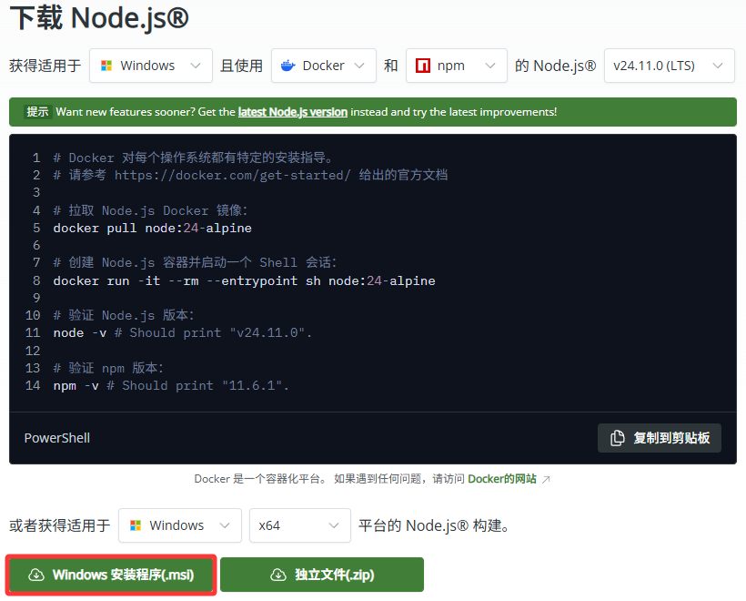
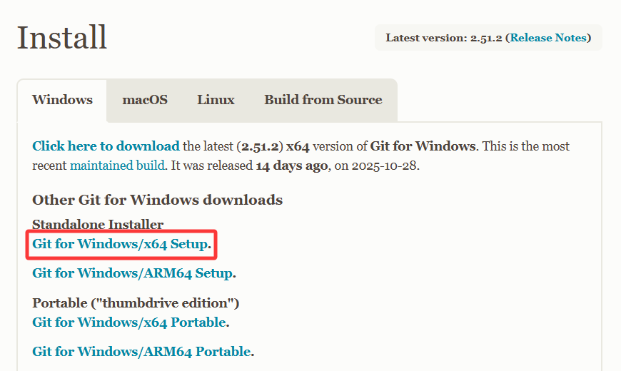
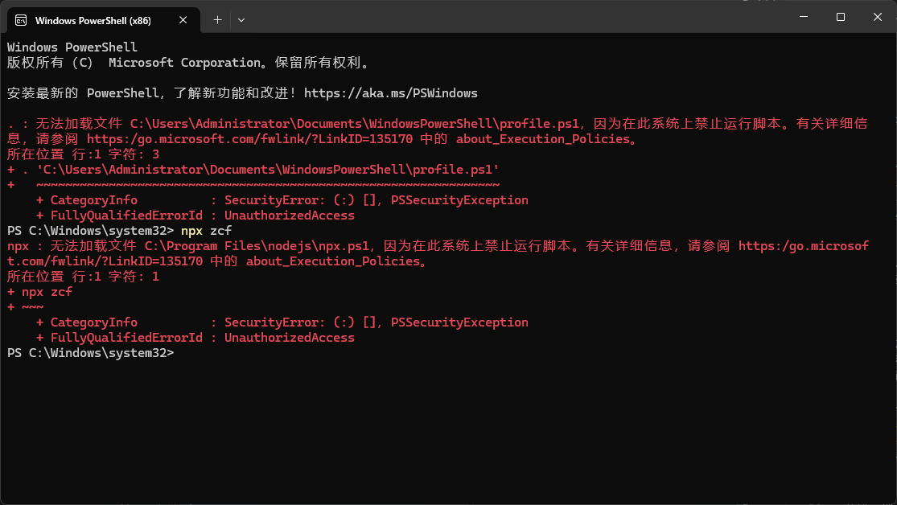
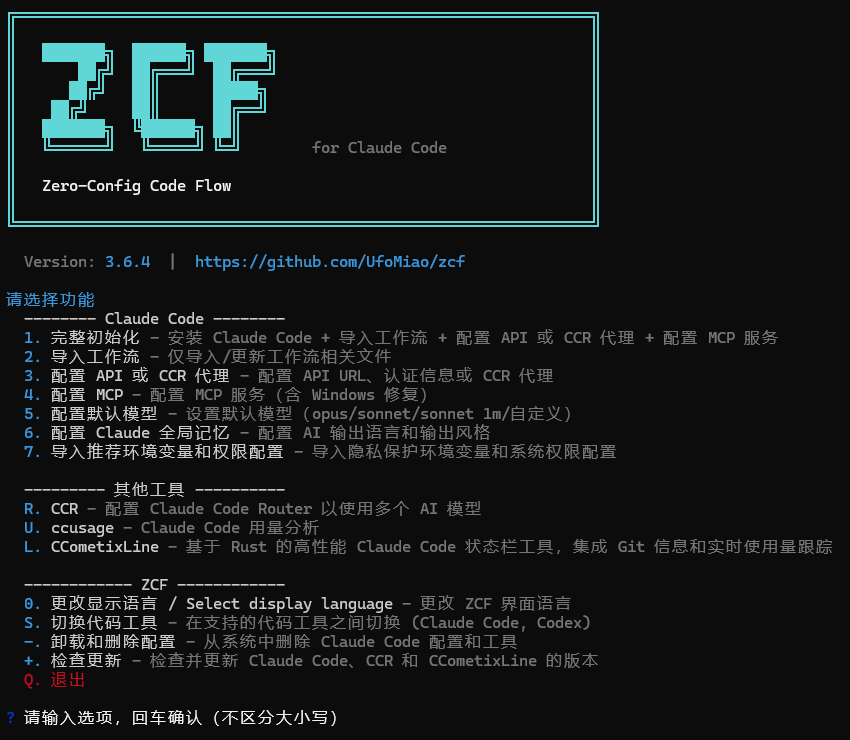
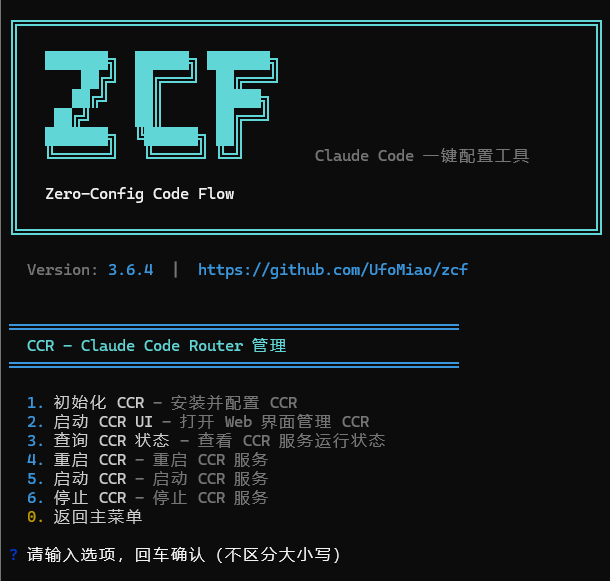
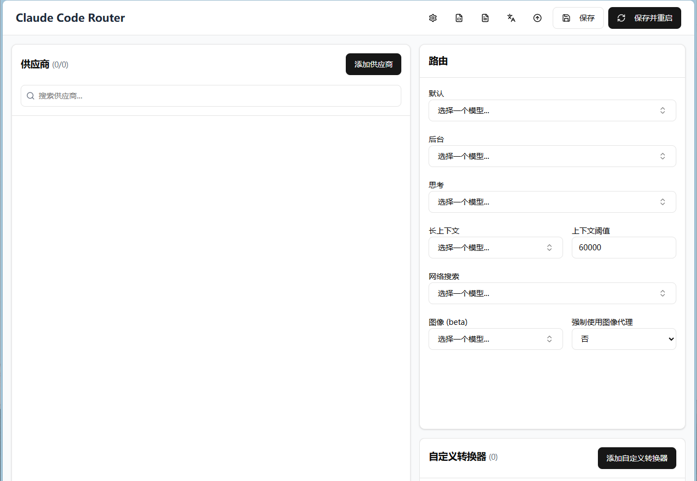
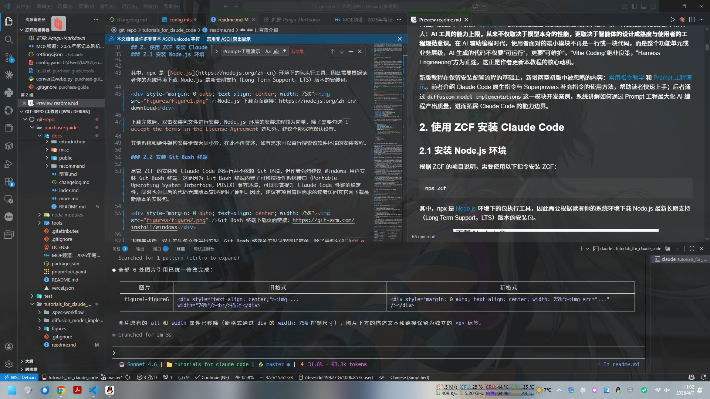
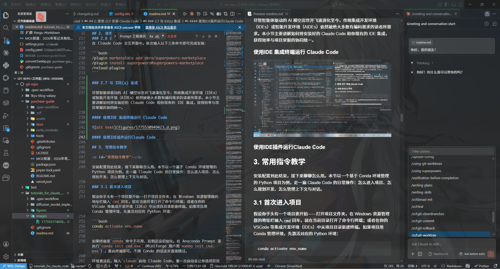

---
head:
  - - meta
    - name: keywords
      content: Vibe Coding,Claude Code,ZCF,AI,大模型,云雾API,GLM,智谱,Coding Plan,LLM,Minimax
---

<h1 align="center">善弈者谋势，不善者谋子<br/>基于Zero-Config Code Flow的Claude Code配置使用教程</h1>

---

<p style="text-indent: 0"><b>作者</b>：劳家康&韩律元</p>

<p style="text-indent: 0"><b>单位</b>：哈尔滨工业大学，仪器科学与工程学院&未来技术学院</p>

<p style="text-indent: 0"><b>日期</b>：2026年4月6日</p>

## 0.阅读导航

本教程面向希望在Windows操作系统上以极低成本快速搭建AI编程环境的学生用户。根据读者需求，可以选择不同的阅读起点：

- **如果希望完全理解作者的思考脉络**，建议完整阅读本教程
- **如果仅仅需要快速配置Claude Code环境**，建议阅读[使用 ZCF 安装 Claude Code](#ZCF)部分内容
- **如果已经成功配置Claude Code环境，但希望提高AI编程产出质量**，建议阅读后文中的[常用指令教学](#command)和作为实战演练的[Prompt 工程演示](#Prompt)部分内容

## 1.背景介绍

使用自然语言实现程序设计和开发，一直是无数“编程小白”的终极梦想，也是学术界和工业界长期努力的研究方向。近年来，大语言模型（Large Language Models，LLMs）的快速发展，推动了AI驱动的开发环境（AI-Driven Development Environments，AIDEs）的长足进步。以[Cursor](https://cursor.com/cn)和集成[GitHub Copilot](https://github.com/features/copilot)的[Visual Studio Code](https://code.visualstudio.com)（VSC）为代表的AIDEs，凭借智能代码补全和自动化工作流，已经让这一梦想部分实现。[来自 Stack Overflow 的行业调查](https://survey.stackoverflow.co/2025/ai)显示，已有约84%的开发者将AI工具纳入日常开发流程，甚至在部分团队的开发项目中，有近半的代码是由AI生成的。可以说，使用AI工具编程已是不可逆转的时代潮流。

然而，当广大学生用户将这些AI工具应用于实际科研编程任务时，往往面临成本、时间和性能的限制。一方面以Cursor为例，其全代码库上下文感知能力和代码补全体验备受好评，但其付费策略对于预算有限的学生用户并不友好；另一方面以GitHub Copilot为例，其通过[GitHub Education](https://education.github.com)计划为学生用户提供免费使用资格，但其在近期的更新中移除了学生用户对Claude Opus 4.6等先进模型的访问权限，加之上下文感知能力本就薄弱，面对复杂项目时愈发力不从心。除此之外，以[Trae](https://www.trae.cn)、[Qoder](https://qoder.com)、[CodeBuddy](https://copilot.tencent.com)为代表的新兴AIDEs性价比颇高，却在模型切换灵活性上存在短板；以[Continue](https://www.continue.dev)、[Roo Code](https://github.com/RooVetGit/Roo-Code)为代表的开源插件定制性强，却有较高的使用门槛，难以开箱即用。

以上问题促成了以[Claude Code](https://claude.com/product/claude-code)和[Codex](https://openai.com/codex)为代表的下一代编程智能体（Agents）的诞生。此类Agent基于命令行界面（Command Line Interface，CLI），通过工具调用、子代理协作、沙盒执行等机制显著提升了自主编程能力，并支持通过上下文协议（Context Protocol，MCP）集成外部工具和服务。在此基础上，技能（Skill）系统进一步将任务流程和领域知识封装为可复用的模块，持续拓展着Agent的能力边界。一言以蔽之，用户只需在终端中以自然语言描述需求，此类Agent即可产出远超传统AI辅助编程方案质量的代码。然而对于中国地区的学生用户而言，使用这些工具并非易事。以Claude Code为例，由于官方高昂的资费和不友好的地区政策，诸多用户不得不通过第三方应用程序编程接口（Application Programming Interface，API）曲线救国，并手动集成MCP和Skill以弥补代理模型与官方模型之间的性能差异。这对于本来就是“编程小白”的学生用户而言，无疑是一道难以逾越的门槛。

基于上述认知，作者于2025年11月发布初版教程，彼时以“What could a soul like that be capable of?”为引，承载着对LLM时代AI编程工具的浪漫想象。然而五个月过去，作者必须承认当初的乐观多少有些一厢情愿。这五个月里，以Coding Plan为代表的订阅制方案逐渐成熟，客观上降低了使用Agent工具的门槛。然而同一时期，[OpenClaw](https://openclaw.ai)的现象级爆红和随之而来的安全问题，以一种直接的方式提醒了所有人：**AI工具的能力上限，从来不仅取决于模型本身的性能，更取决于智能体的设计成熟度与使用者的工程规范意识**。在AI辅助编程时代，使用者面对的最小模块不再是一行或一块代码，而是整个功能单元或业务层级，AI生成的代码不仅要“可运行”，更要“可维护”。“Vibe Coding”绝非良策，“Harness Engineering”方为正途，这正是作者更新本教程的核心动机。

新版教程在保留安装配置流程的基础上，新增两章初版中被忽略的内容：[常用指令教学](#command)和[Prompt 工程演示](#Prompt)。前者介绍Claude Code原生指令与Superpowers补充指令的使用方法，帮助读者快速上手；后者通过`diffusion_model_implementations`这一模块开发案例，系统讲解如何通过Prompt工程最大化AI编程产出质量，进而拓展Claude Code的能力边界。

## 2.使用ZCF安装Claude Code<a id="ZCF"></a>

### 2.1 安装Node.js环境

根据ZCF的项目说明，需要使用以下指令安装ZCF：

```bash
npx zcf
```

其中，npx是[Node.js](https://nodejs.org/zh-cn)环境下的包执行工具，因此需要根据读者你的系统环境下载Node.js最新长期支持（Long Term Support，LTS）版本的安装包。

<div style="margin: 0 auto; text-align: center; width: 75%">Node.js下载页面链接：https://nodejs.org/zh-cn/download</div>

下载完成后，双击安装包文件进行安装，Node.js环境的安装过程较为简单，除了需要勾选`I accept the terms in the License Agreement`选项外，建议全部保持默认设置。

其他系统和硬件架构安装步骤大同小异，在此不再赘述，如有需求可以自行搜索该软件环境的安装教程。

### 2.2 安装Git Bash终端

尽管ZCF的安装和Claude Code的运行并不依赖Git环境，但作者强烈建议Windows用户安装Git Bash终端。这是因为Git Bash终端内置了可移植操作系统接口（Portable Operating System Interface，POSIX）兼容环境，可以显著提升Claude Code性能的稳定性，同时也为日后的代码仓库版本管理提供了便利。因此，建议有项目管理需求的读者访问其官网下载最新版本的安装包。

<div style="margin: 0 auto; text-align: center; width: 75%">Git Bash终端下载页面链接：https://git-scm.com/install/windows</div>

下载完成后，双击安装包文件进行安装，Git Bash终端的安装过程同样简单，除了需要勾选`Add a Git Bash Profile to Windows Terminal`选项和`Use Visual Studio Code as Git's default editor`选项外，建议全部保持默认设置。上述两个选项的启用依读者需求而定。

> 需要说明的是，ZCF和Claude Code完全支持原生Windows PowerShell终端，下文所有操作均以PowerShell终端为例，无需额外配置。如果读者偏好类Unix风格的终端，可以全程使用Git Bash终端执行命令，两者的使用方法和效果完全一致。

### 2.3 安装ZCF并执行完整初始化

成功安装Node.js环境和Git Bash终端后，打开Windows PowerShell终端，输入以下命令安装ZCF：

```bash
npx zcf
```

但是此时往往会遭遇如下错误提示：

```bash
npx : 无法加载文件 C:\Program Files\nodejs\npx.ps1，因为在此系统上禁止运行脚本。有关详细信息，请参阅 https:/go.microsoft.com/fwlink/?LinkID=135170 中的 about_Execution_Policies。
```

<div style="margin: 0 auto; text-align: center; width: 75%">PowerShell终端执行策略错误提示</div>

这是因为在默认情况下，Windows PowerShell终端禁止执行未签名的脚本文件，因此需要修改其执行策略：

```bash
Set-ExecutionPolicy RemoteSigned -Scope CurrentUser
```

修改执行策略后，重新打开Windows PowerShell终端，即可通过上文的命令成功安装ZCF。

<div style="margin: 0 auto; text-align: center; width: 75%">ZCF交互配置页面</div>

安装ZCF后，需要执行完整初始化流程，以便为读者一键安装配置Claude Code及其增效工具，在主页面中输入选项“1”并回车开始初始化，推荐具体设置如下：

- **选择Claude Code配置语言**：推荐“English”选项
- **选择AI输出语言**：推荐“简体中文”选项
- **选择Claude Code的安装方式**：推荐“npm”或者“cmd”选项
- **选择API配置模式**：推荐“使用CCR代理”选项
- **选择要安装的工作流类型**：推荐全选
- **选择要安装的输出风格**：推荐“工程师专业版”选项
- **是否配置MCP服务**：推荐“Yes”选项
- **选择要安装的MCP服务**：推荐全选除了“Exa AI搜索”以外的所有选项

### 2.4 修改Claude Code配置

完成ZCF安装和初始化后，Claude Code已可正常使用。但为使Windows用户获得更好的使用体验，建议打开文件`%USERPROFILE%\.claude\settings.json`，该地址通常对应于`C:\Users\your_username\.claude\settings.json`，执行如下配置：

```json
{
	"env": {
		"DISABLE_TELEMETRY": "1",
		"DISABLE_ERROR_REPORTING": "1",
		"DISABLE_INSTALLATION_CHECKS": "1",
		"CLAUDE_AUTOCOMPACT_PCT_OVERRIDE": "85",
		"CLAUDE_CODE_DISABLE_NONESSENTIAL_TRAFFIC": "1",
		"MCP_TIMEOUT": "60000",
		"ANTHROPIC_BASE_URL": "http://127.0.0.1:3456",
		"ANTHROPIC_API_KEY": "sk-zcf-x-ccr",

		// 7897 端口为 Clash Verge 的默认混合代理端口
		// 如果读者使用其他网络代理工具，请根据实际情况修改端口号
		// 如果你不知道此类工具，请忽略下面两行配置，随意配置将导致不可用
		"HTTP_PROXY": "http://127.0.0.1:7897",
		"HTTPS_PROXY": "http://127.0.0.1:7897"
	},

	// ... 其他配置项

	"statusLine": {
		"type": "command",
		"command": "ccline",
		"padding": 0
	}
}
```

相比于Claude Code的默认设置，上述配置主要调整了以下四个部分：

- **禁用安装检查**：Claude Code默认会在每次启动时执行安装检查并推荐新版安装方法，该信息容易挤占CCometixLine状态栏组件的显示空间。通过设置`DISABLE_INSTALLATION_CHECKS`环境变量即可禁用该检查。
- **提高上下文自动压缩触发阈值**：Claude Code默认在上下文使用率达到70%时触发自动压缩，但该阈值并非适用于所有任务，可能导致上下文过早被压缩。通过设置`CLAUDE_AUTOCOMPACT_PCT_OVERRIDE`环境变量，可将触发阈值调整至更合适的水平。
- **设置HTTP和HTTPS代理**：除浏览器外，Windows操作系统中的绝大多数应用程序均不支持系统级代理设置，需要通过设置`HTTP_PROXY`和`HTTPS_PROXY`环境变量使Claude Code的网络请求能够正确通过代理服务器转发，这在后续安装Superpowers时将起到重要作用。如果读者已在系统环境变量中配置了HTTP和HTTPS代理，则无需重复设置，这是因为Claude Code遵守父进程终端配置好的系统代理环境变量。
- **修改CCometixLine的command**：此外，CCometixLine状态栏组件在Windows操作系统下可能出现无法正常显示的问题。依据经验，可通过修改`statusLine`配置项中的`command`字段为`ccline`加以解决。

### 2.5 配置CCR

完成上述配置后，接下来的关键一步是配置CCR，以摆脱Anthropic官方高昂的资费和地区政策的限制。

在过去半年里，以Coding Plan为代表的订阅制方案逐渐成熟，成为学生用户使用Agent工具的主流选择。此类方案成本远低于官方按量计费，不过需要注意的是，订阅制方案普遍存在使用数据被用于后续模型训练的问题。如果读者对此存在顾虑，也可以使用API密钥按量调用，但成本将显著增加。经过作者的实际测试和综合考量，按性价比从高到低筛选出以下四个平台，供读者权衡选用：

- **[MiniMax](https://platform.minimaxi.com)**：
  1. 性价比最高的选择。主力模型MiniMax M2.7和M2.5参数量均为230B-A10B，主推的Plus套餐仅49元/月（490元/年），支持每5小时1500次模型调用，并提供极速版套餐选项以满足用户实时性需求，服务稳定性好。
  2. 缺点在于主力模型参数量较小，性能落后于GLM-5系列模型和Kimi K2.5模型，未针对Agent系统进行专项优化，且不提供联网、视觉等MCP工具链。
  3. **API Base URL：**`https://api.minimaxi.com/anthropic`。

- **[GLM](https://open.bigmodel.cn)**：
  1. 综合实力均衡的选择。主力模型GLM-5.1参数量达745B-A44B，主推的Pro套餐为149元/月（402.3元/季，1430.4元/年），提供联网、视觉等全功能MCP工具链。模型更新频率最快，新推出的GLM-5-Turbo、GLM-5v-Turbo两款加速模型均针对Agent系统进行了专项优化，在Claude Code中优势明显。
  2. 缺点在于算力资源相对不足，GLM-5系列除Turbo系列外推理速度极慢，且高峰期额度消耗系数达3倍。
  3. **API Base URL：**`https://open.bigmodel.cn/api/anthropic`。

- **[Kimi](https://platform.kimi.ai)**：
  1. 理论智能水平最高的选择。主力模型Kimi K2.5参数量达1T-A32B，主推的Allegretto套餐为199元/月（1908元/年），采用周度/月度限额机制，针对重度开发用户友好。模型原生支持多模态，无需额外调用MCP工具链即可完成视觉理解等任务，国内直连稳定。
  2. 缺点在于价格最高，且模型尚未完全针对Agent编码系统（即本文的主角Claude Code一类工具）进行优化，无法全面发挥性能潜力。
  3. **API Base URL：**`https://api.kimi.com/coding`。

- **[云雾 API](https://yunwu.ai/register?aff=bxvJ)**：
  1. 通用聚合平台，提供包括Claude Opus 4.6在内的数百种模型，资费远低于官方API，调用速度较快，适合救急使用或需要调用官方模型时的替代方案。
  2. 缺点在于**按量计费**模式对编程CLI工具并不友好，成本较难预估，不同分组渠道可能需要配置不同的统一资源定位符（Uniform Resource Locator，URL），且服务稳定性依赖于中转链路。
  3. **API Base URL：**`https://yunwu.ai/v1/`。

#### 2.5.1 启动CCR服务

打开Windows PowerShell终端，输入以下命令打开CCR管理页面：

```bash
npx zcf ccr
```

<div style="margin: 0 auto; text-align: center; width: 75%">CCR管理页面</div>

在CCR管理页面输入选项“2”并回车打开CCR UI，注意首次打开CCR UI时需要使用登录密钥“sk-zcf-x-ccr”。

<div style="margin: 0 auto; text-align: center; width: 75%">CCR UI</div>

#### 2.5.2 填写供应商

在CCR UI的供应商选项卡中，选择添加供应商，根据所选的LLM服务平台，填写对应信息。作者实际使用的是GLM和云雾API，以下以两者为例：

- **以GLM为例，填写流程如下：**
  1. 在”从模板导入”处选择“智谱Coding Plan”
  2. 在”API密钥”处填写从GLM开放平台获取的API密钥
  3. 在”模型”处填写所需调用的模型名称，推荐：“glm-4.7”、“glm-5-turbo”、“glm-5v-turbo”
  4. 点击”保存”

- **以云雾API为例，填写流程如下：**
  1. 在”名称”处填写“云雾API Claude Code”
  2. 在”API完整地址”处填写`https://yunwu.ai/v1/messages`
  3. 在”API密钥”处填写从云雾API获取的API密钥，并在云雾API配置分组为“Claude Code专属”
  4. 在”模型”处填写所需调用的模型名称，推荐：“claude-opus-4-6”、“claude-sonnet-4-6”
  5. 在”供应商转换器”处选择“Anthropic”
  6. 点击”保存”

- **提示**：
  1. 热门LLM服务平台在CCR中通常会预置Claude Code的API配置模板，读者可以直接从“从模板导入”中获取对应的模板，之后依次填写“API密钥”、“模型”等信息后点击“保存”即可，无需手动填写供应商信息。
  2. 读者在手动填写供应商信息时，“供应商转换器”的选择务必与API的格式保持一致：如果API为以“v1/messages”结尾的Anthropic格式，则选择“Anthropic”；如果API为OpenAI格式（“API完整地址”以“v1/completions”结尾），则选择“OpenAI”。

#### 2.5.3 填写路由

在CCR UI的路由选项卡中，根据不同任务类型配置模型路由，以GLM为例，推荐路由配置如下：

|   路由类型   |   适用任务   |             模型选择逻辑              |   推荐模型   |
| :----------: | :----------: | :-----------------------------------: | :----------: |
|   **默认**   |   通用任务   | 高性能、中长上下文、短思考、Agent优化 | GLM-5-Turbo  |
|   **后台**   | 低优先级任务 |                低成本                 |   GLM-4.7    |
|   **思考**   | 高复杂度任务 |       高性能、长上下文、长思考        | GLM-5-Turbo  |
| **长上下文** | 长上下文任务 |           高性能、长上下文            | GLM-5-Turbo  |
| **网络搜索** | 联网搜索任务 |         支持MCP联网搜索工具链         | GLM-5-Turbo  |
|   **图像**   | 图像理解任务 |             支持视觉理解              | GLM-5V-Turbo |

### 2.6 安装Superpowers

前文提到，相比“Vibe Coding”，“Harness Engineering”才是更可靠的路径。[Superpowers](https://github.com/obra/superpowers)就是一套践行这一理念的技能框架，它为Claude Code注入了一套完整的软件开发工作流，涵盖需求澄清、计划编写、测试驱动开发、代码审查等关键环节。与原生Claude Code相比，Superpowers通过自动触发的技能约束，使AI代理在编码过程中自动遵循最佳工程实践，显著提升代码质量和可维护性。其详细功能与使用方法将在[常用指令教学](#command)中介绍。

安装完成后，在任意文件夹打开Windows PowerShell终端，输入以下命令启动Claude Code：

```bash
claude
```

在Claude Code交互界面中，依次输入以下三条命令即可完成安装：

```bash
/plugin marketplace add obra/superpowers-marketplace
/plugin install superpowers@superpowers-marketplace
/reload-plugins
```

### 2.7 与IDE集成

尽管智能体驱动的AI横空出世并飞速演化至今，传统的IDEs或AIDEs依然被绝大多数有编码需求的读者所需要。需要说明的是，VSC虽在严格分类上属于代码编辑器（Code Editor），但由于其丰富的插件生态已在事实上实现了轻量级IDE的功能，因此在本文中也将VSC归入IDE的范畴。本小节主要以VSC为例，详细讲解如何将安装好的Claude Code和你现有的IDE集成，获得效率与项目掌握的协同统一。

#### 2.7.1 使用IDE集成终端运行Claude Code

既然Claude Code本身是一个CLI工具，而集成终端也是IDE最基础的功能之一，那么将Claude Code按上文安装成功之后，我们只需要在IDE的集成终端中直接运行`claude`命令，就可以在终端所在目录开启Claude Code会话。需要注意的是，与在其他终端中直接使用一样，需要在运行前确保当前目录为项目根目录，并确保进入之前已经为Claude Code开启必要环境，这一点在下文的[常用指令教学](#command)会详细介绍。

至于如何快速进入项目所在终端，读者可以在左侧文件资源管理器下，右键项目根目录下任意文件或空白位置并选择“在集成终端中打开”以直接开启位于项目根目录的终端。如下图演示的本文开发界面所示：

<div style="margin: 0 auto; text-align: center; width: 100%">在集成终端中使用Claude Code</div>

上述操作的效果是，在界面偏下位置使用终端和Claude Code交互，上方可以正常打开文件，编辑和审阅代码。

值得注意的是，由于Claude Code对VSC有一定的支持，你在打开的编辑器中选中的任何文字，都可以被Claude Code读取到并作为上下文提示词，你的选中会在CCLine的最右边，即终端的最右下角显示出来，形如：`⧉ 3 lines selected`。借助这个特性，你可以通过选中文字，快速便捷地将Claude Code的注意力指向你想让它关注的地方去。

#### 2.7.2 使用IDE插件运行Claude Code

这是目前大多数用户在IDE中使用AI辅助编码的方式。前文背景中所介绍的以[Continue](https://www.continue.dev)、[Roo Code](https://github.com/RooVetGit/Roo-Code)为代表的开源插件，大多都以“面板”（Panel）的方式提供和用户的交互方式。

为了让不熟悉终端的用户快速上手，或是让喜欢使用侧边面板布局的用户得以使用Panel运行Claude Code，Anthropic官方提供了Claude Code for VS Code官方插件，可以打开拓展管理页面（或按快捷键`Ctrl+Shift+X`），搜索`Claude Code for VS Code`，选择Anthropic官方提供的插件安装即可。

安装后，有三种方式将Claude以GUI的形式集成到IDE中：

1. 读者应该可以在左侧活动栏（即拓展图标所在的区域）看到Claude图标，点击即可在左侧面板侧边栏打开Claude Code。
2. 也可以在任意编辑窗口的右上角看到Claude图标，点击将默认并列打开新的编辑窗口，启动一个Claude Code图形会话。
3. VSC还提供辅助侧边栏功能，可以在“查看-外观-辅助侧边栏”中开启，或按`Ctrl+Alt+B`快捷键显示，该侧边栏收纳如$\LaTeX$开发工具和Copilot等辅助编码工具。Claude Code也应在此列中，选中即可打开Claude Code的图形插件界面。

任意一种方式均优先使用本地环境安装的Claude Code，并使用我们先前对Claude Code的配置。如下图所示：

<div style="margin: 0 auto; text-align: center; width: 100%">利用插件调用Claude Code</div>

可以看到，我们先前使用ZCF和Superpowers所安装的斜杠命令或Skills都能正常工作，这证明我们在插件中调用的就是方才安装在本地的那个Claude Code实例，说明VSC插件本质上是本地Claude Code实例的GUI封装，共享同一套配置文件和插件系统。

总而言之，无论是横版上下布局还是纵向左右布局，读者都可以根据开发习惯和视觉体验灵活选用。

#### 2.7.3 在IDE中审阅Claude Code的修改

无论是终端形式还是GUI形式，Claude Code都会自动在合适情况下和VSC本身交互。在进行一些重要修改的时候，Claude Code将在代码编辑器窗口中打开一个代码对比（Diff）窗口并等待读者你的意见。该窗口左侧是原始代码，右侧是Claude Code的修改建议，发生改变的部分将以红绿高亮进行标记。如果你在审阅后同意修改，可以点击接受按钮，Claude Code会将修改应用到你的项目中并继续进行下一步工作。

说句题外话，如果你有使用Git版本控制工具来管理项目的优秀习惯，VSC自带的Git功能（插件）也是增强你对AI生成代码掌控程度的利器。在左侧活动栏的“源代码管理”功能中，将可以使用Git Diff随时查看存储库（Repository）中代码修改。读者还可以随时提交或暂存目前的代码版本，以在出现问题的时候快速且方便地回溯代码仓库。总之，尽管Git版本控制和Claude Code开发项目并无直接关系，但却可以极大增强你对AI生成代码的掌控力。读者若有兴趣，可自行学习VSC中的Git插件使用和Git版本控制工具本身。相信作为久负盛名的版本控制工具，Git在Agentic AI时代仍然会是保障代码质量和开发效率的最基础工具之一。

## 3.常用指令教学<a id="command"></a>

安装配置到此结束，接下来聊聊怎么用。本节以一个基于Conda环境管理的Python项目为例，走一遍Claude Code的日常操作：怎么进入项目、怎么规划开发、怎么管理上下文与对话。

### 3.1 首次进入项目

假设你手头有一个项目要开始——打开项目文件夹，在Windows资源管理器的地址栏输入`cmd`回车，就在当前目录打开了命令行终端；或者在你的VSC等IDE中从项目目录新建终端。如果项目用Conda管理环境，先激活对应的Python环境：

```bash
conda activate env_name
```

如果终端里`conda`命令不可用，说明还没初始化。在Anaconda Prompt里执行`conda init cmd.exe`（Miniforge用户用`mamba init cmd.exe`），重启终端即可。不用Conda的话这步直接跳过。

环境激活后，输入`claude`启动Claude Code。第一次启动会让你选项目目录，选当前目录就行。

如果项目文件夹是空的，后面直接开始干活就行。但如果里面已经有代码，建议先跑一遍：

```bash
/zcf:init-project
```

它会扫描整个项目目录，自动生成`CLAUDE.md`等上下文文件。相比Claude Code自带的`/init`，`/zcf:init-project`会额外生成项目索引、Mermaid结构图和模块导航面包屑，让Claude Code更准确地理解项目结构。有文件的项目建议都跑一遍。

### 3.2 开发工作流

初次使用Claude Code的读者最容易犯的错误，就是需求一来直接开写。写了一大堆，回头一看这里不对劲，那也不满意，最后不得不推倒重来，还对模型的能力开始产生怀疑。**实际上，这不是模型能力的问题，而是没想清楚就动手的问题**——就像装修房子不画图纸，水电工和木工各干各的，最后拼出来的东西很难住人。实施的质量取决于规划的质量。

为了解决这个问题，Claude Code和Superpowers提供了两种分工明确的机制。你可以把它们想象成出发前的两个动作：Plan模式是打开地图查看地形，头脑风暴则是坐下来规划行进路线。

#### 3.2.1 Plan模式

Plan模式是Claude Code内置的只读探索机制，通过`Shift+Tab`或`/plan`激活，快捷键再按一次退出。激活后，Claude Code可以读取文件、运行命令，但不会修改任何东西——读代码和改代码是两件事，不应混在一起。接手新项目时快速了解代码库结构，重构前评估依赖关系，都适合用它。安装Superpowers后，规划职能由头脑风暴接管，Plan模式就退回到它最核心的用途：安全地探索代码。

#### 3.2.2 头脑风暴

`/brainstorming`是Superpowers提供的需求澄清工作流，核心定位是“从模糊到清晰”。激活后，Claude Code不会急于写代码，而是先了解项目现状，再逐一向你提问：需求的目的是什么、约束在哪、怎样算成功。问清楚之后，它会提出两到三种技术方案供你权衡。方案没批准之前，一行代码都不会动。确认之后，它自动生成设计文档，顺势进入计划编写和代码实施阶段，整个过程是连贯的。凡是涉及功能开发或架构设计的任务，建议优先用`/brainstorming`开头。

#### 3.2.3 实施开发

经过头脑风暴的需求澄清，要构建的内容已经清晰。此时用自然语言描述开发任务，Claude Code便会开始实施，逐步展示代码变更供读者审查；确认质量可靠后，可切换至`Accept edits`模式批量接受，提高效率。实施阶段本身并不复杂，它只是在检验前期规划的质量，规划越清晰，实施越顺；规划越模糊，返工越多。好的实施是好的规划自然带出来的结果。

### 3.3 上下文与对话管理

同一个模型，有时候输出质量很高，代码逻辑清晰、风格一致；有时候却频频出错，甚至把之前交代过的事忘得一干二净。很多人第一反应是模型变差了，**但问题往往出在上下文管理上**。上下文窗口就像一张书桌：桌面标称能放200本书，但真堆满200本的时候，你要翻到最底下那本，得先把上面的全搬开。LLM也是一样，随着对话推进，它对早期信息的注意力会逐渐稀释，指令服从度也随之下降。标称支持200K上下文，不意味着在这个范围内都能保持同等质量的输出。

所以上下文管理不只是技术操作，更是一种工作习惯：你在上下文里留了什么，Claude Code就“知道”什么；你怎么组织它，它就怎么理解你的项目。**会管上下文的人，哪怕只用朴素的自然语言，也能获得稳定的输出；不会管的，再好的工作流，跑着跑着也会跑偏。**

下面介绍六条常用的上下文管理指令，按使用频率从高到低排列，旨在帮助读者快速学习和认识上下文管理技巧。

#### 3.3.1 /compact

最常用的手段是压缩。随着对话推进，细节不断堆积，有用的没用的都挤在上下文里。输入`/compact`，Claude Code会对历史对话做摘要，保留关键信息，丢弃冗余，腾出空间继续工作。压缩是有损的，部分细节可能在摘要中被简化乃至遗漏。因此建议主动触发，不要等到输出质量开始下降再补救。

> 一个实用的节奏是：每完成一轮有意义的对话后主动压缩一次，而不是等到Claude Code开始“忘事”才补救。

#### 3.3.2 /clear

比压缩更彻底的方式是清空。当对话已经偏离方向，或者需要切换到完全不相关的任务时，在退化的上下文里继续工作只会事倍功半。输入`/clear`，Claude Code会清除全部对话历史，重新开始。`CLAUDE.md`等项目文件不会因此受到影响，Claude Code仍能从中读取项目背景。清掉的是对话历史，不是项目本身的上下文。

> 典型场景：上一个功能做完了，接下来要开始一个完全不相关的新任务。

#### 3.3.3 /rewind

有时候不需要全部清空，只是某一步走错了，后面越跑越偏。输入`/rewind`，选择对话中的某个历史节点，该节点之后的文件变更会被自动撤销，从那里重新出发。与其让一个错误在后续对话中持续放大，不如及时回退。

> 典型场景：Claude Code改错了一个关键文件，后续的修改都建立在这个错误之上，这时候回退到出错之前的节点比手动逐个撤销要高效得多。

#### 3.3.4 /resume

许多任务无法在一次对话中完成，关掉再打开默认就是全新的上下文，之前的进度就断了。输入`/resume`可恢复上一次的对话上下文，自动匹配最近一次对话；也可以在启动时从对话列表中选择任意历史对话恢复，按需衔接。

#### 3.3.5 /diff

如果项目在git仓库中，输入`/diff`可以查看所有未提交的代码变更，还可以按对话轮次逐条回看Claude Code每次修改了什么。管理对话时，知道自己做了什么和知道自己还能做什么同样重要。尤其在准备提交代码之前，用它过一遍所有变更，能有效避免遗漏或误改。

#### 3.3.6 /btw

Claude Code正在执行任务时，如果临时想到一个问题，不必等它干完。输入`/btw <你的问题>`，它会立刻回复，当前任务不受影响，且这条消息不会计入主对话上下文，不占额外空间。

> 典型场景：执行过程“卡住了”，问问他怎么了；产生了一个plan，你有地方没看懂，但是不想干扰正常的规划-执行流程。

### 3.4 从Tips中学习更多进阶用法

读者在使用Claude Code的实践过程中，若留心终端界面往往会发现：如游戏的加载界面一般，一些小提示（Tips）会适时的出现在正在执行的任务中。如果你感兴趣，不妨试试提示给出的命令/操作/快捷键，或许能帮你发现一片新的天地。

## 4.Prompt工程演示<a id="Prompt"></a>

### 4.1 反思

相信用过ChatGPT等WebChat工具的读者，都经历过这样的工作流：把需求丢给AI，等待它输出代码，然后粘进IDE里测试，如果能用就万事大吉，如果报错就再问一轮。单文件小项目里这套流程确实顺畅，在一个对话窗口中持续对话几轮，就能完成一整份代码。但项目规模一旦大到需要拆分多个文件，问题就来了：先看注释和docstring，这份代码用中文和Sphinx风格写，那份代码用英文和Google风格写，还有份代码直接不写；再看变量名，同样是获取图像，这个文件里叫`getImage`，那个文件里叫`get_image`，还有高手直接来个`fetch_data`。单独看每个文件似乎都差强人意，合在一起就让人接受不能。

根源在于一个经常被人忽视的事实：LLM的上下文窗口总是有限的。这就好比你在一块固定大小的白板上写字——写满了就得擦，问题只在于擦哪些。WebChat时代的上下文传递只有三种模式：完全保留、自动压缩和自动截断。完全保留会导致上下文长度快速膨胀，你在早期对话中强调的内容，在长对话后大概率已经被淹没在上下文的噪声中；自动压缩虽然能有效控制上下文长度，但是压缩过程不可能是无损的，只能做到关键信息的保留；至于自动截断则更为简单粗暴，直接丢弃早期对话内容。可以说，不论采用哪种方式，随着对话轮次的增加，接口不一致和风格漂移都是不可避免的结果。

AIDEs和CLI工具的出现缓解了上述问题，它们能够自动读取项目文件并构建上下文，开发者不再需要每次重新交代项目背景。但缓解不等于解决，此类工具解决的是“AI看不到代码”的问题，却没有解决“AI不知道你想要什么样的代码”的问题，因此它们能够降低跨文件接口不一致的风险，却无法获知你对接口契约、编码规范的期望。**不主动建立约束，AI就只能按照自己的判断行事，而每次的判断都可能不同**。

Prompt工程的价值正在于此：不是“把需求说清楚”这么简单，而是系统地为AI建立一套信息框架，让它的输出从“能用”升级为“可维护”。本节利用仓库里的[diffusion_model_implementations](https://github.com/HIT-SudoMaker/tutorials_for_claude_code/tree/master/diffusion_model_implementations)项目做案例，讲这套框架的三层结构：精确定义接口契约、建立统一的编码范式、用架构承载规范。三层递进，先把方向定对，再把标准立好，从而确保代码实现符合预期。

### 4.2 精确定义接口契约

很多人遇到代码结构混乱时，第一反应是“Prompt是不是不够长”，然后拼命往对话里塞细节，背景、需求、约束堆一大段。AI确实输出了更多文字，但接口不一致、模块耦合等核心问题依旧存在。问题从来不在Prompt有多长，而在是否精确定义了接口和结构。一千字的泛泛描述，不如三百字的精确规格。

上一节说过，装修不画图纸，水电工和木工各干各的，拼出来的东西很难住人——接口定义在多文件协作中扮演的就是图纸的角色。一旦方法签名、参数类型、返回值形状被确定，AI就没有“自由发挥”的余地，它不会在一个实现里把参数名改成`input`，在另一个实现里改成`data`；不会在这个算法里加一个`guidance_scale`参数，在另一个算法里省掉。

#### 4.2.1 需求文档长什么样

精确的接口定义可以来自多种渠道：与擅长长思维链推理的模型充分讨论后整理为Markdown文档，例如Gemini 3.1 Pro、GPT 5.4 Pro，或在Claude Code中直接使用`/brainstorming`进行结构化头脑风暴，它会在讨论结束后自动生成设计文档。当然也可以手动编写，形式不限，核心都是为AI提供精确的接口和结构定义。

`diffusion_model_implementations`项目的需求文档（`docs/idea.md`）就是一个例子。它做了三件关键的事。

(a)确定文件结构

```bash
diffusion_model_implementations/
├── config.yaml
├── runtime.py
├── diffusion_implementations/
│   ├── __init__.py
│   ├── ddpm.py
│   ├── ddim.py
│   ├── sde_solver.py
│   └── dpm_solver.py
└── models/
    ├── __init__.py
    ├── unet.py
    ├── dit.py
```

四个算法各一个文件，两个模型各一个文件，`runtime.py`负责调度，`config.yaml`负责配置。没有歧义，没有自由发挥的空间。不写这一段，AI很可能把四个算法塞进同一个文件，或者自己发明一个多余的`utils.py`。

(b)确定接口签名

扩散算法的三个核心方法：

```python
def forward_sample(self, x_0: torch.Tensor, t: int) -> torch.Tensor:
    """
    前向加噪：从 x_0 直接采样到 x_t
    """

def reverse_sample(self, x_t: torch.Tensor, t: int, condition: Optional[torch.Tensor], model: nn.Module) -> torch.Tensor:
    """
    单步反向去噪：给定 x_t，预测噪声并计算 x_{t-1}的分布后采样
    """

def reverse_sample_loop(self, shape: Tuple[int, ...], condition: Optional[torch.Tensor], model: nn.Module) -> torch.Tensor:
    """
    完整反向采样循环：从纯噪声逐步去噪到 x_0
    """
```

噪声预测模型的统一接口：

```python
def forward(self, x_t: torch.Tensor, t: torch.Tensor, condition: Optional[torch.Tensor]) -> torch.Tensor:
    """
    预测噪声，输出形状与 x_t 一致
    """
```

每个方法的参数名、参数类型、返回类型全部被精确确定。`forward_sample`接收`x_0`和目标时间步`t`；`reverse_sample`额外接收可选张量`condition`和`model`；`reverse_sample_loop`不需要`t`但需要`shape`。这些设计不是随意的，前向过程直接按噪声调度加噪，反向去噪需要外部指定当前时间步，而完整采样循环内部自行遍历所有时间步。`condition`的类型是`Optional[torch.Tensor]`而不是`torch.Tensor`，因为无条件生成时需要传`None`。这种精确定义消除了AI在实现时自行决定类型的空间。

(c)确定配置结构

```yaml
diffusion:
  implementation: "ddpm"
  timesteps: 1000
  beta_start: 0.0001
  beta_end: 0.02
  beta_schedule: "linear"

model:
  type: "unet"
  in_channels: 1
  out_channels: 1
```

配置驱动是现代软件工程的基本理念。运行时决策从代码中抽离，放进配置文件，切换算法只需改一个字符串。需求文档不仅定义了配置结构，还要求AI对不支持的配置值快速失败并抛出清晰异常，这就把错误处理行为也提前约束了。

#### 4.2.2 验证：定义什么，AI就产出什么

按照上述方法，你应该能观察到一个直接的效果：AI产出的代码签名与需求文档完全一致，不多一个参数，不少一个类型。随便打开两个算法文件对比一下：

```python
# ddpm.py
def forward_sample(self, x_0: torch.Tensor, t: int) -> torch.Tensor:

# dpm_solver.py
def forward_sample(self, x_0: torch.Tensor, t: int) -> torch.Tensor:
```

四个算法文件都是这个签名，两个模型的`forward`也是同理——参数名、参数类型、返回类型一个字都没差。**不需要在Prompt里写“请保持接口一致”之类的模糊指令**，只要把接口定义写清楚，一致性是自然而然的结果。

### 4.3 建立统一的编码范式

上一节解决了“做什么”的问题。但接口一致只是第一步。

你可以把接口契约想象成乐谱上的旋律线——它规定了每个乐手演奏什么音符，但没有规定弓法、指法、呼吸。让AI实现多个文件时，风格漂移几乎是必然的：一个文件用中文写docstring，另一个用英文；一个函数补全了完整的类型提示，另一个只写了个`def`；一个文件的注释写在代码上方，另一个文件的注释缩在行尾。这种问题靠需求文档解决不了，需求文档管的是接口契约，管不到演奏风格。靠在Prompt里口头提醒也不靠谱，“请保持代码风格一致”太模糊，AI每次对“一致”的理解都可能不同。

需要一份专门的编码约束文档。这比需求文档更重要：需求文档通常只写一次，管的是“做什么”；编码约束每次写代码都要遵守，管的是“怎么做”。

这里有一个容易踩的坑：很多人把精力花在纠结“docstring该用中文还是英文”“变量名该用camelCase还是snake_case”此类风格选择上，但选择本身并没有绝对的对错之分，真正重要的是不管选了哪一边都写清楚，并且确保AI每次执行同一套标准。下面展示的是`diffusion_model_implementations`项目的编码规范，选择了一套适合中文教学项目的约定。你的项目完全可以做出完全不同的选择，比如docstring全部用英文、命名采用camelCase。重点不在于“这些规则是什么”，而在于“这些规则是如何被定义和执行的”。

#### 4.3.1 设计理念：可执行、可检查、可复述

写编码规范很容易走两个极端。一个极端是干脆不写，“AI写代码应该有自己的风格判断”，然后得到一堆风格各异的文件，审查时不知道该以哪个为准。另一个极端是写一大堆，把PEP 8全文贴进去，洋洋洒洒几十页，然后AI根本无法从中提炼重点。

中间路线的核心信条只有一句话：

> **代码应写得像稳定的工程契约，而不是临时的个人表达**

围绕这个信条，每一条规则都应该满足三个标准：

- 可执行：AI或工程师可以直接据此行动，不需要猜测
- 可检查：审查时可以明确判断某行代码是否命中规则
- 可复述：规则可以被稳定地转写为prompt或skill，反复使用

这三个标准是通用的，跟具体选了什么风格无关。不管你规定docstring用三行还是一行、注释用中文还是英文，只要规则满足这三个标准，AI就能稳定执行。

整份文档建议分三层结构：判定规则（定义“必须”“禁止”等术语的精确含义）→具体规范（命名、类型提示、docstring、注释、文本语言等）→审查清单（逐条勾选）。不是规则越多越好，而是每一条都经得起追问：这条规则，AI看了之后知道该怎么执行吗？

#### 4.3.2 具体规范：四条消除歧义的规则

下面从“要解决什么问题”的角度，看这个项目选择了哪四条规则。再次强调，这些规则本身不是重点，重点在于每一条规则都是可执行、可检查、可复述的。

##### (a)Docstring的唯一合法形态

这是本份规范里最“斤斤计较”的一条。它规定docstring的最小合法形态是固定的三个物理行：

```python
def load_config(config_path: str) -> Dict[str, Any]:
    """
    读取 YAML 配置文件并返回配置字典
    """
```

三双引号各自独占一行，摘要写在中间，一行都不能少。而下面这种写法属于违例：

```python
def load_config(config_path: str) -> Dict[str, Any]:
    """读取 YAML 配置文件并返回配置字典"""
```

三引号和摘要挤在同一行，不行。哪怕内容完全一样，形式不对就是不对。

为什么在“看起来差不多”的细节上较真？因为规则的价值不在于某一行代码的美感，而在于消除歧义。如果允许两种写法并存，AI在同一个项目里就会随机选择，有时写三行有时写一行，审查时标准也不统一。规定唯一合法形态，就把这种随机性彻底消灭了。当然，你也可以规定唯一合法形态是单行写法，效果是一样的——关键不在于选了哪种，而在于只选了一种。

当需要字段块时，规范同样给出了精确格式。来看一个真实例子，`diffusion_implementations/__init__.py`中`build_diffusion`的docstring：

```python
def build_diffusion(config: Dict[str, Any]) -> nn.Module:
    """
    根据配置字典构建扩散算法实例

    Args:
        config: diffusion 配置字典，必须包含 implementation 字段，
            其他字段根据具体算法传递

    Returns:
        构建好的扩散算法实例

    Raises:
        ValueError: 不支持的 implementation 值或缺少必要配置
    """
```

三双引号独占一行；摘要独占一行且只写一行接口契约；摘要与`Args:`之间空一行；参数名与冒号对齐，描述文本保持缩进；`Raises:`精准列出调用方需要处理的异常。每一条都有据可查。

##### (b)命名使用完整单词

本份规范要求“默认使用完整单词，禁止省略、截断和习惯性缩写”。来看一个反面场景：同一个概念，如果命名不约束，AI可能在一个文件里叫`ch`，另一个文件里叫`emb`，还有一个文件里直接用`h`，根本分不清它是height还是hidden。

实际项目中的做法是严格遵守完整单词命名。`DDPM`类的构造函数就是一个例证：

```python
def __init__(
    self,
    timesteps: int,
    beta_start: float,
    beta_end: float,
    beta_schedule: str = "linear",
) -> None:
```

`timesteps`而不是`T`或`steps`，`beta_start`而不是`b0`或`bs`。`_ResBlock`的构造函数同样如此：

```python
def __init__(
    self,
    in_channels: int,
    out_channels: int,
    time_embed_dim: int,
) -> None:
```

`in_channels`而不是`ic`或`ch_in`，`time_embed_dim`而不是`ted`或`t_dim`。

缩写仅在极少数窄场景下被允许：参数名后缀如`embed_dim`、`num_classes`，业界固定导入别名如`np`、`nn`，张量形状解包如`B, C, H, W = x.shape`。除此之外，一律用完整单词。当然，如果你的团队习惯用缩写，完全可以规定一份“缩写词表”作为规范的附录，把允许使用的缩写及其全称一一列出。做法不同，但原理一样：消除命名时的自由发挥空间。

##### (c)公有接口补全类型提示

所有公有函数和方法都要求补全参数类型与返回值类型。这不是装饰品，而是代码契约的一部分，让IDE提供准确的自动补全，让静态分析工具捕获类型错误，让读代码的人一眼知道该传什么、会返回什么。

`runtime.py`中的三个函数是这方面的范例：

```python
def load_config(config_path: str) -> Dict[str, Any]:
    ...

def build_from_config(
    config: Dict[str, Any],
) -> Tuple[nn.Module, nn.Module, Dict[str, Any]]:
    ...

def get_device(config: Dict[str, Any]) -> torch.device:
    ...
```

三个函数，每一个都包含完整的参数类型和返回值类型。`build_from_config`的返回值是一个三元组，类型被精确声明为`Tuple[nn.Module, nn.Module, Dict[str, Any]]`，调用方不需要去猜第一个元素是扩散算法还是模型，类型说明里写得清清楚楚。

AI生成代码时，如果规范要求补全类型提示，它对类型的把握也会更准确，不会出现“本来该传`int`结果传了`str`”这种低级错误。

##### (d)源码文本统一使用中文

docstring、注释、内部logger、内部异常文本，全部默认使用中文。

```python
# 预计算前向过程所需系数
self.register_buffer("betas", betas)
self.register_buffer("alphas", alphas)
self.register_buffer("alphas_cumprod", alphas_cumprod)
```

```python
raise ValueError(f"不支持的 dpm_solver.order: {order}，支持的值为：[1, 2]")
```

面向中文用户的中文项目，源码文本用中文，阅读成本最低。这条规则不是在争论“中文好还是英文好”，而是在消除“这次用中文、下次用英文”的随机选择。统一了语言，就不会出现同一个项目里docstring一半中文一半英文的情况。如果你的项目面向国际用户，把这条换成“源码文本统一使用英文”即可，效果完全一样。

#### 4.3.3 当规范生效时

当接口契约统一了“做什么”，编码范式统一了“怎么做”，AI生成的代码就会呈现出高度一致的品质感。来看`DDPM`类的实际docstring：

```python
class DDPM(nn.Module):
    """
    提供前向加噪与反向去噪的扩散采样接口
    """

    def __init__(
        self,
        timesteps: int,
        beta_start: float,
        beta_end: float,
        beta_schedule: str = "linear",
    ) -> None:
        """
        构造 DDPM 并预计算噪声调度系数

        Args:
            timesteps:     总扩散步数 T
            beta_start:    噪声调度起始值
            beta_end:      噪声调度终止值
            beta_schedule: 调度策略，支持"linear"和"cosine"
        """
```

逐条核对这份规范中的规则：三双引号各自独占一行；摘要独占一行且不加句号；`Args:`的说明列纵向对齐；没有模块级docstring；签名包含完整的参数类型和返回值类型；参数名使用完整单词；docstring使用中文。每一条都精确命中。这就是编码约束文档想要达到的效果。不是要求你的项目也采用完全相同的规则，而是希望你能像这样，用可执行、可检查、可复述的标准，消除AI输出中的随机性。

### 4.4 用架构承载规范

到目前为止，前两节解决了两个问题：精确定义接口契约（做什么），建立统一的编码范式（怎么做）。但有一个更底层的问题还没回答：同样一份编码规范，为什么在结构清晰的项目里效果很好，在面条代码里毫无作用？

**答案很直接：代码架构决定Prompt的效力上限**。还是用盖房子来打比方——图纸画得再漂亮，如果地基是歪的、墙体没有承重结构，装修工人也没法按图施工。代码架构就是这个地基和承重墙。你在代码中做出的每一个结构选择，都在同时决定AI能以多高的效率理解并遵守你的规范。

|      架构决策      |                                    启用了什么                                    |
| :----------------: | :------------------------------------------------------------------------------: |
|  **工厂函数模式**  |               配置驱动才有意义，改一行配置切算法，不需要碰任何代码               |
|  **单文件单职责**  |           编码规范才能逐文件审查，每个文件的职责清晰，风格检查才有抓手           |
|  **统一接口签名**  | docstring才能成为可靠契约，AI读到一个函数的docstring，就能推断所有同类函数的行为 |
| **清晰的模块边界** |             分层放置策略才成立，不同类型的信息天然属于不同的模块层级             |

用`diffusion_model_implementations`项目来验证。

工厂函数模式：`diffusion_implementations/__init__.py`中的`build_diffusion`和`models/__init__.py`中的`build_model`就是两个工厂函数。它们读取配置字典，根据`implementation`或`type`字段动态构建对应的实例。切换算法只需修改配置，不需要改动任何业务代码。如果代码里没有工厂函数，配置驱动就是空谈。

单文件单职责：`ddpm.py`只管DDPM，`dit.py`只管DiT，`runtime.py`只管配置加载和构建。每个文件做什么，从文件名就能看出来。这种结构让编码规范可以逐文件审查，审查`ddpm.py`时，不需要关心DiT的实现细节。

统一接口签名：四个扩散算法共享同一套方法签名，两个模型共享同一个`forward`签名。AI读到一个算法的docstring，就能准确推断其他三个算法的行为。如果每个算法的接口都不一样，docstring再规范也没有参考价值。

清晰的模块边界：`diffusion_implementations/`管算法，`models/`管网络结构，`runtime.py`管调度，`config.yaml`管参数。四个模块各司其职，边界清晰。这种结构直接决定了信息天然属于哪一层。

#### 4.4.1 信息分层放置

当架构足够清晰，信息的分层放置就不是人为规定的，而是架构自然推导出来的。越通用的信息放得越稳，越具体的信息放得越近。

|    放置位置    |                       本项目案例                       |    生效范围    |
| :------------: | :----------------------------------------------------: | :------------: |
| **全局上下文** | <code>diffusion_model_implementations/CLAUDE.md</code> |    所有对话    |
|  **需求规格**  |               <code>docs/idea.md</code>                |  特定功能开发  |
|  **编码规范**  |         <code>docs/coding_standards.md</code>          |  所有代码文件  |
|  **接口契约**  |                   各函数的docstring                    | 单个函数调用方 |
| **运行时配置** |                <code>config.yaml</code>                |    每次运行    |

全局上下文放在`CLAUDE.md`中，因为项目的基本信息在所有对话中都需要，架构决定了这是项目级的知识。需求规格放在`docs/idea.md`中，因为它只在开发特定功能时才需要，架构的模块边界决定了这是功能级的知识。编码规范放在`docs/coding_standards.md`中，因为编写任何文件时都应该遵守，这是跨模块的横切关注点。接口契约写在docstring里，因为AI读到那个函数时自然能看到，单文件单职责的架构让这种内聚成为可能。运行时参数放在`config.yaml`中，因为工厂函数模式让配置驱动成为现实，改一行配置切算法，代码一行没动。

说到底，架构和规范不是两件独立的事。地基不稳，图纸再漂亮也没用。

### 4.5 预期效果与验证方法

前三节讲的是方法，这一节看效果。当接口契约、编码范式和代码架构三层到位之后，AI的产出会呈现出几个明显的特征。

#### 4.5.1 接口一致性

这一点在4.2已经展示过：四个算法的`forward_sample`和两个模型的`forward`签名完全一致，参数名、参数类型、返回类型一个字都没差。精确的规范约束了AI的输出空间，一致性不是偶然的。

#### 4.5.2 代码风格一致性

编码范式生效后，不同文件的代码会呈现出统一的品质感。4.3节展示了`DDPM`类的docstring，这里再看`UNet`类的：三双引号各自独占一行，中文摘要不加句号，`Args:`说明列纵向对齐，参数名使用完整单词，签名包含完整的类型提示。和`DDPM`一模一样的格式，和`DiT`也一模一样。这不是巧合——同一份规范约束下，风格一致是自然的结果。

#### 4.5.3 配置驱动

三层方法论叠加后，最终体现为一个朴素的效果：改一行配置，切换整个算法或模型，代码一行没动。

比如在`config.yaml`中把扩散算法从DDPM换成DPM-Solver：

```yaml
diffusion:
  implementation: "dpm_solver" # 原来是"ddpm"，改这一个字段就够了
  timesteps: 1000
  beta_start: 0.0001
  beta_end: 0.02
  beta_schedule: "linear"
  dpm_solver:
    order: 2
    steps: 20
```

切换的桥梁是工厂函数。`build_diffusion`读取`implementation`字段，动态构建对应的实例：

```python
def build_diffusion(config: Dict[str, Any]) -> nn.Module:
    implementation = config.get("implementation")
    # ... 校验逻辑 ...
    if implementation == "ddpm":
        return DDPM(**common_kwargs)
    elif implementation == "dpm_solver":
        dpm_config = config.get("dpm_solver", {})
        return DPMSolver(**common_kwargs, order=dpm_config.get("order", 2), steps=dpm_config.get("steps", 20))
```

模型侧的`build_model`也是同样的模式。配置驱动不是某个单独环节的功劳，而是需求定义、编码规范和代码架构三者协同的结果。

### 4.6 本节小结

回到最初的问题：怎么让AI生成可维护的代码？

答案不是写更长的Prompt，而是搭一套框架让AI在里面稳定发挥。这个框架有三层：接口契约告诉它做什么，编码范式告诉它怎么做，代码架构则决定了前两层能不能真正落地。三层都到位，AI的产出就是稳定的；缺任何一层，都会在某个环节开始漂移。

如果你读完想动手试试，可以从三件事开始：

1. 写一份需求规格，放在项目`docs/`目录下。不需要很长，但每个公有方法的签名、参数类型、返回值和配置结构都要写清楚
2. 写一份编码约束，挑四到六条对你的项目最重要的规则。docstring格式、命名规则、类型提示，这三个方向最值得优先约束
3. 整理代码架构。工厂函数、单文件单职责、统一接口签名——这三个决策能最大化前两份文档的效力

所有这些，说到底就是一句话：**你给AI搭的舞台有多稳，它的表演就有多靠谱**。
