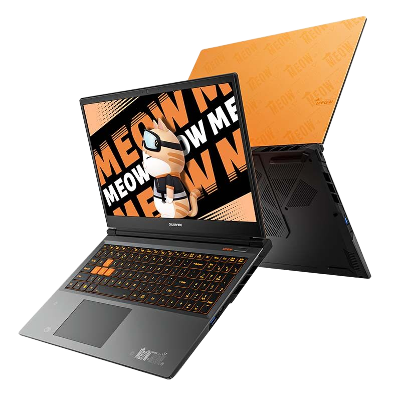
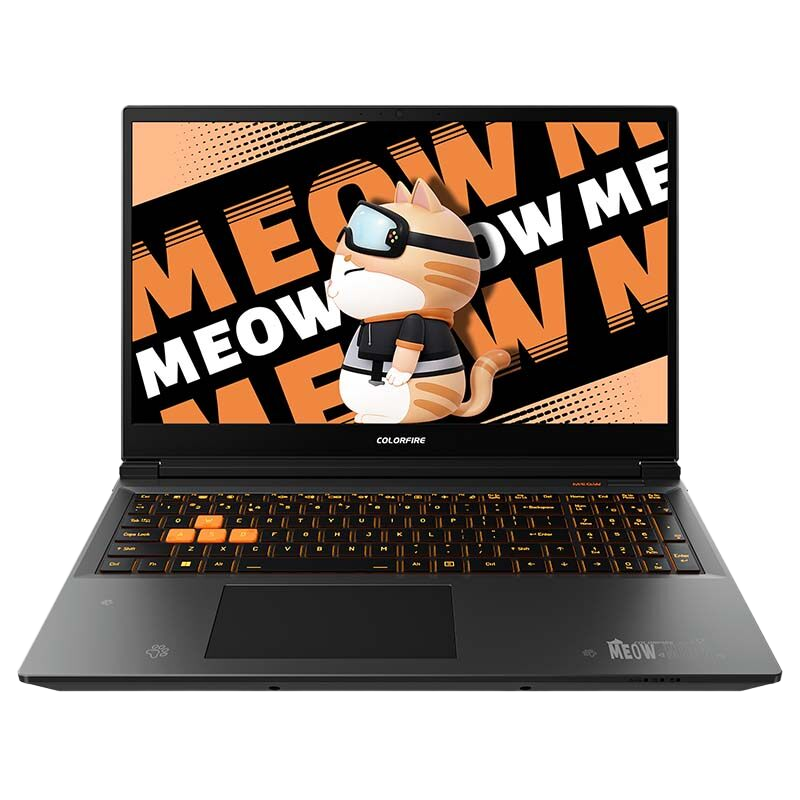
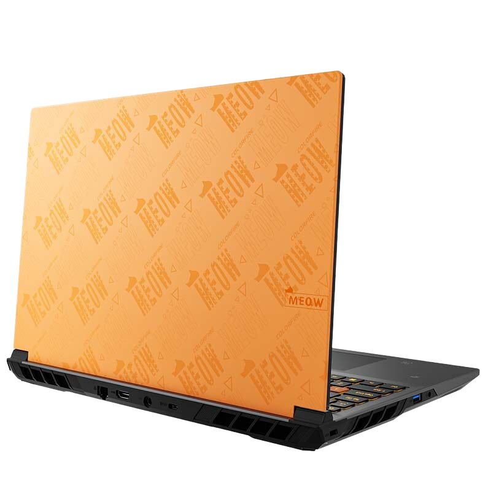

# 七彩虹 橘宝 R16

## 外观

## 配置

|   项目   |                     参数                     |
| :------: | :------------------------------------------: |
| 机身参数 |               16 英寸；2.49kg                |
| 核心配置 |         R7-7845HX；RTX-4060/RTX-4070         |
| 存储配置 |       16G DDR5-5200MHZ；1T 西数 SN540        |
| 屏幕配置 |      2560\*1600；100% sRGB 色域；240Hz       |
| USB 接口 | USB-A:5Gbps\*1 、10Gbps\*1 ；USB-C:10Gbps\*2 |
| 影音配置 |   HDMI 2.1；3.5mm 音频接口；DP 1.4（核显）   |
| 供电配置 | 230W DC 电源接口；100W PD 充电；73Wh 锂电池  |
| 网络配置 |          RJ45 网口；AX210 无线网卡           |

[主购买链接：R9-7845HX+RTX4070 16G+1T ￥ 5999.2（JD 国补）](https://3.cn/2b-2kuJj)

## 总结

七彩虹在橘宝 R15 经历大失败后，重新推出了这款橘宝 R16 来与机械革命进行竞争，尽管这款机器相较于蛟龙 16Pro 仍有不足，但却足够替换掉自家的隐星 P15TA。

这款机器采用了桌面端移植的拥有 12 个大核的 7845HX，在多核跑分上遥遥领先于前两台机器，机身的外观设计依然沿用了橘宝 R15 上那一套，颜值在游戏本中算较为出众的，键盘的背光为 RGB，但是触控手感一般。机器的接口中规中矩，唯一可惜的是没有 USB4，同时独显也不支持 DP 输出。在拓展性上，内存为单 16G，方便后期加装，M.2 位也有两个，尽管出厂的硬盘不再是七彩虹的白片，但是换成西数的 QLC 硬盘反而令人更为膈应。机器的屏幕依然是那块 2k 240Hz 的面板，屏幕素质算是处在第一梯队。机身重量相对较重，达到了 2.49kg，在这样的重量下，机器的散热规模是相对不错的，同时显卡用的也是今年的新 bios，但是七彩虹调教的过于保守了，这导致机器在游戏性能上相较于其他 4070 笔记本要低上 5%，同时风扇噪音在温度不高的情况下相对较吵，比较影响听感。

如果你需要一台外观较好，性价比还不错，并且对 CPU 的性能有一定要求，不在乎便携性与噪音，这一台橘宝 R16 还是一个不错的选择，尤其是在 13/14 代处理器有缩肛风险的情况下，7845HX 的强劲性能足以满足你的生产力需求。

::: warning
在购买时，请注意不要购买成产品力更差的橘宝 R15，这两者虽为同一系列产品，但在配置、性能释放上有着较大的差距，请以购机指南推荐的配置为准，购买前仔细确认选择的配置再付款。
:::

## 其他角度外观

