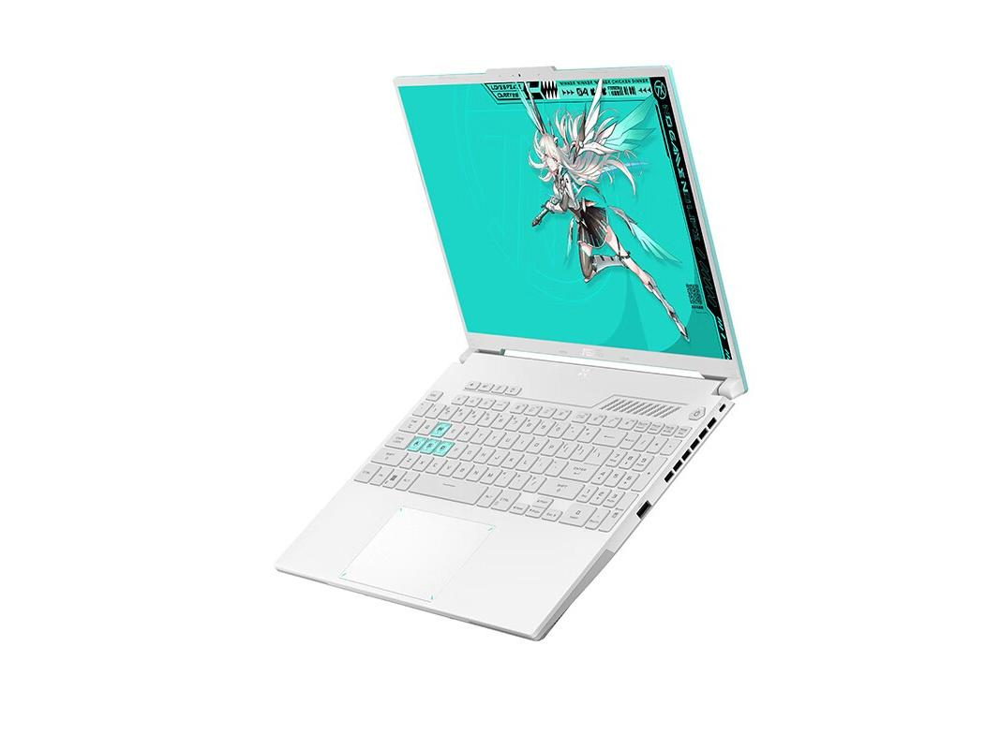

# 华硕天选 5 Pro 锐龙版

## 外观

## 配置

|   项目   |                    参数                     |
| :------: | :-----------------------------------------: |
| 机身参数 |               16 英寸；2.22kg               |
| 核心配置 |             R9-7940HX；RTX4070              |
| 存储配置 |       16G DDR5-5200MHZ；1T 西数 SN560       |
| 屏幕配置 |     2560\*1600；100%sRGB 高色域；165Hz      |
| USB 接口 |      USB-A: 5Gbps\*2 ；USB-C:10Gbps\*2      |
| 影音接口 |          HDMI 2.1；3.5mm 音频接口           |
| 其它接口 |               Micro SD 读卡器               |
| 供电配置 | 280W DC 电源接口；100W PD 充电；90Wh 锂电池 |
| 网络配置 |       RJ45 网口；瑞昱 8852BE 无线网卡       |

[主购买链接：R9-7940HX+RTX4070 16G+1TB 青色 ￥ 8589（PDD）](https://mobile.yangkeduo.com/goods2.html?ps=XtjYDAfGfn)

[副购买链接：R9-7940HX+RTX4070 16G+1TB 青色 ￥ 8999（JD）](https://3.cn/23-hp4fv)

## 总结

在看到去年联想推出的 R9000P 在市场上呼风唤雨之后，华硕终于在一年后推出了 R9000P 的对位产品，天选 5 Pro 锐龙版。相对于 R9000P 来说，天选 5 Pro 锐龙版同样搭载了代号为 Dragon Range 的 ZEN4 架构的 HX 处理器。天选 5 Pro 这颗 7940HX 处理器可以说是 R9000P 上那颗 7945HX 的降频版，基准频率降低了 0.1Ghz，最高睿频降低了 0.2Ghz，实测多核跑分比 7945HX 只低了 2%左右，在游戏性能上可以说这两颗 CPU 之间没有差距。

先从外观模具来看，天选 5 Pro 锐龙版在重量上可以说是同类型游戏本中最轻便的，外观相较于其他竞品也更受消费者喜爱。内存使用了单 16G，方便消费者后续升级，在接口方面算是中规中矩，相对于 R9000P 少了两个 A 口，但两个 A 口算是足够使用了。机器的屏幕也算是中规中矩，但是在刷新率和亮度上都逊于 R9000P 上那块屏幕。最令人不爽的是这款机器的硬盘与网卡的位置依旧采用了“叠叠乐”设计，并且网卡给到的还是热稳定性较差的瑞昱 8852BE 无线网卡，因此在到手后最好是升级成热稳定性更好的 AX200/210 网卡。

总而言之，在 R9000P 停产并涨价至 9000 元以上后，天选 5 Pro 是唯一一台 9000 元以下价位搭载 AMD 旗舰级 CPU 的 4070 一线品牌游戏本。7940HX 可以让你不用担心 CPU 性能不足，而 4070 显卡也能够让你畅玩 2K 游戏并满足视频剪辑的需求。如果你需要一款外观不错，重量相对轻薄，售后相对不错的游戏本，并且之后可能需要进行建模或是使用大型仿真软件，这款搭载了 7940HX 的天选 5 Pro 会是一个比较好的选择。
