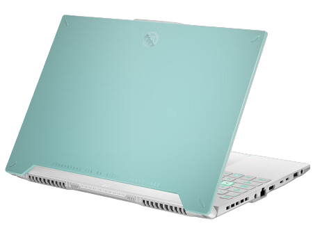

# 华硕 天选 5 锐龙版

## 外观

## 配置

|   项目   |                    参数                     |
| :------: | :-----------------------------------------: |
| 机身参数 |              15.6 英寸；2.08kg              |
| 核心配置 |              R7-8845H；RTX4060              |
| 存储配置 |      16G DDR5-5600MHZ；512G 西数 SN740      |
| 屏幕配置 |    2560\*1600；100%DCI-P3 广色域；165Hz     |
| USB 接口 | USB-A:5Gbps\*2；USB-C:10Gbps\*1、40Gbps\*1  |
| 影音接口 |  HDMI 2.1；3.5mm 音频接口；DP 1.4（独显）   |
| 供电配置 | 240W DC 电源接口；100W PD 充电；90Wh 锂电池 |
| 网络配置 |       RJ45 网口；瑞昱 8852BE 无线网卡       |

[主购买链接：R7-8845H+RTX4060 16G+512G 青色 ￥ 5599 (PDD)](https://mobile.yangkeduo.com/goods1.html?ps=E0gR0Lm3HU)

[副购买链接：R7-8845H+RTX4060 16G+512G 青色 ￥ 5839.2（JD 国补）](https://3.cn/2b2d-EhE)

## 总结

如果今年一定要在一线品牌内挑出一个 8000 元内的 4060 笔记本，那么天选 5 锐龙版可以说是唯一一个“勉强”符合条件的选手。放在去年，天选 4 锐龙版可以说是杀穿了同级别的笔电市场，本来以为华硕在今年能够带来升级后的产品，但不知道是华硕的产品经理认为天选 4 在同级别市场上已经没有了对手，还是认为天选 4 已经做到了完美，他们今年推出的天选 5 相比天选 4 CPU的差距不大，机器的模具和硬盘都没有一丝改变，更令人气愤的是，天选 5 的黑色版本的屏幕反而相对天选 4 还有所降级，如果你对屏幕有所介意，最好是购买满血的青色版本。而在之前就已经被消费者诟病的网卡硬盘叠叠乐，导致高温掉网卡的通病，也依旧保留在那里。

那为什么我们还要推荐这一款机型呢？是因为我们已经无法从其他一线品牌中找出更好的机器了，只能从一堆“烂货”里挑出一个最好的来进行推荐，同时低价位的天选 4 锐龙版的库存也已经清完，目前市场上天选 4 7940H 版的价格甚至比天选 5 还要高。如果你想购买一个颜值尚可，较为轻便且续航还行的游戏本，并且只认一线品牌，那么这台机器算是除了翼龙 15Pro 外最好的选择，但机器在到手之后记得将网卡更换为 Intel 的 AX200/210，不然你将饱受掉网卡的苦恼。

::: tip
随着戴尔逐渐撤出中国市场，HP 的笔记本在经过黑屏门之后仍未有所改进。联想拯救者可以说是完全目中无人，高昂的价格配上中庸的配置，完全没有把消费者当作衣食父母。对于消费者来说，我们是不愿意看到这种情况的，只有有序且多样化的竞争才能够促使市场与消费者双端受益，希望在50系显卡进入市场后，如此现象能够有所改善。
:::
