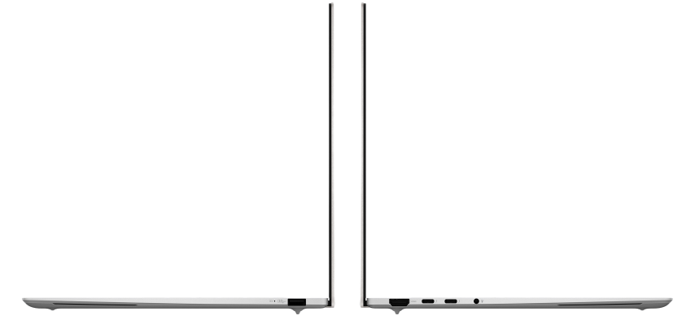

# 华硕 灵耀 14Air

## 外观

    <video autoplay loop muted style="width: 100%; display: block;">
        <source src="./assets/华硕灵耀14Air.mp4" type="video/mp4">
    </video>

视频来自<a href='https://www.asus.com.cn/laptops/for-home/zenbook/asus-zenbook-s-14-ux5406/'>官方产品展示页</a>

## 配置

|   项目   |                  参数                  |
| :------: | :------------------------------------: |
| 机身参数 |             14 寸；1.18kg              |
| 核心配置 |              Ultra 7 258V              |
| 存储配置 |   32G LPDDR5X-8533MHZ；1T 西数 SN560   |
| 屏幕配置 | 2880\*1800 OLED；100% sRGB 色域；120Hz |
| USB 接口 |   USB-A:10Gbps\*1 ；USB-C:40Gbps\*2    |
| 影音配置 |    HDMI 2.1；3.5mm 音频接口；DP 1.4    |
| 供电配置 |        65W PD 充电；72Wh 锂电池        |
| 网络配置 |             BE201 无线网卡             |

主购买链接：[Ultra-7 258V 32G+1TB ￥ 7175.2（JD 国补）](https://3.cn/2ozoQ-Ue?jkl=@C1CQI4mJIW@)

## 优缺点[<Icon icon="clarity:info-line" />](/recommend/推荐#优缺点)

|              优点              |              缺点              |
| :----------------------------: | :----------------------------: |
| 游戏性能不错，重量轻薄便于携带 |  内部拓展性较差，硬盘水平一般  |
|          续航能力极强          | 机身满载噪音较大，发热相对严重 |
|       外观设计与做工较好       |                                |

## 适合人群

对预算不那么敏感，对做工质感与品牌服务有着较高的需求，需要一台续航极强同时质量较轻，便携性好的办公本，有着较高的出行需求。

## 总结

一台笔记本，不仅内存焊接在 CPU 上，而且机器的续航完全领先同期其他 X86 笔记本，除了 MacBook 你还会想到什么？华硕灵耀 14Air 给出了一个不同于 MacBook 的新选择。

得益于二代 Ultra 处理器的 Lunar Lake 架构和台积电的 N3B 工艺，这台机器的日常模拟测试续航达到了惊人的 11 小时，已经十分接近 Macbook 了，成为了目前 X86 架构中续航最强的机器。1.18kg 的重量搭配高达 11 小时的续航时间，这对于那些经常外出，需要使用生产力软件的用户（工科生）来说，简直是他们的福音。同时 intel 还给这一代 Ultra 处理器搭载了升级的第二代 Xe 核显，在视频解码和显示输出支持上有了较大的升级。核显性能在跑分上明显领先 AMD 的 780M，游戏实测中也能小幅度领先 780M。但 Intel 这次为了优化大小核调度，取消了超线程，这导致 CPU 多核性能相对于竞品要更弱，但却实打实的优化了大小核跨簇访问的延迟。机器的屏幕依旧是那块饱受好评的 OLED 屏幕，同时机器的扬声器规格相对其他笔记本更高，外放水平相当不错。机器的网卡是目前最先进的 BE201 网卡，支持目前还未普及使用的 WIFI 7，留足了战未来的空间。接口方面，这台机器给到了两个雷电 4 和一个 A 口，唯一不足的是 A 口相对较少，但是雷电 4 接口在拓展性方面相对不错。在内部拓展性方面，这台机器也是向苹果看齐，内存与硬盘均不支持拓展，并且硬盘也仅为中速的 PCIE4.0 硬盘，并没有给到这个价位应该有的旗舰盘，与其旗舰轻薄本的身份有所出入。同时这台机器也有着灵耀系列的通病，满载下机身噪音相对较高，同时机身发热也较为严重。

如果你的预算相对充足，需要一台重量轻便，同时对机器的续航有着极高的需求，想要一台 X86 架构的 MacBook 平替，那么这台机器是你最好的选择，它能满足你使用生产力软件的同时，还能给你提供如 MacBook 般的续航。

## 其他角度外观

