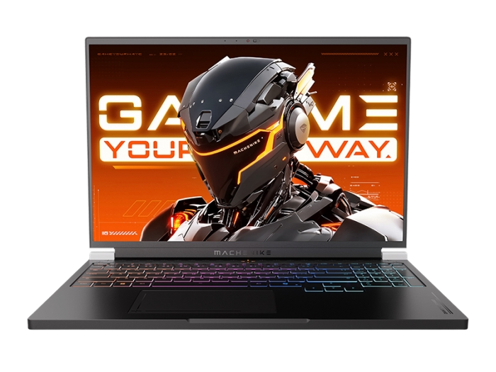
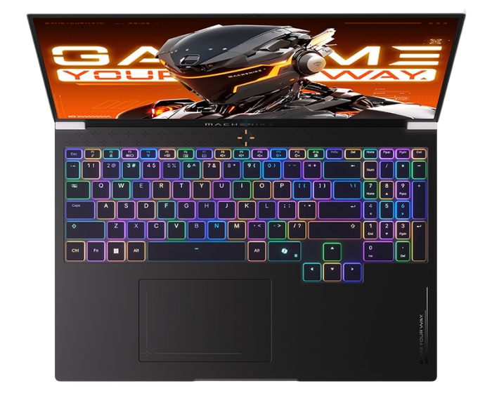

# 机械师 曙光 16Pro 2025

## 外观

## 配置

|   项目   |                    参数                     |
| :------: | :-----------------------------------------: |
| 机身参数 |               16 英寸、2.67kg               |
| 核心配置 |             R9-7945HX、RTX5080              |
| 存储配置 |     32G DDR5-5200MT/s ； 1T YMTC PC411      |
| 屏幕配置 | 2560\*1600；100%sRGB 高色域；300Hz；500nits |
| USB 接口 |       USB-A:5Gbps\*3；USB-C:10Gbps\*2       |
| 影音接口 |    HDMI 2.1；3.5mm 音频接口；Mini DP 2.1    |
| 供电配置 | 420W DC 电源接口；140W PD 充电；80Wh 锂电池 |
| 网络配置 |         RJ45 网口；MT7920 无线网卡          |

主购买链接：[R9-7945HX+RTX5080 32G+1TB ￥ 11999（JD 国补）](https://3.cn/2ozgD1-Q?jkl=@I04CgEY7DN@)

## 优缺点[<Icon icon="clarity:info-line" />](/recommend/推荐#优缺点)

|               优点               |             缺点             |
| :------------------------------: | :--------------------------: |
|   屏幕素质非常高，噪音控制不错   | 机器重量相对较高，且续航较低 |
|       氮化镓适配器减重不错       |         网卡相对一般         |
| 外部接口与内部拓展性极强，有 RGB |     售后服务水平仍需提升     |

## 适合人群

需要一台一万元出头的高性价比 5080 游戏本，偶尔有外出使用需求，对重量与售后服务不那么敏感，对高帧率网游刚需较大。
