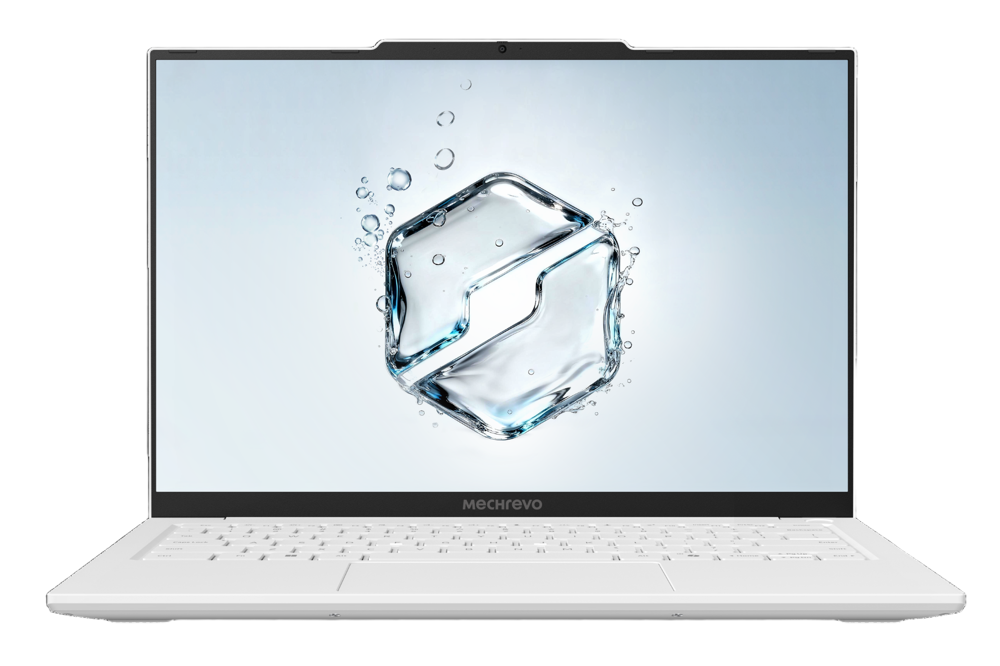

# 机械革命 无界 14 2026

## 外观

## 配置

|   项目   |                     参数                     |
| :------: | :------------------------------------------: |
| 机身参数 |                14 寸、1.07kg                 |
| 核心配置 |              Intel Ultra5 226V               |
| 存储配置 |     16G LPDDR5X-8533MT/s、1T YMTC PC41Q      |
| 屏幕配置 | 2880\*1800；100%sRGB 高色域；120Hz；500nits  |
| USB 接口 | USB-A:480Mbps\*1、10Gbps\*2；USB-C:40Gbps\*2 |
| 影音接口 |           HDMI 2.1；3.5mm 音频接口           |
| 供电配置 |           65W PD 充电；60Wh 锂电池           |
| 网络配置 |                AX211 无线网卡                |

主购买链接：[无界 14 U5-226V 16G+1TB ￥3885.88（JD 国补）](https://3.cn/2R-yA9DA?jkl=@Q5pVD9DTBh@)

副购买链接：[无界 14X Air R7 H 255 32G+1TB ￥4199.85（抖音国补）](https://v.douyin.com/9jnwR1uKMkI/)

## 优缺点 [<Icon icon="clarity:info-line" />](/recommend/recommend_overview#优缺点)

|           优点           |                缺点                |
| :----------------------: | :--------------------------------: |
| 外部拓展性极强，接口丰富 | 内部拓展性差，内存与硬盘均不能升级 |
|      综合性价比极高      |          CPU 性能相对较差          |
|  屏幕观感不错，续航非常强  |            售后相对一般            |

## 适合人群

预算在 4 千元左右，需要一台价格低廉，能够胜任移动办公需求的超轻本，同时对售后不是非常的敏感，没有大型游戏需求。

## 总结

作为机械革命推出的对标 Macbook Neo 的产品，这台小星耀 14 在低价位段完全弥补了星耀 14 涨价的空缺，也是目前能够购买到性能相对够用的高性价比超轻本，与来酷的两款产品形成了非常好的互补。得益于在内存涨价前生成的 LunarLake 处理器，这台机器的成本相比其他机器有所降低，固态也搭配了原厂的 QLC 硬盘。这块屏幕在去年也饱受好评，在这个价位段可以说是完全没有对手。同时令人惊喜的是，这台机器的外部接口配置非常丰富，在做到超轻的重量下还能给到如此多的接口配置，并且网卡也没有缩水，可以说是这个价位非常值得购买的办公笔记本。但超高的性价比带来的是售后的不足，同时使用的 U5-226V 处理器的性能也相对一般，但这样也带来了不错的续航表现，能够支持较长时间的移动办公需求。

如果你的预算在 4000 元左右，需要一台质量超轻，续航尚可的办公本，没有较大的游戏需求，并且不在意售后服务，那么这款笔记本非常适合你，同时这也是轻薄本+台式配置的最佳拼图。如果你需要更大的内存，可以考虑购买 R7 H 255 版本，如果你对售后有一定要求，我们更推荐你购买[来酷 Air 系列](联想来酷Air16)的产品。
