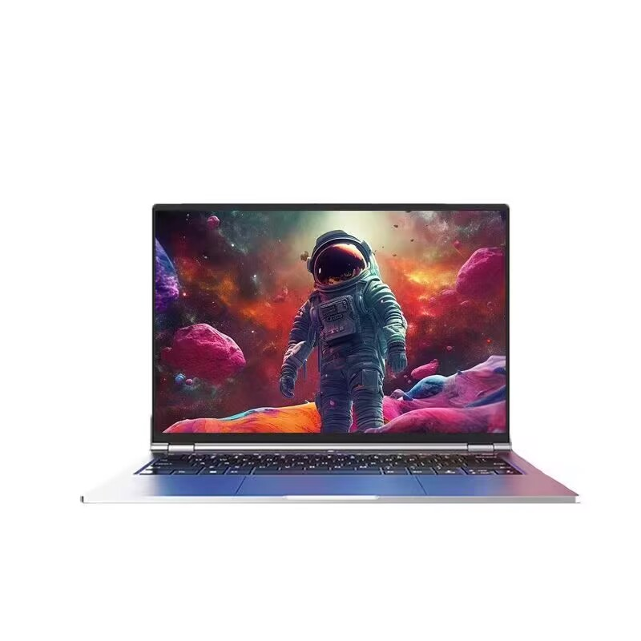

# 机械革命 无界 14Pro

## 外观

## 配置

|   项目   |                     参数                     |
| :------: | :------------------------------------------: |
| 机身参数 |                14 寸、1.49kg                 |
| 核心配置 |                   Utral 5 125H               |
| 存储配置 |       32G DDR5-5600MHZ、2T YMTC PC411        |
| 屏幕配置 |      2880\*1800；100%sRGB 高色域；120Hz      |
| USB 接口 | USB-A: 5Gbps\*2 ；USB-C:40Gbps\*1、10Gbps\*1 |
| 影音接口 |           HDMI 2.0；3.5mm 音频接口           |
| 供电配置 |          100W PD 充电；60Wh 锂电池           |
| 网络配置 |                AX200 无线网卡                |

[主购买链接：Ultra-5 125H 32G+2TB ￥ 4399（PDD）](https://mobile.yangkeduo.com/goods.html?ps=h4QdW1tfJf)

## 总结

这台机器首发价格在 5099 时性价比是完全比不过无界 14X 的，但现在它的价格到了 4399，这就给有不同需求的同学提供了一个新的选择。机器的重量和性能释放算是正常水准，但是机器噪音相对较高，同时适配器和左手腕托位置的温度都有点高。内存是可插拔的 32g，搭配上 2T 的旗舰硬盘，机器内部还有一个多余的 M.2 硬盘位。考虑到 Intel 核显的剪辑视频能力，这台机器非常适合作为一个低价位的剪辑视频的选择。机器的接口有一个是雷电 4，网卡也没有缩水给到了 AX200。Ultra 5 的核显虽然跑分比 8845H 要高，但是游戏中表现要低于 8845H，应付 LOL 这种网游也是足够的。这台机器的屏幕放在这个价位也是非常好的，可惜的是电池只有 60Wh，外出续航能力相较于 80Wh 的无界 14X 仍会差一点，但 Ultra 处理器的高续航能力又稍稍弥补了这一点。

综上，这一台机器的最佳受众是预算在 5k 元以内，需要一台剪辑视频能力较强的轻薄本的艺术文科类学生。32G 的内存搭配上 Xe 核显，在剪辑视频上相较于 8845H 还是有小幅度领先的，虽然搭载 Ultra 处理器的笔记本普遍价格都在 5000 元以上，但机械革命用自己的实际行动给了更多用户一个新的选择。
