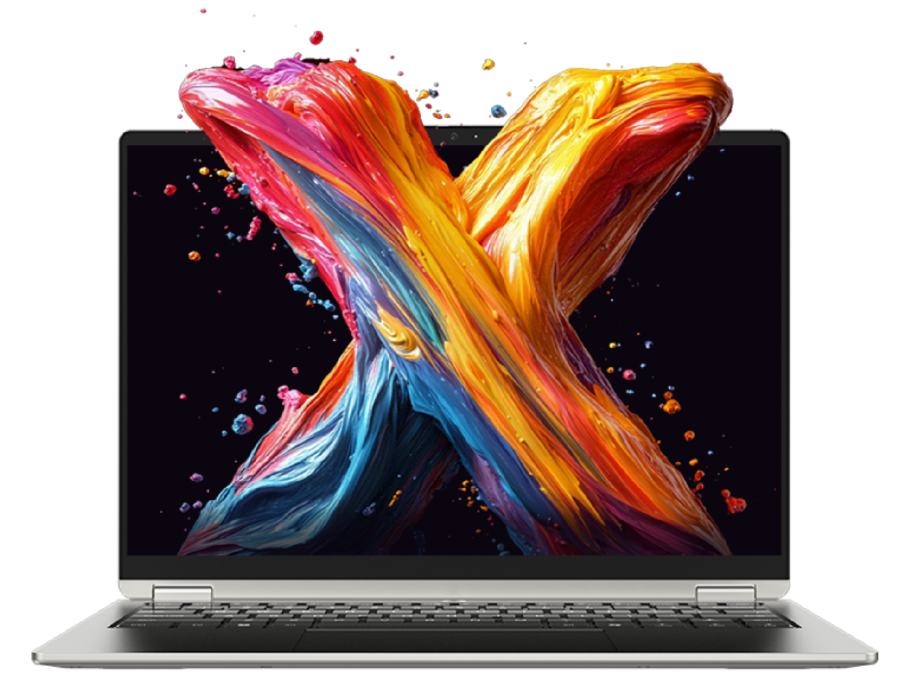

# 机械革命 无界 14X Pro

## 外观

## 配置

|   项目   |                             参数                              |
| :------: | :-----------------------------------------------------------: |
| 机身参数 |                         14 寸、1.5kg                          |
| 核心配置 |                  AMD R7 H 255;AMD AI 9 H 365                  |
| 存储配置 | 32G LPDDR5X-7500MT/s、 32G LPDDR5X-8000MT/s;1T YMTC PC41Q |
| 屏幕配置 |          2880\*1800、100%sRGB 高色域、120Hz、500nits          |
| USB 接口 |          USB-A:5Gbps\*3；USB-C:40Gbps\*1、10Gbps\*1           |
| 影音接口 |               HDMI 2.1；3.5mm 音频接口；DP 1.4                |
| 供电配置 |                  140W PD 充电；99.9Wh 锂电池                  |
| 网络配置 |     RJ45 网口、MT7922 无线网卡；RJ45 网口、AX200 无线网卡     |

主购买链接：[R7 H 255 32G+1TB ￥ 4079.2（JD 国补）](https://3.cn/2G-R79dH?jkl=@X17Yg0CCEr@)

副购买链接：[AI 9 H 365 32G+1TB ￥ 4799（PDD 百亿补贴）](https://mobile.yangkeduo.com/goods2.html?ps=u9Zb2avird)

## 优缺点 [<Icon icon="clarity:info-line" />](/recommend/推荐#优缺点)

|           优点           |         缺点         |
| :----------------------: | :------------------: |
|  均衡的水桶机，配置丰富  |    网卡与硬盘稍差    |
| 性能释放好，游戏性能领先 | 重量在轻薄本中算重的 |
|   屏幕素质强，外观较好   |     内存无法更换     |

## 适合人群

预算在 4 千元左右，需要一台续航够强，性能释放不错的水桶轻薄本，非常需要小键盘，同时对售后和重量不是非常的敏感，并且平时有轻度游戏需求。

## 总结

作为机械革命贯彻性能释放与电池容量的新产品，无界 14X Pro 不仅继承了自己的老大哥无界 14X 的优秀拓展性，同时还对电池进行了提升，补足了续航弱的短板，同时进一步提升了屏幕的观感。但这台机器仍有少许不足，其硬盘使用的是 QLC 颗粒，并且内存不能更换，网卡也存在着抽奖的情况。但总的来说，如果你的预算在 4 千元左右，需要一台续航极高，性能释放极佳，接口配置尚可的轻薄本，并且对售后不那么敏感，那么这台机器在市场上可以说是独一档的选择。

::: tip 注意事项
该机器左侧的 C 口只支持 100W 的输入，在高强度使用时请将适配器连接至尾部 C 口。
:::
