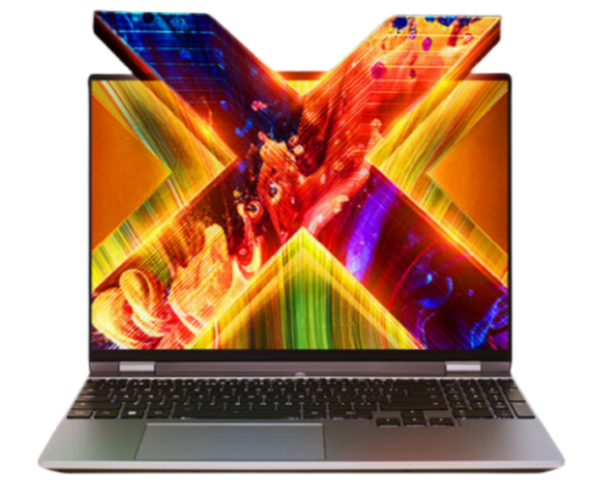

# 机械革命 无界 14X/15X

## 外观

无界14x

无界15X

## 配置

|   项目   |                          参数                          |
| :------: | :----------------------------------------------------: |
| 机身参数 |             14 寸、1.47kg；15.3 寸、1.74kg             |
| 核心配置 |                       R7-8745HS                        |
| 存储配置 |          24G DDR5-5600MHZ、1T 英睿达 P3 Plus           |
| 屏幕配置 |      2880\*1800；100%sRGB 高色域；120Hz；450nits       |
| USB 接口 | USB-A:5Gbps\*1 、10Gbps\*2；USB-C:40Gbps\*1、10Gbps\*1 |
| 影音接口 |            HDMI 2.1；3.5mm 音频接口；DP 1.4            |
| 供电配置 |               100W PD 充电、80Wh 锂电池                |
| 网络配置 |               RJ45 网口；MT7922 无线网卡               |

主购买链接：[无界 14X R7-8745HS 24G+1TB ￥ 3199.2（JD 国补）](https://3.cn/2i8cBm-X)

副购买链接：[无界 15X R7-8745HS 32G+1TB ￥ 3599.2（JD 国补）](https://3.cn/2i8d-9n8)

## 优缺点[<Icon icon="clarity:info-line" />](/recommend/推荐#优缺点)

|          优点          |           缺点           |
| :--------------------: | :----------------------: |
| 内外拓展性好，接口丰富 |     金属外壳漏电明显     |
|      综合性价比高      | 机器续航相对其他机型略差 |
|      性能释放较好      |       售后相对一般       |

## 适合人群

预算在 3 千元左右，需要一台价格低廉，性能释放不错的水桶轻薄本，同时对售后和重量不是非常的敏感，有轻度游戏需求。
