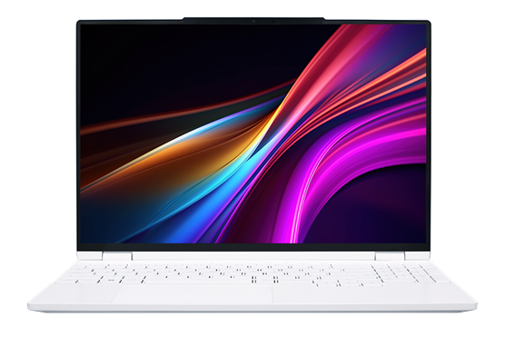

# 机械革命 无界 14X/15X

## 外观

## 配置

|   项目   |                                    参数                                    |
| :------: | :------------------------------------------------------------------------: |
| 机身参数 |                       14 寸、1.47kg；15.3 寸、1.67kg                       |
| 核心配置 |                                 R7-8845HS                                  |
| 存储配置 | 24G DDR5-5600MHZ、1T YMTC PC300 ； 24G DDR5-5600MHZ、1T YMTC PC411  |
| 屏幕配置 |                     2880\*1800；100%sRGB 高色域；120Hz                     |
| USB 接口 |          USB-A: 5Gbps\*1 、10Gbps\*2 ；USB-C:40Gbps\*1、10Gbps\*1          |
| 影音接口 |                          HDMI 2.1；3.5mm 音频接口                          |
| 供电配置 |                         100W PD 充电；80Wh 锂电池                          |
| 网络配置 |                         RJ45 网口；AX200 无线网卡                          |

主购买链接：[无界 14X R7-8845HS 24G+1TB ￥ 3799（PDD）](https://mobile.yangkeduo.com/goods.html?ps=nHjGCtkKTY)

副购买链接：[无界 15X R7-8845HS 32G+1TB ￥ 4399（PDD）](https://mobile.yangkeduo.com/goods.html?ps=6OmuU2Kyp2)

## 总结

毫无疑问，在今年的笔记本市场中，将无界 14X 称为轻薄本的标准答案是没有丝毫争议的。3999 的首发价格，如今在百亿补贴的售价甚至只有 3741。对比无界 14Pro 与无界 14+，新款 8845HS 尽管相对于 7840H 仅仅升级了 NPU，但无界 14X 的新模具，使得机器的性能释放相较于那两台机器多出了整整 11W。同时贴心的“鸡哥”充分考虑到消费者对 QLC 硬盘的顾虑，将硬盘升级为了长江存储的原厂 TLC 硬盘。在屏幕上，尽管这块屏幕的色域与色准表现与去年的屏幕区别不大，但亮度却实打实的提升了接近 100nit，这块屏幕放在这个价位可以说是打破天下无敌手了。网卡也升级成了性能和稳定性相较于联发科和瑞昱更好的 AX200，并且新增了一个 RJ45 千兆网口。电池方面，鸡哥还从 60Wh 升级成了 80Wh，使得机器的续航时长有了较大的进步。在接口方面，HDMI，3.5mm 音频接口都没有缺席，无界 14X 还新增了一个 USB-A 口，并将一个 Type-C 接口的协议升级至 USB4。在内部拓展性上，机器还是一如既往的给了两个 2280 的 M.2 槽位，同时内存也支持插拔。如果挡住机器 A 面的商标，不知道的消费者还以为这是新款 Thinkbook14+嘞。无界 15X 相较于 14X 升级了小键盘，硬盘也从 PC300 升级成了旗舰 PC411，同时售价为 4199，重量只多出了约 200g。

如果非要挑刺的话，新款无界 14X 所搭载的 24G 内存相当于满血的 32G 内存在性能上会有些落后，进而影响到核显的性能发挥。同时机器为了节约成本，砍除了电源键的指纹识别模块，而机器所带的摄像头也并不支持 Windows Hello 功能。同时这块屏幕在高刷新率的情况下有一定的拖影，在游玩 Fps 类游戏时屏幕会有些油腻。笔记本自带的GAN适配器在满载一段时间后温度会有些偏高，但并不会影响适配器的寿命与机器的性能释放。总体来说，这些小缺点，在 3741 的机器上，显得不足为过。

综上，无界 14X 是一款具有特色，性价比拉满的水桶机。其丰富的接口和内部拓展性，在同价位完全是秒杀其他产品，唯有 5 千元价位的 Thinkbook14+ 能和他掰掰腕子。如果你的预算在 4 千元左右，需要一台续航够强，图形性能不错的轻薄本，同时对售后不是非常的敏感，那么我极力推荐你购买无界 14X。如果你需要数字小键盘与更大一点的屏幕，你也可以选择无界 15X。
