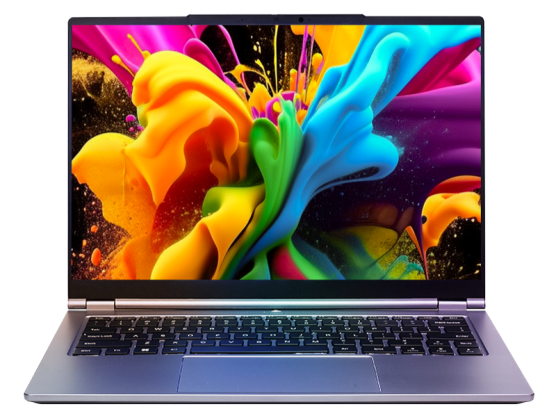
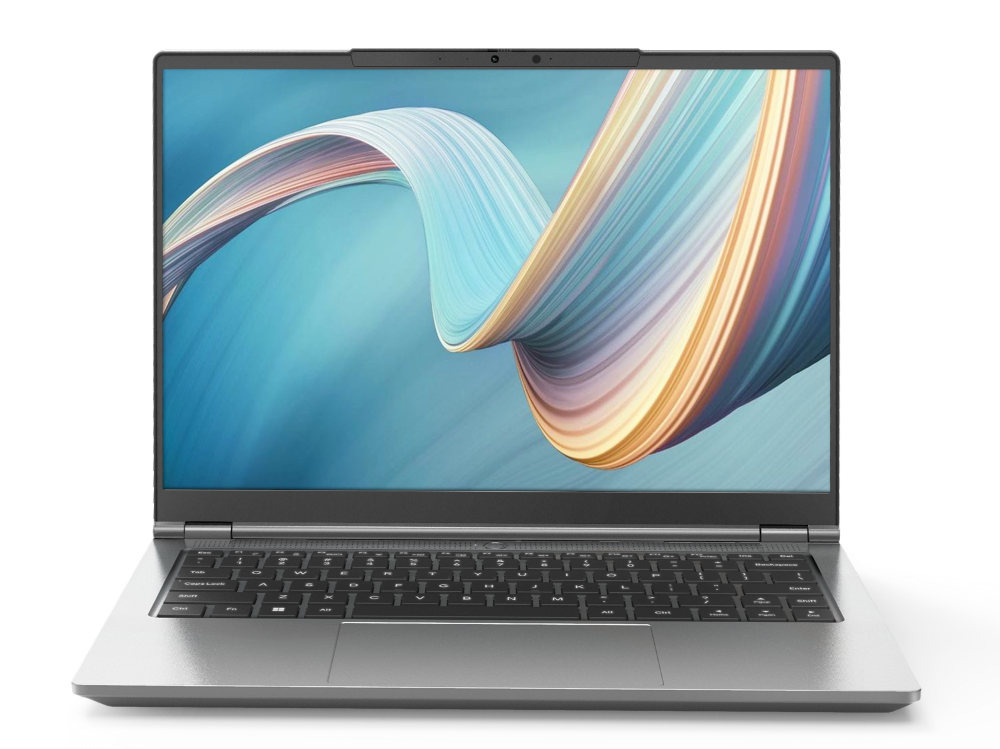

# 机械革命 无界 14X 斗战版

## 外观

无界 14x

无界 14X 斗战版

## 配置

|   项目   |                           参数                           |
| :------: | :------------------------------------------------------: |
| 机身参数 |                      14 寸、1.45kg                       |
| 核心配置 |                       AMD R7 H 255                       |
| 存储配置 |            16G DDR5-5600MHZ、512G YMTC PC41Q             |
| 屏幕配置 |        1920\*1200；100%sRGB 高色域；60Hz；300nits        |
| USB 接口 | USB-A:480Mbps\*1 、10Gbps\*2；USB-C:40Gbps\*1、10Gbps\*1 |
| 影音接口 |             HDMI 2.1；3.5mm 音频接口；DP 1.4             |
| 供电配置 |                100W PD 充电、80Wh 锂电池                 |
| 网络配置 |                RJ45 网口；MT7922 无线网卡                |

主购买链接：[无界 14X 斗战版 R7-8745HS 16G+512GB ￥ 3185.8（JD 国补）](https://3.cn/2-GR2toI?jkl=@G170p0Dt8A@)

## 优缺点 [<Icon icon="clarity:info-line" />](/recommend/推荐#优缺点)

|          优点          |          缺点          |
| :--------------------: | :--------------------: |
| 内外拓展性好，接口丰富 |    金属外壳漏电明显    |
|      综合性价比高      | 机器屏幕与硬盘有所缩水 |
|      性能释放较好      |      售后相对一般      |

## 适合人群

预算在 3 千元左右，需要一台价格低廉，性能释放不错的水桶轻薄本，同时对售后和重量不是非常的敏感，有轻度游戏需求。

## 总结

在内存与硬盘均大幅涨价的环境下，机械革命通过缩减配置来保留这款 3K 出头价位的笔记本，算是给予低预算用户一个尚且能接受的选择。这台机器在前两年广受好评的无界 14X 的模具上进行修改，将屏幕更换为一块 1200P 60Hz 的低亮度显示屏，同时将内存更换为单根 16G，硬盘则更换为 512G 的长江存储 QLC 硬盘。唯一值得消费者诟病的自然是这块称得上“瞎眼”的屏幕，以及原先无界 14X 模具上存在的缺点，比如机身漏电，续航相对其他机型一般。但其仍保留着原先强劲的性能释放，同时价格在国补的加持下仅为 3185 元，这对于预算不算那么充裕，并且对售后不敏感的同学，无疑来说是较好的选择。
