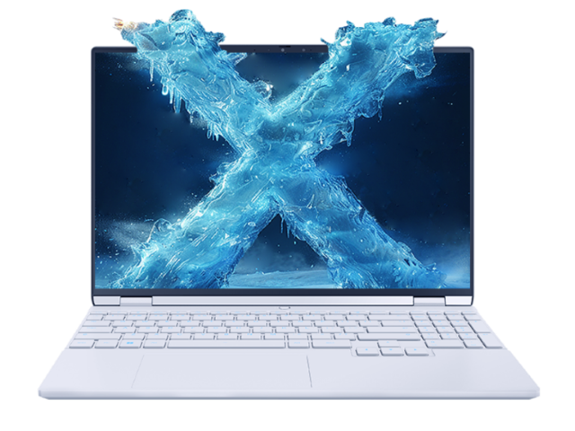

# 机械革命 无界 15XPro

## 外观

## 配置

|   项目   |                    参数                     |
| :------: | :-----------------------------------------: |
| 机身参数 |               15.3 寸、1.79kg               |
| 核心配置 |                 AI 9 H 365                  |
| 存储配置 |    32G DDR5-5600MT/s、1T 英睿达 P3 Plus     |
| 屏幕配置 | 2560\*1600；100%sRGB 高色域；120Hz；400nits |
| USB 接口 | USB-A:5Gbps\*3 ；USB-C:40Gbps\*1、10Gbps\*1 |
| 影音接口 |      HDMI 2.1；3.5mm 音频接口；DP 1.4       |
| 供电配置 |         140W PD 充电；99.9Wh 锂电池         |
| 网络配置 |         RJ45 网口；MT7922 无线网卡          |

主购买链接：[AI 9 H 365 32G+1TB ￥ 4239.2（JD 国补）](https://3.cn/2i-8fitv)

## 优缺点[<Icon icon="clarity:info-line" />](/recommend/推荐#优缺点)

|                 优点                 |         缺点         |
| :----------------------------------: | :------------------: |
|        均衡的水桶机，配置丰富        |    网卡与硬盘稍差    |
|       性能释放好，游戏性能领先       | 重量在轻薄本中算重的 |
|         屏幕素质强，外观较好         |   外表易磕碰或划伤   |
| 适配器为三角插，解决金属外壳漏电问题 |                      |

## 适合人群

预算在 4 千元左右，需要一台续航够强，性能释放不错的水桶轻薄本，非常需要小键盘，同时对售后和重量不是非常的敏感，并且平时有轻度游戏需求。

::: tip 注意事项
该机器左侧的 C 口只支持 100W 的输入，在高强度使用时请将适配器连接至尾部 C 口。
:::
