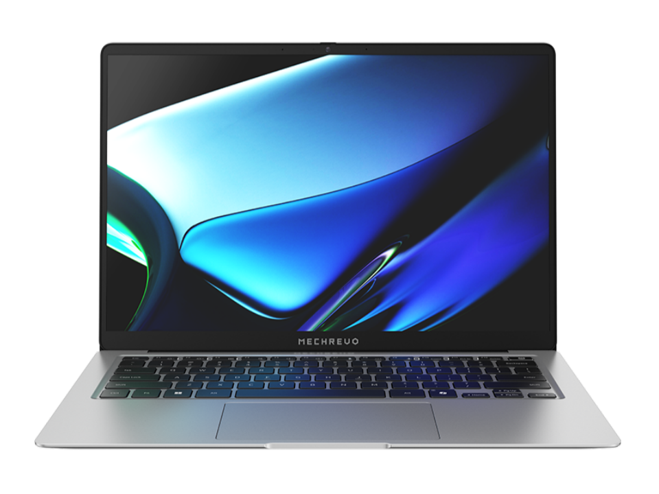

# 机械革命 星耀 14

## 外观

## 配置

|   项目   |                     参数                      |
| :------: | :-------------------------------------------: |
| 机身参数 |                 14 寸、1.0kg                  |
| 核心配置 |                  AI 9 H 365                   |
| 存储配置 |     32G DDR5-8000MT/s、1T 英睿达 P3 Plus      |
| 屏幕配置 | 2880\*1800；100%DCI-P3 广色域；120Hz；500nits |
| USB 接口 |  USB-A:5Gbps\*2 ；USB-C:40Gbps\*2、10Gbps\*1  |
| 影音接口 |       HDMI 2.1；3.5mm 音频接口；DP 1.4        |
| 供电配置 |           100W PD 充电；80Wh 锂电池           |
| 网络配置 |                AX210 无线网卡                 |

主购买链接：[AI 9 H 365 32G+1TB ￥ 4559.2（JD 国补）](https://3.cn/2o-zpx8L?jkl=@C5qOzBrXUH@)

副购买链接：[R7 H 255 32G+1TB ￥ 3999.2（JD 国补）](https://3.cn/2ozoQ-Ue?jkl=@C1CQI4mJIW@ )

## 优缺点[<Icon icon="clarity:info-line" />](/recommend/推荐#优缺点)

|             优点             |          缺点          |
| :--------------------------: | :--------------------: |
|      平民价格的超轻薄本      |  屏幕未校色，色准较差  |
|  性能释放相较于同类型产品好  | 使用的固态硬盘相对较差 |
| 接口丰富，拓展性强，续航较好 |     触控板手感一般     |

## 适合人群

预算在 4 千元左右，需要一台质量超轻，性能释放尚可，续航较强的轻薄本，同时对售后没有较高的要求，平时有着较高的移动办公需求。
