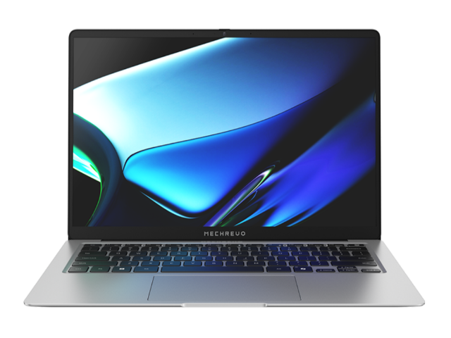

# 机械革命 星耀 14

## 外观

## 配置

|   项目   |                     参数                      |
| :------: | :-------------------------------------------: |
| 机身参数 |                 14 寸、1.05kg                  |
| 核心配置 |       AMD AI 9 H 365;Intel Ultra 5 225H        |
| 存储配置 |      32G LPDDR5X-8000MT/s、1T YMTC PC411     |
| 屏幕配置 | 2880\*1800；100%DCI-P3 广色域；120Hz；500nits |
| USB 接口 |  USB-A:5Gbps\*2 ；USB-C:40Gbps\*2、10Gbps\*1  |
| 影音接口 |       HDMI 2.1；3.5mm 音频接口；DP 1.4        |
| 供电配置 |           100W PD 充电；80Wh 锂电池           |
| 网络配置 |                AX210 无线网卡                 |

主购买链接：[AI 9 H 365 冰晶蓝 32G+1TB ￥ 5067（PDD 百亿补贴）](https://mobile.yangkeduo.com/goods2.html?ps=sHGGHcTauf)

副购买链接1：[R7 H 255 钛银 32G+1TB ￥ 4546.7（JD 国补）](https://3.cn/2GRa-LDe?jkl=@ACKY73xzbp@)

副购买链接2：[U7 225H 冰晶蓝 32G+1TB ￥ 5923.7（JD 国补）](https://3.cn/2GRb3-j1?jkl=@D18O98m2pv@)

## 优缺点[<Icon icon="clarity:info-line" />](/recommend/recommend_overview#优缺点)

|             优点             |          缺点          |
| :--------------------------: | :--------------------: |
|      平民价格的超轻薄本      |  屏幕未校色，色准较差  |
|  性能释放相较于同类型产品好  |  AMD版本C口速率较差    |
| 接口丰富，拓展性强，续航较好 |     触控板手感一般     |

## 适合人群

预算在 4 千元左右，需要一台质量超轻，性能释放尚可，续航较强的轻薄本，同时对售后没有较高的要求，平时有着较高的移动办公需求。

## 总结

作为机械革命在2025年抛出的“王炸”机型，这台机器可以说是抢尽了其他产品的风头。轻至1kg的重量，与重量完全不符的性能释放，如果换作友商来定价，那至少是7K价位的产品，但机械革命却硬生生的将产品拉到了4000元级别的市场，如果不是因为内存硬盘涨价，最低配的R7 255H版本甚至只需3000多元。尽管如今机器有所涨价，但其超高的性价比与独特的定位，使其仍是2026年笔电市场最值得推荐的产品。出色的拓展性与超高的续航，搭配极轻的重量，对于需要经常移动出差的用户，这台机器完全可以成为他们趁手的生产力工具，如果你打算采用轻薄本+台式机的方案，这台笔记本也无疑是这套方案的最佳拼图。当然，如果你的预算非常充足，十分想要一台重量轻便，续航堪比Macbook的Windows机器，那么我们推荐你等待即将上市的新款星耀14。其搭载Intel最新的Ultra X7 358H处理器，国补后售价约为6799元，综合续航水平应该能达到13小时，在1.2kg内的超轻本中绝对是独一无二的。
