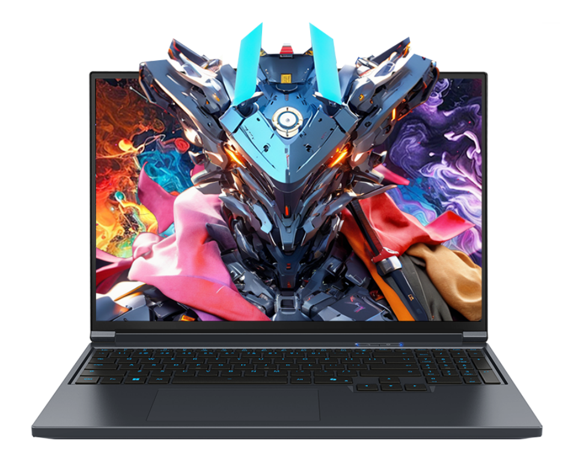

# 机械革命 极光 X/XPRO

## 外观

## 配置

|   项目   |                         参数                         |
| :------: | :--------------------------------------------------: |
| 机身参数 |           16 英寸、2.34kg；16 英寸、2.44kg           |
| 核心配置 | i7-13700HX、RTX5070/5060； i7-14650HX、RTX5070Ti |
| 存储配置 |           16G DDR5-5600MT/s；1T YMTC PC41Q           |
| 屏幕配置 |     2560\*1600；100%sRGB 高色域；300Hz；500nits      |
| USB 接口 |           USB-A:5Gbps\*3 ；USB-C:10Gbps\*2           |
| 影音接口 |        HDMI 2.1；Mini DP 2.1；3.5mm 音频接口         |
| 供电配置 |   250/280W DC 电源接口；140W PD 充电；80Wh 锂电池    |
| 网络配置 |              RJ45 网口；AX201 无线网卡               |

主购买链接：[极光 X i7-13700HX+RTX5060 16G+1TB ￥ 5359.2 （JD 国补）](https://3.cn/2i8-MIGW)

主购买链接：[极光 X Pro i7-14650HX+RTX5070Ti 32G+1TB ￥ 7999.2 （JD 国补）](https://3.cn/2-i8NFWd)

副购买链接：[极光 X i7-13700HX+RTX5070 16G+1TB ￥ 6399.2 （JD 国补）](https://3.cn/2i-8NI9Z)

## 优缺点[<Icon icon="clarity:info-line" />](/recommend/推荐#优缺点)

|           优点           |          缺点          |
| :----------------------: | :--------------------: |
| 屏幕素质非常强，刷新率高 | 硬盘与网卡相对性能较差 |
|  拓展性非常强，接口丰富  |  售后服务水平仍需提升  |
|   性价比高，游戏性能强   |                        |

## 适合人群

需要一台性价比**非常高**，性能释放不错，拓展较强的游戏本，对售后与重量不那么敏感，对高帧率网游刚需较大，且偏爱 Intel 处理器。

## 其他外观

