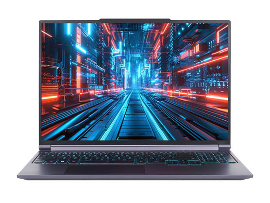

# 机械革命 极光 X/XPRO

## 外观

## 配置

|   项目   |                      参数                       |
| :------: | :---------------------------------------------: |
| 机身参数 |        16 英寸、2.34kg；16 英寸、2.44kg         |
| 核心配置 | i7-13700HX、RTX5070/5060； i7-14650HX、RTX5070Ti |
| 存储配置 |        16G DDR5-5600MT/s；1T YMTC PC41Q         |
| 屏幕配置 |   2560\*1600；100%sRGB 高色域；300Hz；500nits   |
| USB 接口 |        USB-A:5Gbps\*3 ；USB-C:10Gbps\*2         |
| 影音接口 |      HDMI 2.1；Mini DP 2.1；3.5mm 音频接口      |
| 供电配置 | 250/280W DC 电源接口；140W PD 充电；80Wh 锂电池 |
| 网络配置 |            RJ45 网口；AX201 无线网卡            |

主购买链接：[极光 X i7-13700HX+RTX5060 16G+1TB ￥ 5359.2 （JD 国补）](https://3.cn/2i8-MIGW)

主购买链接：[极光 X Pro i7-14650HX+RTX5070Ti 32G+1TB ￥ 7999.2 （JD 国补）](https://3.cn/2-i8NFWd)

副购买链接：[极光 X i7-13700HX+RTX5070 16G+1TB ￥ 6399.2 （JD 国补）](https://3.cn/2i-8NI9Z)

## 优缺点

|           优点           |          缺点          |
| :----------------------: | :--------------------: |
| 屏幕素质非常强，刷新率高 | 硬盘与网卡相对性能较差 |
|  拓展性非常强，接口丰富  |  售后服务水平仍需提升  |
|   性价比高，游戏性能强   |                        |

## 适合人群

需要一台性价比**非常高**，性能释放不错，拓展较强的游戏本，对售后与重量不那么敏感，对 FPS 游戏刚需较大，且偏爱 Intel 处理器。

<!-- ## 总结

毫无疑问，这款极光 X 是鸡哥在尝到蛟龙 16Pro 的甜头后，决心抢占 7000 元以下价位 4070 笔记本王者地位的新尝试。这种尝试是消费者喜闻乐见的，毕竟随着蛟龙 16Pro 的涨价，目前市面上 7000 元以下算是能够购买的 4070 游戏本只有 P15 TA 一款，极光 X 的出现，毫无疑问就是为了抢占 P15 TA 的市场。

为了减少成本，鸡哥从 Intel 那收到了一批 12800HX 的库存，这个 CPU 在性能上略强于 P15 TA 上那颗 13650HX，除了功耗相对高一点，算是个不错的选择。机身模具采用的是耀世 16Pro 的同款模具，在性能释放和外观上相比 P15 TA 都要略胜一筹。屏幕的基本参数与 P15 TA 基本相同，但是亮度达到了 500nit，几乎是 P15 TA 的两倍。硬盘与网卡一如既往的没有缩水，这点非常好评。适配器给的是 240W 的 Sic 适配器，在重量上减轻了许多，双烤也来到了 60+125W 的水平，在同级别遥遥领先。机器的噪音表现与性能释放可以说是 7000 元价位以下表现最佳的，游戏表现也领先一大批 4070 笔记本。唯一遗憾的是如果采用耀世 15Pro 的模具，机器的重量还能减轻，并且内存采用的是双 8g，而不是单 16g，对于后续升级相对麻烦一点。

但是在 6499 的价格下，这台机器的优点远远超过了其缺点。如果你需要一台性能释放极佳，性价比拉满的游戏本，并且没有加装 3 个 M.2 硬盘的需求，我们会更加推荐这一台笔记本而不是 P15 TA。毕竟同样的价格，无论是性能表现还是屏幕、硬盘上，极光 X 都要明显好于 P15 TA。机械革命在今年可以说是铆足劲在抢占各价位的笔电市场，并且给消费者展现出了相当大的诚意。希望机械革命能够戒骄戒躁，脚踏实地地做好之后的产品，努力提升售后服务和消费者的体验感受，为笔记本市场的发展注入更多动力。

::: warning 注意
在 2024 年 618 之后，固态硬盘的价格有所上涨，机械革命出于控制成本的考量，将全品牌新出厂机器的硬盘进行了更改，具体批次的硬盘可能有所不同，因此在购买机械革命品牌的笔记本到手后，建议您尽快查看机器的硬盘。同时在国补大范围上线之后，出于进一步减缩成本的考量，机械革命将部分机型的网卡也进行了缩减。为此我们也对目前机械革命使用过的硬盘进行了总结：长存 4.0 旗舰盘 PC411；长存 3.0 旗舰盘 PC300；英睿达 P3 PLUS;长存 4.0 QLC 旗舰盘 PC41Q；金士顿 QLC。如果您到手的机器为 QLC 硬盘，我们建议您在不嫌弃麻烦的情况下多备份数据，以确保机器的稳定使用。
::: -->
