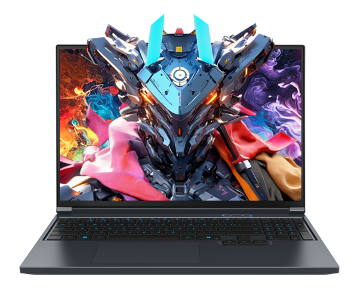

# 机械革命 极光 X/XPRO 2025

## 外观

## 配置

|   项目   |                      参数                       |
| :------: | :---------------------------------------------: |
| 机身参数 |        16 英寸、2.34kg；16 英寸、2.44kg         |
| 核心配置 |      Intel i7-13700HX、i7-14650HX；RTX5060      |
| 存储配置 | 16G DDR5-5600MT/s；1T YMTC PC41Q、1T 金士顿 NV3 |
| 屏幕配置 |   2560\*1600；100%sRGB 高色域；300Hz；500nits   |
| USB 接口 |        USB-A:5Gbps\*3 ；USB-C:10Gbps\*2         |
| 影音接口 |      HDMI 2.1；Mini DP 2.1；3.5mm 音频接口      |
| 供电配置 | 250/280W DC 电源接口；140W PD 充电；80Wh 锂电池 |
| 网络配置 |            RJ45 网口；AX201 无线网卡            |

主购买链接：[极光 X i7-13700HX+RTX5060 灰色 16G+1TB ￥ 6263.65 （JD 国补）](https://3.cn/2GVz-WOa?jkl=@T1mbQ3ir2X@)

副购买链接：[极光 X Pro i7-14650HX+RTX5060 16G+1TB ￥ 6698 （PDD 百亿补贴）](https://mobile.yangkeduo.com/goods2.html?ps=CHPs1zHSle)

## 优缺点 [<Icon icon="clarity:info-line" />](/recommend/recommend_overview#优缺点)

|           优点           |          缺点          |
| :----------------------: | :--------------------: |
| 屏幕素质非常强，刷新率高 | 硬盘与网卡相对性能较差 |
|  拓展性非常强，接口丰富  |  售后服务水平仍需提升  |
|   性价比高，游戏性能强   |    离电续航能力较差    |

## 适合人群

需要一台性价比**非常高**，性能释放不错，拓展较强的游戏本，对售后与重量不那么敏感，对高帧率网游刚需较大，且偏爱 Intel 处理器。

## 总结

极光 X 延续了 24 年的性价比路线，使用 N-1 与 N-2 CPU 拉低整套配置的价格，但性能上并没有落于下风，在电竞网游中依旧表现不错。这套模具的内吹散热结构表现不错，功耗策略并不激进，噪音调教不让人烦躁。搭配这块各方面参数都称得上优秀的屏幕，这台机器的整体使用体验并没有因为其性价比而有所缺失。

不过 HX 处理器的外围功耗相对较高，机器的离电续航表现不会太亮眼。同时硬盘使用的 QLC 颗粒在寿命和长时读写性能上也注定是不如 TLC 颗粒。

同时，对于这一系列同显卡但 CPU 不同的机型，14650HX 和 13700HX 在同显卡的情况下表现差异微乎其微，仅在 PUBG 等内存敏感的应用场景会有些许差距，具体差异可以参考我们前面列出的处理器完整规格表。

## 其他外观

