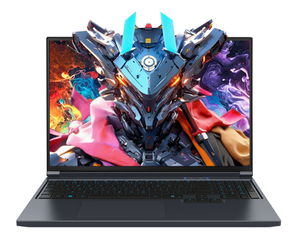

# 机械革命 极光 X/XPRO 2025

## 外观

## 配置

|   项目   |                      参数                       |
| :------: | :---------------------------------------------: |
| 机身参数 |        16 英寸、2.34kg；16 英寸、2.44kg         |
| 核心配置 |      Intel i7-13700HX、i7-14650HX；RTX5060      |
| 存储配置 |          16G DDR5-5600MT/s；1T 金士顿 NV3       |
| 屏幕配置 |   2560\*1600；100%sRGB 高色域；300Hz；500nits   |
| USB 接口 |        USB-A:5Gbps\*3 ；USB-C:10Gbps\*2         |
| 影音接口 |      HDMI 2.1；Mini DP 2.1；3.5mm 音频接口      |
| 供电配置 | 250/280W DC 电源接口；140W PD 充电；80Wh 锂电池 |
| 网络配置 |            RJ45 网口；AX211 无线网卡            |

主购买链接：[极光 X i7-13700HX+RTX5060 灰色 16G+1TB ￥ 6773.65 （JD 国补）](https://3.cn/2Rzexa-R?jkl=@D69O45QkNL@)

副购买链接：[极光 X i9-14900HX+RTX5070 灰色 16G+1TB ￥ 8218.65 （JD 国补）](https://3.cn/2-Rzf2xC?jkl=@L8V0rBWgYE@ )

## 优缺点 [<Icon icon="clarity:info-line" />](/recommend/recommend_overview#优缺点)

|           优点           |          缺点          |
| :----------------------: | :--------------------: |
| 屏幕素质非常强，刷新率高 | 硬盘与网卡相对性能较差 |
|  拓展性非常强，接口丰富  |  售后服务水平仍需提升  |
|   性价比高，游戏性能强   |    离电续航能力较差    |

## 适合人群

需要一台性价比**非常高**，性能释放不错，拓展较强的游戏本，对售后与重量不那么敏感，对高帧率网游刚需较大，且偏爱 Intel 处理器。

## 总结

极光 X 延续了 24 年的性价比路线，在内存与硬盘大涨价的现在，仍能保持在6000元价位实属难得。机器的整体模具与蛟龙16Pro基本一致，但在网卡上使用了稳定性更好的AX211。尽管使用 N-1 与 N-2代的CPU，但在游戏性能上相对于新款Ultra处理器并没有落后，不过HX处理器在外围功耗上相对较高，因此机器的整体续航水平并不亮眼，其较高的重量也注定这台机器不是一台适合移动办公的笔记本。同时硬盘也缩水为金士顿的QLC硬盘，相较于TLC硬盘在稳定性与寿命上都有一定衰减。如果你比较偏爱Intel处理器，并且预算相对有限，那么这台机器在今年是极具性价比的选择。如果你对售后需求较高，我们更推荐你购入斗战者战7000系列笔记本。

## 其他外观

