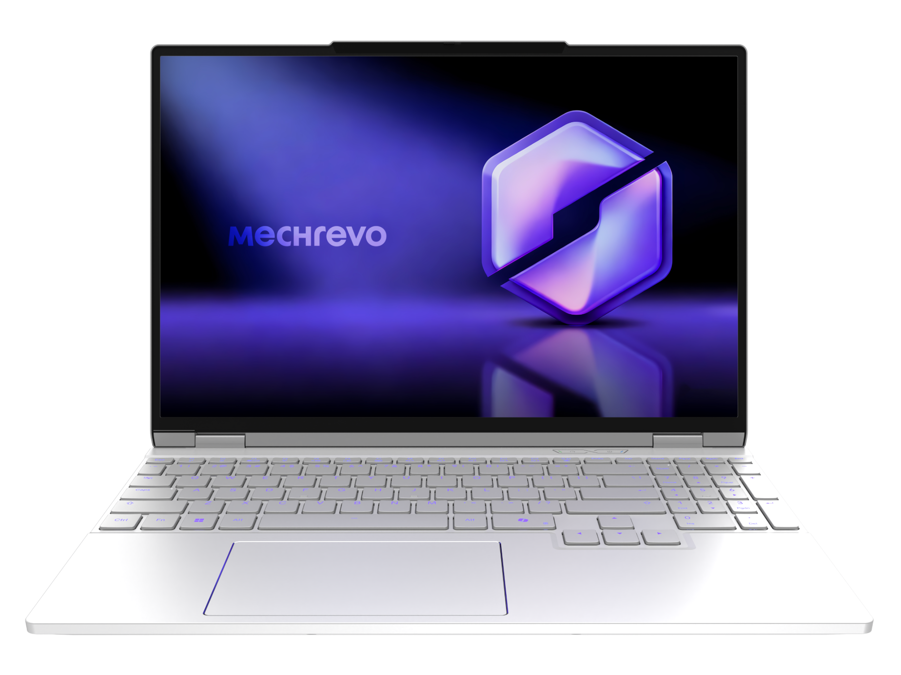

# 机械革命 翼龙 15 Pro

## 外观

## 配置

|   项目   |                          参数                          |
| :------: | :----------------------------------------------------: |
| 机身参数 |                    15.3 英寸；1.9kg                    |
| 核心配置 |                 AMD R7 H 255；RTX5060                  |
| 存储配置 |            32G DDR5-5600MT/s；1T YMTC PC411            |
| 屏幕配置 |      2560\*1600；100% sRGB 高色域；300Hz；500nits      |
| USB 接口 | USB-A:5Gbps\*2、10Gbps\*1 ；USB-C:10Gbps\*1、40Gbps\*1 |
| 影音接口 |         HDMI 2.1；3.5mm 音频接口；Mini DP 2.1          |
| 供电配置 |      210W DC 电源接口；140W PD 充电；99Wh 锂电池       |
| 网络配置 |              RJ45 网口；MT 7922 无线网卡               |

主购买链接：[R7 H 255+RTX5060 32G+1TB 灰色 ￥ 7198.65（JD 国补）](https://3.cn/2GRmxT-p?jkl=@I465aDi3HE)

## 优缺点 [<Icon icon="clarity:info-line" />](/recommend/推荐#优缺点)

|              优点              |                缺点                 |
| :----------------------------: | :---------------------------------: |
| 机身与适配器相对轻便，方便携带 |    性能释放稍弱，游戏性能相对弱     |
|  接口与拓展性丰富，屏幕素质好  | 内存为单根 32G，性能较两根 16G 要低 |
|   续航相对不错，机器噪音较低   |              网卡略差               |

## 适合人群

需要一台性价比较高，拓展性较强的轻薄低噪音游戏本，对售后没有太大的需求，没有生产力需求，并且主玩 3A 单机游戏。

## 总结

在 2024 年，机械革命推出了他们在当年市场最重量级的产品，用来对标友商的天选系列。凭借着更轻的重量，更大的电池，更强的外围配置，以及极强的性价比，翼龙 15 Pro 可以说是统治了当年的轻薄游戏本市场。时过两年，如今机械革命在内存硬盘涨价的大环境下推出了全新一代翼龙 15 Pro，这款模具在各方面相对于 2024 版都有所升级，但却属于生不逢时的产品，无论是早一年或是晚一年，这款产品都能获得与其产品力匹配的市场认可度。在 CPU 上，这台机器依旧采用了与 24 款一样的 CPU，显卡尽管更新为 5060，但其在大部分游戏中的表现甚至和 4060 打平。在最主要的 CPU 与 GPU 上进步甚少，甚至可以说经过了 2 年时间，这种表现完全可以说是退步。但这与笔记本厂商无关，研发出一款足够进步的模具，对于笔记本厂商来说已经做到了最好。

新模具在 24 款 2.03kg 的基础上继续减重了 0.1kg，同时电池却提升了 99Wh，达到了笔记本电池的上限，显示器也进行了小幅度的升级，USB 接口的速率也全面提升。同时机械革命还提供了两个 HDMI 2.1 接口，分别连接核显与独显。但这台机器仍有着“性价比”带来的小问题，机器的网卡相对略差，内存因为供应链的问题采用单根 32G，相较于双 16G 性能要略弱。如果你需要一台性价比尚可，续航能力较强的轻薄低噪音游戏本，对售后不敏感，并且主玩 3A 游戏，那么这台笔记本是你能够考虑的对象。
