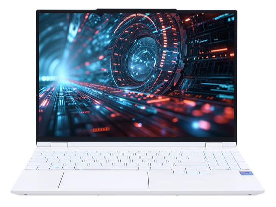

# 机械革命耀世/翼龙 15Pro

## 外观

## 配置

|   项目   |                               参数                                |
| :------: | :---------------------------------------------------------------: |
| 机身参数 |              15.3 英寸、2.07kg；15.3 英寸、2.03kg；               |
| 核心配置 |              i7-13650HX、RTX4060；R7-8845H、RTX4060               |
| 存储配置 |                  32G DDR5-5600MHZ、1T YMTC PC411                  |
| 屏幕配置 |                2560\*1600；100%sRGB 高色域；240Hz                 |
| USB 接口 | USB-A: 10Gbps\*2 、5Gbps\*1；USB-C:10Gbps\*1（40Gbps） 、5Gbps\*1 |
| 影音接口 |                 HDMI 2.1；3.5mm 音频接口；Mini DP                 |
| 供电配置 |            240W DC 电源接口；100W PD 充电；80Wh 锂电池            |
| 网络配置 |       RJ45 网口、AX211 无线网卡;RJ45 网口、MT7922 无线网卡        |

[主购买链接：翼龙 15Pro 黑色 R7-8845H+RTX4060 16G+1T ￥ 6599（PDD）](https://mobile.yangkeduo.com/goods.html?ps=rlPci4VzLp)

[耀世 15Pro 黑色 i7-13650HX+RTX4060 16G+1T ￥ 6699（PDD）](https://mobile.yangkeduo.com/goods2.html?ps=H2l9XuJAoA)

## 总结

如果要选出一款今年最均衡，无论是性能释放还是性价比等方面都远超其他机型的 4060 游戏本，翼龙 15Pro 是当之无愧的候选者。在仅有 2.03kg 的重量下，这台机器不仅塞进了 80Wh 的大电池，其散热能力相对于竞品也毫不逊色。其恰到好处的搭载了 R7-8845H 处理器，尽管在运行如 VALORANT 等类型的游戏时，其 1%LOW 帧与那些搭载 HX 处理器的机器存在一定的差距，但 8845H 超高的能耗比与其内置的 780M 核显搭配上 80Wh 的大电池，使得其在脱离电源时，兼有续航时长和图形性能。

其搭载的 2.5K 高刷屏更是令人眼前一亮，高达 550nit 的亮度和 240hz 的刷新率，可以说在万元内找不到一块比这更好的屏幕了。在内部拓展性和外部接口方面这台机器也毫不含糊。但鸡哥为了节约成本，翼龙 15Pro 的一个 Type-C 接口降速成了 10Gbps 的，而耀世上搭载的则是雷电 4 接口。同时翼龙 15Pro 的网卡也是逊色于 AX200 的 MT7922。

总而言之，翼龙 15Pro 实现了性能、续航、便携性的微妙平衡，可以说是 7000 元内最值得购买的 4060 笔记本，称之为 2024 年的 R7000P 完美版也不为过。如果你不需要续航能力，而是更追求 CPU 的性能和满速接口，那么你也可以选择同款模具但不同 CPU 的耀世 15PRO。
