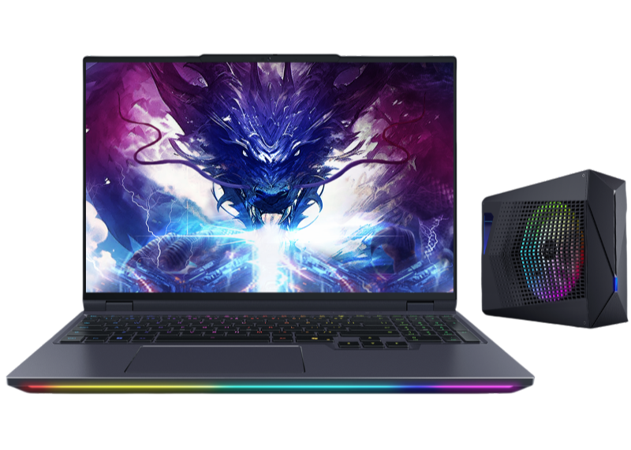

# 机械革命 苍龙 16 Ultra 2025

## 外观

## 配置

|   项目   |                      参数                       |
| :------: | :---------------------------------------------: |
| 机身参数 |                 16 英寸、2.69kg                 |
| 核心配置 |             R9-9955HX3D、RTX5070Ti              |
| 存储配置 |       32G DDR5-5600MT/s ； 1T YMTC PC411        |
| 屏幕配置 | 2560\*1600；100% DCI-P3 广色域；300Hz；1200nits |
| USB 接口 |         USB-A:5Gbps\*3；USB-C:10Gbps\*2         |
| 影音接口 |      HDMI 2.1；3.5mm 音频接口；Mini DP 2.1      |
| 供电配置 |   420W DC 电源接口；140W PD 充电；99Wh 锂电池   |
| 网络配置 |           RJ45 网口；MT7922 无线网卡            |

主购买链接：[R9-9955HX3D+RTX5070Ti 32G+1TB ￥ 13469（JD 国补）](https://3.cn/2G-Rxn6C?jkl=@A6sbc8IsjI@)

副购买链接：[R9-9955HX+RTX5080 32G+1TB ￥ 14969（JD 国补）](https://3.cn/2GRxu-yj?jkl=@E4x3Q4CwLj@)

## 优缺点 [<Icon icon="clarity:info-line" />](/recommend/推荐#优缺点)

|               优点               |       缺点       |
| :------------------------------: | :--------------: |
|          屏幕素质非常高          | 机器重量相对较高 |
|       氮化镓适配器减重不错       |   网卡相对一般   |
| 外部接口与内部拓展性极强，有 RGB | 水冷机需单独购买 |

## 适合人群

需要一台一万元出头的高性价比 5080 游戏本，偶尔有外出使用需求，对重量与售后服务不那么敏感，对高帧率网游较为刚需，对 CPU 生产力有着极高的需求，且后期有上水冷的需求。

## 总结

作为机械革命在 2025 年的顶级旗舰游戏本，这台苍龙 16 Ultra 很明显是来狙击拯救者 9000P 至尊版的，但他与拯救者的思路不同，拯救者是走的极致风冷这条路，而机械革命则考虑通过“外置骨骼”来降低散热压力。这两种方案的最终性能释放差距并没有太大，但水冷带来的噪音下降是比较明显的。为了匹配如此高的售价，机械革命破天荒的给苍龙 16Ultra 使用了一块打遍天下无敌手的 Mini LED 屏幕，这块屏幕在各方面表现都非常好，对得起他的价格。但在接口上，这台模具还是有所缩水，同时网卡也选择了更低成本的 7922。

如果你刚需一台性能非常强劲的游戏本，并且非常讨厌机器的噪音，同时预算不在考虑的范围内，那么这台苍龙 16 Ultra 或许是你想要尝试的电子玩具，但其水冷的属性使得其更像是当做一台笔记本模式的台式机在使用，几乎完全牺牲了便携性。
