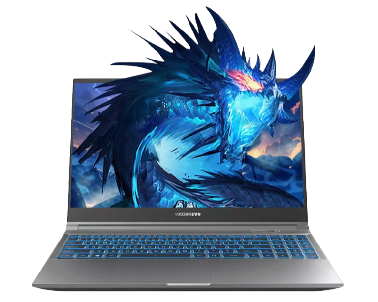

# 机械革命 蛟龙 15K/Pro

## 外观

## 配置

|   项目   |                                    参数                                    |
| :------: | :------------------------------------------------------------------------: |
| 机身参数 |                      16 英寸、2.23kg；16 英寸、2.19kg                      |
| 核心配置 |                             R7-7435H；RTX4060                              |
| 存储配置 |   16G DDR5-4800MHZ、1T YMTC PC300； 16G LPDDR5-4800MHZ、1T YMTC PC411   |
| 屏幕配置 | 1920\*1080、100%sRGB 高色域、165Hz； 2560\*1440、100%sRGB 高色域、165Hz |
| USB 接口 |                USB-A:5Gbps\*2 、480Mbps\*1；USB-C:10Gbps\*1                |
| 影音接口 |                     HDMI 2.1；Mini DP；3.5mm 音频接口                      |
| 其它接口 |                              Micro SD 读卡器                               |
| 供电配置 |                       230W DC 电源接口；62Wh 锂电池                        |
| 网络配置 |                         RJ45 网口；AX200 无线网卡                          |

[主购买链接：蛟龙 15Pro R7-7435H+RTX4060 16G+512G ￥ 4694.85（PDD）](https://mobile.yangkeduo.com/goods2.html?ps=5FYgNVuzJb)

[副购买链接：蛟龙 15K R7-7435H+RTX4050 16G+512G ￥ 3999（PDD）](https://mobile.yangkeduo.com/goods.html?ps=jAJOgPxBkB)

## 总结

看到这台机器，无疑让我想到了去年凭借一己之力打下所有 4060 游戏本价格的极光 Pro，但这台机器显然更“狠”。4999 的价格，在硬盘、内存、电池、网卡都有所升级的情况下，首发价格反而降低了整整 1000 元。好家伙，只能说你鸡哥不愧是你鸡哥，发起力来就没有其他厂商什么事情了。

这台机器使用的 CPU 是 ZEN3+架构的 6800H 阉割核显后诞生的产物，对于日常游戏来说是完全够用的。在屏幕上，首发价格 4999 的蛟龙 15K 搭载了一块 1920\*1080 分辨率的 165Hz 高刷屏，实际表现除了分辨率低于一般的 2K 屏，在最大亮度、色彩表现、响应时间上，都达到了常见 2K 屏的平均水准。而首发价格 5099 的蛟龙 15Pro 所搭载的 2K 屏在色准表现上则低于平均水准，但在这个价位，这些根本算不上是缺点了。这两款机器的网卡更是令人好评，使用了来自 Intel 的 AX200，须知价格比这两台机器更贵的 ThinkBook14+都只是使用了来自瑞昱或者是联发科的网卡，鸡哥这样的操作值得消费者点赞。

如果你的预算不是很高，但是想畅玩 3A 大作或是对笔记本电脑性能有一定的需求，那么 3999 的蛟龙 15K 搭配 4050 显卡也足够满足你的需求。而目前价格在 4695 的蛟龙 15Pro，还是值得你为了屏幕和显卡去升级的。但是在购买这两台机器后，记得再加购一个键盘进行外接，不然在满载情况下，使用原装键盘的体验会较为糟糕。总的来说，这台机器在性价比方面是完全拉满的，机器的少数缺点在这个价格面前不值一提，尊称它为 2024 年度 4060 笔记本的 “平民战神” 完全不足为过。

::: warning
在 2024 年 618 之后，固态硬盘的价格有所上涨，机械革命出于控制成本的考量，将全品牌新出厂机器的硬盘进行了更改，具体批次的硬盘可能有所不同，因此在购买机械革命品牌的笔记本到手后，建议您尽快查看机器的硬盘。为此我们也对目前机械革命使用过的硬盘进行了总结：长存 4.0 旗舰盘 PC411；长存 3.0 旗舰盘 PC300；英睿达 P3 PLUS;长存 4.0 QLC 旗舰盘 PC41Q；金士顿 QLC。如果您到手的机器为金士顿的 QLC 硬盘，我们建议您在不嫌弃麻烦的情况下使用七天无理由退换更换机器，以确保机器的稳定使用。
:::
