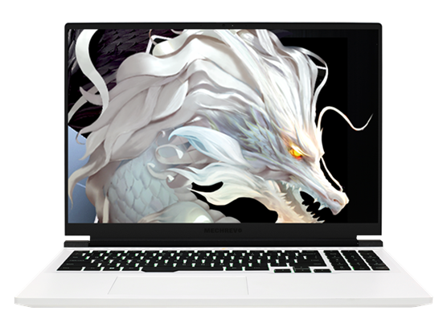

# 机械革命 蛟龙 16Pro

## 外观

## 配置

|   项目   |                          参数                           |
| :------: | :-----------------------------------------------------: |
| 机身参数 |                     16 英寸、2.51kg                     |
| 核心配置 |                   R7-7745HX；RTX4070                    |
| 存储配置 |             16G DDR5-4800MHZ；1T YMTC PC300             |
| 屏幕配置 |           2560\*1600；100%sRGB 高色域；240Hz            |
| USB 接口 | USB-A:5Gbps\*2 、480Mbps\*1、10Gbps\*1；USB-C:10Gbps\*1 |
| 影音接口 |        HDMI 2.1；3.5mm 音频接口；DP 1.4（核显）         |
| 供电配置 |       230W DC 电源接口；100W PD 充电；60Wh 锂电池       |
| 网络配置 |                RJ45 网口；AX200 无线网卡                |

[主购买链接：R7-7845HX+RTX4070 16G+1TB ￥ 6499（PDD）](https://mobile.yangkeduo.com/goods2.html?ps=jTN7tv2r0y)

[副购买链接：R7-7745HX+RTX4060 16G+512GB ￥ 5039.2（JD 国补）](https://3.cn/2b-29TS6)

## 总结

去年的蛟龙 16Pro 无疑是一款令人印象深刻的产品，而今年的蛟龙 16Pro 则可以说是真真正正的凶残。

在处理器方面，这颗 R7-7745HX 在六千元价位并无敌手，搭配 4070 显卡可以说是通杀任何 2k 游戏。内存采用了单条的 16G，非常方便后续升级。硬盘与屏幕、网卡皆为第一梯队水准。

可惜，蛟龙 16Pro 在体验上仍存在着些许问题：一是电源适配器缩水，导致最终双烤仅有 30W+130W 的性能释放。尽管最终游戏性能差距不大，但是电源缩水总还是令人膈应；二是其电池容量进一步缩水至 60Wh，考虑到 HX 处理器过高的 IO Die 功耗，其离电续航能力堪忧；三是机器的外部接口相比去年也进行了大幅度缩水，尽管接口数量差不多，但是有两个 USB-A 口的带宽从 20Gbps 砍到了 5Gbps。虽然这对日常使用影响不大，但这种操作还是令消费者不爽。

总的来看，这仍是一台非常值得购买的低价位 4070 性能本。不错的 CPU 搭配 4070 显卡，无论是各类游戏还是对处理器性能有相当要求的仿真软件，蛟龙 16Pro 都能轻松应对。但 618 过后的涨价操作，使得这款机器在目前仍不值得入手。当它能回到 6699 之下的价格之时，便是一款比 P15 TA 更值得购买的机器。

::: warning
在 2024 年 618 之后，固态硬盘的价格有所上涨，机械革命出于控制成本的考量，将全品牌新出厂机器的硬盘进行了更改，具体批次的硬盘可能有所不同，因此在购买机械革命品牌的笔记本到手后，建议您尽快查看机器的硬盘。为此我们也对目前机械革命使用过的硬盘进行了总结：特等奖 PC411；一等奖 PC300；二等奖 P3P TLC；三等奖 PC41Q；参与奖 P3P QLC；安慰奖 金士顿 QLC。如果您到手的机器为参与奖和安慰奖，我们建议您在不嫌弃麻烦的情况下使用七天无理由退换更换机器，以确保机器的稳定使用。
:::