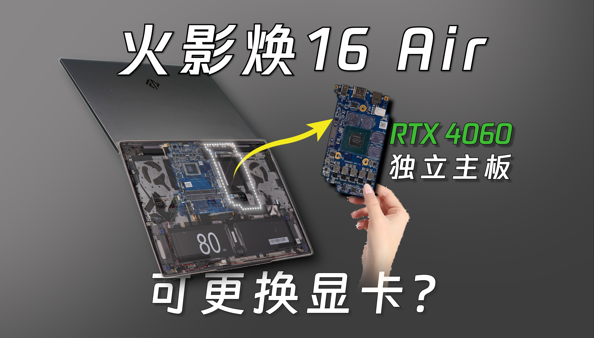

# 火影 焕 16Air

## 外观

## 配置

|   项目   |                     参数                     |
| :------: | :------------------------------------------: |
| 机身参数 |               16 英寸；1.98kg                |
| 核心配置 |             R7-8845HS；RTX-4060              |
| 存储配置 |        32G DDR5-5600MHZ；1T 群联 E27T        |
| 屏幕配置 |      2560\*1600；100% sRGB 色域；240Hz       |
| USB 接口 | USB-A:480Mbps\*1、5Gbps\*2 ；USB-C:10Gbps\*2 |
| 影音配置 |      HDMI 2.1；3.5mm 音频接口；Mini DP       |
| 其它接口 |               Micro SD 读卡器                |
| 供电配置 | 210W DC 电源接口；100W PD 充电；80Wh 锂电池  |
| 网络配置 |          RJ45 网口；AX200 无线网卡           |

[主购买链接：R7-8845HS+RTX4060 32G+1TB ￥ 5599（JD 国补）](https://3.cn/2b2-jPPk)

## 总结

如果要评选今年设计最独特的笔记本，这台火影焕 16Air 绝对是当仁不让的第一名，其内部独特的分板设计不仅节约了维修成本，还减轻了整体的重量，同时更给用户提供了战未来的选择。

B 站 up 主<a href="https://space.bilibili.com/479927880">@嗨我是熊猫</a>相关<a href="https://www.bilibili.com/video/BV1J3zzYjEUz/">测评视频</a>封面

这台机器使用的是类似无界 15X 的模具，机身相对轻薄，在重量上，得益于分板设计偷来的些许重量，这台机器突破了 2kg 大关，达到了 1.98kg，相比 16 寸天选 4 的 2.08kg 和 15.6 寸翼龙 15Pro 的 2.03kg 还要更轻。并且这台机器在做到更轻薄的同时，在性能释放上也没有丝毫落后，除了因为显卡 Vbios 版本的原因导致显卡跑分相对于那两款机型较低之外，在双烤与单烤的性能释放上，这台机器打平了翼龙 15Pro，略高于天选 4。在游戏性能方面，焕 16Air 略低于那两台机器，但差距甚小。机器的接口相对丰富，唯一可惜的是没有 USB4，同时内部拓展性与翼龙一样，网卡则采用了更好的 Intel 网卡，稳定性较翼龙与天选更好。屏幕采用的是目前游戏本中第一梯队的 2k 高刷屏，各方面都比较完美。机器的主板连接处的结构相对易损，到手后不建议小白动手拆开，容易丢失保修。同时火影的保修相对于机械革命和其他一线品牌更差，建议有一定动手能力的同学购买。

如果你需要一台较为便携，可玩性较高的游戏本，同时有着一定的动手能力，不太在意售后，那么这台火影焕 16Air 应该是你较好的选择。随着焕 16Air 的推出，在未来“同方系”有可能推出更多不同尺寸，相同类型的机器，也或许，这就是未来笔记本的发展趋势。只要这些厂家不断革新产品线，开发新模具，一定能为当下逐步同质化的笔记本市场注入新的活力，进而促进笔电市场良好发展，达成厂商与消费者双赢的结果。
