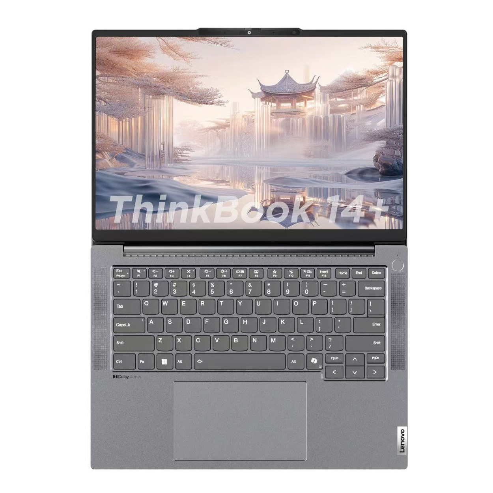

# 联想 ThinkBook14+ 2023/2024

## 外观

## 配置

|   项目   |                                    参数                                     |
| :------: | :-------------------------------------------------------------------------: |
| 机身参数 |                       14 寸、1.42kg；14.5 寸、1.56kg                        |
| 核心配置 |                             R7-7840H；R7-8845H                              |
| 存储配置 | 32G LPDDR5X-6400MHZ、1T 亿联 AM6A1； 32G LPDDR5X-7500MHZ、1T 亿联 AM6B1/三星 PM9C1  |
| 屏幕配置 | 2880\*1800、100%sRGB 高色域、90Hz； 3072\*1920、100%DCI-P3 广色域、120Hz |
| USB 接口 |          USB-A: 5Gbps\*1 、10Gbps\*2 ；USB-C:10Gbps\*1 、40Gbps\*1          |
| 影音接口 |                          HDMI 2.1；3.5mm 音频接口                           |
| 其它接口 |                               Micro SD 读卡器                               |
| 供电配置 |          100W PD 充电、62Wh 锂电池； 100W PD 充电、85Wh 锂电池           |
| 网络配置 |       RJ45 网口、MT7921 无线网卡； RJ45 网口、瑞昱 8852be 无线网卡       |

主购买链接：[R7-8845H 32G+1TB ￥ 4999（PDD）](https://mobile.yangkeduo.com/goods.html?ps=v7OxejcGuz)

副购买链接：[R7-8845H 32G+1TB ￥ 5499（JD）](https://3.cn/23h-dNUG)

## 总结

Thinkbook14+ 在前几年的市场上给人带来了深刻的印象：强劲的性能释放，充足的外部接口，额外的 2280 规格 M.2 硬盘位，堪称轻薄本的版本答案。

2023 款与 2024 款的 ThinkBook14+ 在整体配置上差距不大，前者使用的是 R7-7840H,后者使用的是其马甲 U R7-8845H,两者只相差一个 NPU，但 2024 款的性能释放增加了 11W，并且内存也从 6400MHZ 升级成了 7500MHZ，在游戏性能方面 2024 款要更胜一筹。屏幕上，2023 款采用的是 2880\*1800 分辨率，90HZ 刷新率的屏幕，而 2024 款将屏幕进行了升级，采用 3072\*1920 分辨率，120Hz 刷新率的屏幕，在观感上后者相对更好。2024 款还升级了电池容量，在续航上也有小幅度提升。2024 款将一个 Type-C 接口的协议升级至雷电 4，但是砍掉了 Ultra 版本上的 OCuLink 接口。同时联想在网卡与硬盘方面略有缩水，这点反而不如机械革命。

如果你需要一台 5000 元价位左右、性能释放较好、续航不错、屏幕表现各方面都还行的轻薄本，同时对售后有着较高的需求，那么 ThinkBook14+ 一定是你最好的选择。2023 款目前因为清库存,其货源相对不是很稳定。2024 款在 PDD 上的售价是 4999 元，同时因为联想支持个人送保的政策，我们更推荐你在 PDD 上购买 2024 款的 ThinkBook14+。

::: warning
**但因为联想今年的产品品控问题，我们建议你机器到手之后，一定要做详细的检查，确保机器没有任何问题之后再进行激活。**
:::
