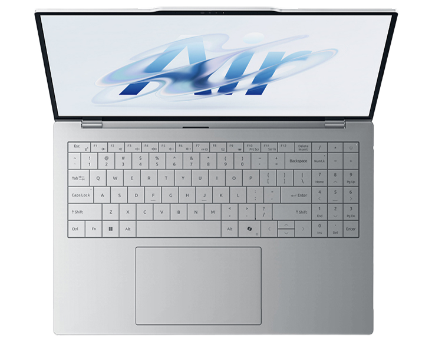
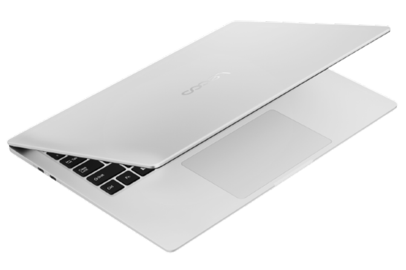
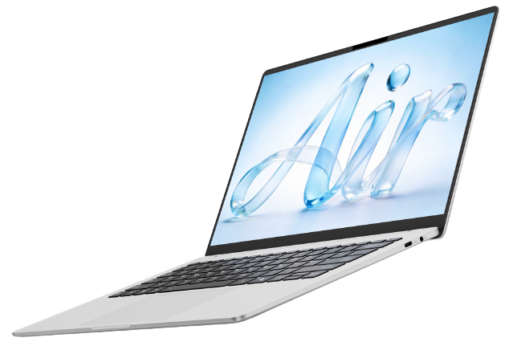

# 联想 来酷 Air 16

## 外观

## 配置

|   项目   |                    参数                     |
| :------: | :-----------------------------------------: |
| 机身参数 |                16 寸、1.06kg                |
| 核心配置 |              Intel Ultra5 226V              |
| 存储配置 |      16G LPDDR5X-8533MT/s、1T TWSC OEM      |
| 屏幕配置 | 2560\*1600；100%sRGB 高色域；120Hz；350nits |
| USB 接口 |      USB-A:5Gbps\*2 ；USB-C:10Gbps\*2       |
| 影音接口 |       HDMI 1.4；3.5mm 音频接口；DP1.4       |
| 供电配置 |          65W PD 充电；60Wh 锂电池           |
| 网络配置 |            瑞昱 8851BE 无线网卡             |

主购买链接：[来酷 Air 16 U5-226V 16G+512GB ￥4223.65（JD 国补）](https://3.cn/2RyR-U3R?jkl=@D1QceBfdBO@)

副购买链接：[来酷 Air 14 Core5 315 12G+512GB ￥3314.14（JD 国补）](https://3.cn/2-RySesm?jkl=@O5wrCB9BBd@)

## 优缺点 [<Icon icon="clarity:info-line" />](/recommend/recommend_overview#优缺点)

|         优点         |                     缺点                     |
| :------------------: | :------------------------------------------: |
| 性价比较高，售后极强 |      内部拓展性差，网卡与硬盘均不能升级      |
|   质量轻，续航尚可   |               整机性能释放较差               |
|                      | 屏幕亮度与色准较差，且屏线裸露，开合时需注意 |

## 适合人群

预算在 4 千元左右，需要一台价格低廉，能够胜任移动办公需求的超轻本，同时对售后有着较高的需求，没有大型游戏需求。

## 总结

作为联想来酷模式的又一力作，这台机器的第一版在去年上市后市场反响非常差，但在今年内存硬盘大涨价的背景下，来酷Air系列凭借供应链的优势实现了“加量不加价”，因此反而值得低价位用户进行购买。16 寸的机器机身质感尚可，使用的 CPU 为去年的 Lunar Lake 处理器，续航表现不错，但整体性能略差。机器的外部接口算是够用，内部拓展性在 16 寸机器中可以说是非常差的，网卡与硬盘均不能升级。并且整机的性能释放较差，屏幕的观感一般，屏线还是裸露的，用户在到手使用后开合屏幕需要注意操作。但这些都不是这个机器的主要竞争力，这款机器的最大优点是纳入了联想的售后体系，至少在今年大涨价的背景下，以四千元左右的价格购买一台不需担心售后的笔记本，对许多预算不算充裕的电脑小白还是非常友好的。

除了 16 寸的机器，价格更低廉的 Air 14 也非常值得购买。这台机器可以说是完完全全对标 Macbook Neo 的产品，称它为 Windows 阵营的 Macbook Neo 也不足为过。机器使用的是基于 Intel 18A 工艺制造的“哈基米湖”处理器，仅有 2 个大核和 4 个超小核，但其整体性能相较于 125H 反而有一定提升。机器的内存缩水为 12G，屏幕也缩水为 1200P 60Hz，并且观感一般。但这台机器是纳入联想售后的最便宜的笔记本，其 3300 元左右的售价，却能够提供目前最好的笔记本售后服务。但这台机器也有许多细节上的缺陷，首先是没有 Type-A 口，整台机器提供了三个 Type-C 口，如果用户需要使用 A 口，还需要额外购买拓展坞搭配使用。其次机器使用的固态可以说是完完全全的杂牌固态，整体的性能释放也非常的保守，可以说是在许多方面都“看齐”了 Macbook Neo。值得欣慰的是机器的外观还算看的过去，并且机器的续航能力非常强，在日常仿真脚本中能够持续 10 小时，完全足够应付一整天的办公。

如果你的预算相对充足，需要一台屏幕更大，观感相对更好的超轻笔记本，并且对售后要求非常高，那么我们推荐你购买 Air 16 版本。如果你的预算相对有限，同时对售后需求较高，对于笔记本的要求也仅限于移动办公，那么 Air 14 也是低价位中唯一的选择，除此之外也仅有 Macbook Neo 能够满足这类需求了。

:::warning 注意事项
**但需要注意，如果你是理工科专业，我们不推荐你仅购买一台搭载 Mac OS 系统的笔记本。**
:::

## 其他外观

